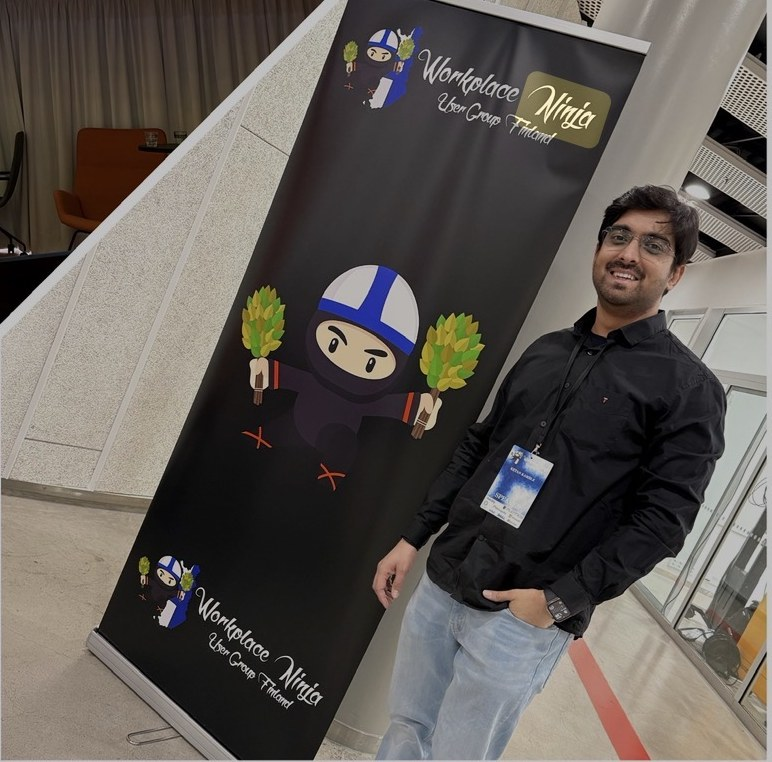
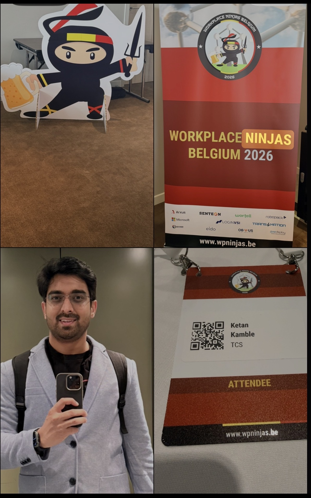

  
  

    About
    <h1 class="ah-name">Ketan Kamble</h1>
    
Microsoft endpoint-management architect · Intune · Entra · Graph

    
📍 Finland — originally from Pune, India · मराठी माणूс

    

      <a href="https://www.linkedin.com/in/ketan-kamble-012a1582" target="_blank" rel="noopener">LinkedIn</a>
      <a href="https://github.com/KetanKamble3894" target="_blank" rel="noopener">GitHub</a>
      <a href="../blog/">Blog</a>
    

  

  
<b>10 yrs</b>in EUC / IT

  
<b>MD-102</b>Endpoint Admin

  
<b>SC-200</b>Security Ops

  
<b>Speaker</b>WNUG Finland

I'm **Ketan Kamble**, a Microsoft endpoint-management architect with **10 years** across End-User Computing and IT — designing and running Intune, Entra ID, Microsoft Graph, Autopilot, Defender, Azure Automation and Power BI environments. I build tooling **in the open** and write about what the portal is actually doing underneath: the Graph calls it fires and the permission each one needs.

  
Practical
Everything comes from a personal lab, reproduced before it's published — including the parts I got wrong. No theory-only posts.

  
Read-only by design
Every script is parameterised, GET-only, and Managed-Identity based. No stored secrets, no write access, nothing that can touch production.

  
In the open
Scripts, reports and the flagship project are open source (MIT) on GitHub. If it helps you ship with more confidence, that's the point.

## What I work with

Microsoft Intune · Microsoft Entra ID · Microsoft Graph (v1.0 + beta) · Windows Autopilot · Windows 365 · Microsoft Defender for Endpoint · Azure Automation & Managed Identity · Power BI reporting · PowerShell 7.

## Certifications

  

    MD-102
    Microsoft 365 Certified: Endpoint Administrator Associate
    Intune, Autopilot, compliance, app deployment, endpoint security.
  

  

    SC-200
    Microsoft Certified: Security Operations Analyst Associate
    Microsoft Defender, threat detection & response, security posture.
  

## Community & speaking

  
  

    Speaker
    <h3>Workplace Ninja User Group — Finland</h3>
    
I spoke at Workplace Ninja User Group Finland on <b>"The Automation Evolution: From Ideas to Impact"</b> — how read-only Azure Automation and Microsoft Graph turn day-to-day endpoint questions into reports you can actually act on. Sharing what works (and what didn't) with the local Intune and Entra community is exactly the kind of "in the open" I care about.

  

  
  

    Attendee
    <h3>Workplace Ninjas Belgium 2026</h3>
    
I attended Workplace Ninjas Belgium 2026 — one of Europe's sharpest gatherings for Intune, Entra and endpoint-security practitioners. Staying close to how the best in the field actually solve these problems is how the writing here stays current and honest.

  

## The flagship: Zero-Access Agent

The idea I'm best known for is the **[Zero-Access Agent](../projects/zero-access-agent/index.md)** — an AI that answers questions about an endpoint fleet **without ever touching a live system**. Read-only collectors export sanitized snapshots; Power BI and the agent read only those. The permission boundary is enforced by *architecture*, not by asking a model to behave. Give the AI the reports — never the systems.

## Work with me

Open to **speaking, collaboration, and sponsorship**. If your product helps EUC and security teams and you'd like it in front of Intune/Entra practitioners, see **[Contact](../work-with-me.md)** for how partnership works here.

## Connect

- :material-linkedin: **[LinkedIn](https://www.linkedin.com/in/ketan-kamble-012a1582)** — say hello
- :material-github: **[GitHub](https://github.com/KetanKamble3894)** — every script and project
- :material-email-outline: **Newsletter** — subscribe below

<form class="nl" action="https://buttondown.email/api/emails/embed-subscribe/YOUR-BUTTONDOWN-USERNAME" method="post" target="popupwindow" onsubmit="window.open('https://buttondown.email/YOUR-BUTTONDOWN-USERNAME','popupwindow')">
  <input type="email" name="email" placeholder="you@work.com" aria-label="Email address" required>
  <button type="submit">Subscribe</button>
</form>

<small>Free, powered by Buttondown. Unsubscribe anytime.</small>

---

*Independent content — not affiliated with, sponsored by, or endorsed by Microsoft. Microsoft, Intune, Entra, Microsoft Graph, Azure and Power BI are trademarks of the Microsoft group of companies. Everything here comes from a personal lab.*
