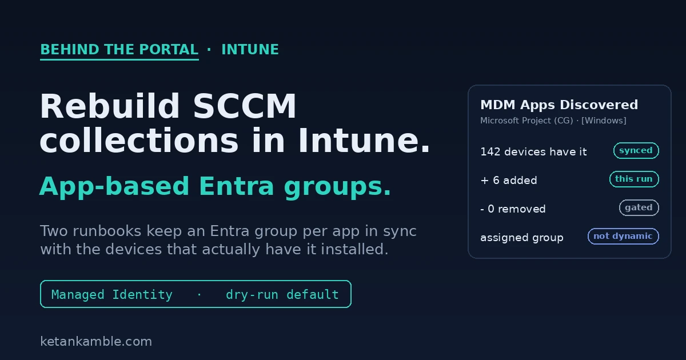

# App-based Entra groups to replace SCCM collections

{ .post-cover width="1200" height="630" fetchpriority=high }

We have been winding down Microsoft Configuration Manager, what most of us still call SCCM, like everyone else. The thing I miss most is not the console, it's collections. A collection that says "every device that has this app installed" was how we targeted an update, and Intune has nothing like it.

Ugur Koc already wrote a script that rebuilds that idea from Intune's own inventory, and it's where I started. On a normal tenant it works well. On our 17,500-device estate it didn't, so I re-engineered it for scale and for running unattended, and that re-engineering is what this post is really about.

This one is also different from most of what I write here. It writes. It changes Entra group membership, so I can't dress it up as read-only. What I did instead was make the writing part paranoid, and that turned out to be the interesting bit.

<!-- more -->

<div class="hook-embed" markdown="0">
<iframe scrolling="no" src="/assets/hooks/app-based-entra-groups.html" title="Before and after: an SCCM collection dynamically tracks which devices have an app installed, Intune has no equivalent, and two Azure Automation runbooks rebuild it by syncing an Entra group per app from Intune detected-apps inventory" loading="lazy" style="display:block;width:100%;aspect-ratio:1200/470;border:0;border-radius:16px;box-shadow:0 10px 30px rgba(0,0,0,.35)"></iframe>
</div>

!!! tip "The short version"
    Intune has no SCCM-style collections, and an Entra dynamic group can't build membership from Intune inventory like "devices that have app X installed". So two Azure Automation runbooks do it: one creates an assigned Entra group per discovered app, the other keeps each group's membership in sync with Intune's detected-apps data. It runs as a Managed Identity, it's dry-run by default, and every removal is guarded so a failed inventory read can't quietly empty a group. It's a re-engineering of Ugur Koc's original script for a large, unattended estate.

## The gap: no collections, and dynamic groups can't see apps

Two facts, and the whole problem sits between them.

Intune has no collections. It targets Entra security groups, optionally narrowed with an assignment filter, and that's it. There's no object that means "the set of devices matching this rule" the way an SCCM collection did.

And an Entra dynamic group can't fill that gap, because dynamic device rules only see Entra device attributes. Things like `deviceOSType`, `deviceModel`, `enrollmentProfileName`, the extension attributes. They cannot read Intune inventory. There is no dynamic rule for "has Microsoft Project installed", because installed-app data lives in Intune, not on the Entra device object. Microsoft's own answer for app-based targeting is assignment filters, which help at assignment time but still don't give you a reusable group you can point other things at.

While SCCM was around, the workaround was to let it own the collection and sync that to an Entra group. Take SCCM away and the workaround goes with it. So the group has to come from somewhere else, and the only place that knows which device has which app is Intune's detected-apps inventory.

## How SCCM did this, and why losing it stops people

If you came from SCCM this is the part you'll recognise, and it's why this matters more than it first looks.

In SCCM you'd make a query-based collection, a membership rule that says "every device where this app is installed". SCCM already had that from hardware and software inventory, so the collection filled itself and kept re-evaluating on a schedule. You never hand-picked devices, the collection just tracked reality. Then to use it in the cloud you'd sync that collection to a Microsoft Entra group with the built-in "Synchronize collection members to Microsoft Entra groups" feature, and point an Intune app deployment at the synced group.

That pipeline is the quiet workhorse a lot of shops still run on. App detection and grouping happened in SCCM, the sync carried it to Entra, and Intune did the deployment. Turn SCCM off and the whole first half goes. The query collections stop evaluating and the sync stops, so the Entra groups Intune was deploying to freeze and then go stale. That's the real stopper. People aren't just losing a console, they're losing the thing that decided which devices a deployment should target.

These two runbooks put that first half back, on Intune's own data. Intune already knows which device has which app through detected apps, so the creator and refresh runbooks turn that into the same kind of self-updating, app-based group, with no SCCM in the path.

## The shape: two runbooks, one Automation account

The whole thing is two PowerShell runbooks in one Azure Automation account, both running as the account's Managed Identity.

The first runbook is the creator. It reads the detected-apps inventory, and for each app worth tracking it creates one **assigned** Entra security group named to a convention, `MDM Apps Discovered - <App> (CG)`, and stamps the platform into the group description as `[Platform=Windows]`. Assigned matters, because you cannot write members into a dynamic group. Entra computes a dynamic group's membership itself and rejects a manual add, so these have to be plain assigned groups that something else keeps current.

The second runbook is the one that keeps them current, and it's the one I'll spend the rest of the post on. It walks every group that matches the convention and reconciles its membership against who currently has the app.

## One app, several detected names

Here's the thing that decides how many groups you end up with. Detected apps are listed by name and by version, so one product usually shows up as more than one row. TeamViewer is the classic case. You'll see "TeamViewer", "TeamViewer 9", often "TeamViewer Meeting" and "TeamViewer Host", and then the same names again for each version installed out there. To Intune those are all separate detected apps, each with its own device count.

So the real question the creator has to answer isn't "make a group for this app", it's "which detected-app rows count as the same app". If you key a group off the exact detected-app name, every one of those rows becomes its own group, and you get "TeamViewer 9" and "TeamViewer Meeting" as two separate groups plus one more per version. That's almost never what you want.

The runbook handles it with name matching. You give it a pattern, and for every detected-app row that matches, it folds all those devices into the one group. So "TeamViewer*" collapses every version and every TeamViewer variant into a single "MDM Apps Discovered - TeamViewer (CG)" group. It's the same wildcard the `OnlyApps` parameter takes, which is why "Adobe*" refreshes every Adobe group at once.

The flip side is just as handy. If you actually care about one version, say you're hunting devices still on an old TeamViewer 9 so you can replace it, you match that exact name and it gets its own group. You decide where the line sits per app, on purpose. What you don't want is to aim it at every detected app with no pattern, because then you really do get a group for every name and every version, and that's a mess nobody asked for.

## Re-engineered for 17,500 devices

Credit where it's due. Ugur Koc's original does exactly this job and proves the idea cleanly, and on a normal tenant it's all you need. Ours is that same idea rebuilt for a 17,500-device estate that has to run on a schedule with nobody watching, and every difference is about scale or safety.

The original resolves devices one at a time. It pulls the managed devices, then makes a separate Graph call to resolve each one to its Entra object. At seventeen and a half thousand devices that's thousands of round trips and hours of runtime, with Graph throttling you with 429s most of the way. It also creates and changes groups by default with the dry run as the opt-in, keeps no record of what it did, and has nothing stopping a partial read from driving wrong removals. That isn't a knock on it, it's just built for a different size of tenant.

Ours turns the same job into a handful of paged sweeps. It reads all the managed devices once and all the Entra devices once, and builds two in-memory hashtable lookups keyed on the ids it needs. After that every device resolves with a dictionary hit instead of an API call, so a full run finishes in minutes instead of hours and the throttling mostly goes away. On top of that, report-only is the default, every run writes a preview or applied CSV so there's an audit trail, and the removal gates below mean a scheduled run would rather do nothing than do the wrong thing. That last part is the whole reason it can run on a timer at all.

## The mapping nobody enjoys

The awkward part is that "the device that has the app" and "the thing you add to a group" are three hops apart, and the IDs do not match along the way.

Intune's detected app gives you managed devices. A managed device carries an `azureADDeviceId`. That value is the Entra device's `deviceId`, which is the registration GUID, and it is *not* the Entra object id. Group membership binds the object id. So every device has to walk: detected app, to Intune managed device, to `azureADDeviceId`, to the Entra device whose `deviceId` matches, to that Entra object's `id`, which is finally the thing you add.

The runbook builds two lookup maps once, up front, so this is all in memory:

```powershell
# For each detected-app row, get the devices that have it, then map each one:
#   Intune managedDevice.azureADDeviceId  ==  Entra device.deviceId  ->  Entra object id
foreach ($appVersion in $appRows) {
    $mds = Invoke-MyGraphGetRequest "$graph/deviceManagement/detectedApps/$($appVersion.id)/managedDevices?`$select=id,deviceName"
    foreach ($d in $mds) {
        $aadId = $IntuneDeviceMap[$d.id].azureADDeviceId   # Intune device -> registration GUID
        $obj   = $EntraDeviceMap[$aadId]                   # registration GUID -> Entra device object
        if ($obj) { $memberIds[$obj.id] = $d.deviceName }  # bind the OBJECT id as the member
    }
}
```

If any of those hops comes back empty, the device is skipped and counted, not guessed at. Some misses are normal. An Intune-only or workplace-joined device can carry an all-zero `azureADDeviceId`, and a device that was cleaned up on one side but not the other won't join. Those are skipped and counted too, and if that skip count ever climbs it's telling you about a registration problem, not about who has the app. That counting matters in a second.

## It writes, so the removals are paranoid

Adding a device to a group is the reversible half. Get it wrong and a machine sits in a group it didn't need, which you can undo. It isn't completely free, once these groups drive a required install or a Conditional Access rule a wrong add has a real effect, so the adds still only come from the inventory read. But removing is the dangerous half. A removal driven by a bad inventory read can pull every device out of a group, and if that group is targeting an app as required, you have just told Intune to stop keeping the app on the fleet. So before a single member is removed, the run has to earn it through three gates.

```powershell
# Gate 0 - resolution. Devices were fetched but none mapped to Entra. That is a
# mapping failure, not "the app is gone", so it must not drive removals.
if ($intuneCount -gt 0 -and $memberIds.Count -eq 0) { $fetchIncomplete = $true }

# Gate 1 - completeness. The number we resolved has to reconcile with Graph's own
# deviceCount for the app. If we are more than 5% short, the read was partial.
$graphSaysCount = ($appRows | Measure-Object deviceCount -Sum).Sum
if ($graphSaysCount -gt 0 -and $intuneCount -lt ($graphSaysCount * 0.95)) { $fetchIncomplete = $true }

# If the fetch was incomplete, skip removals this run and still process the adds.
# A device that was simply missed must never look "stale" and get pulled.
$toRemove = if ($RemoveStaleMembers -and -not $fetchIncomplete) {
    @($currentMemberIds.Keys | Where-Object { -not $memberIds.ContainsKey($_) })
} else { @() }

# Gate 2 - never mass-remove, even on a clean read. If a refresh wants to drop more
# than half a group (and more than ten), something is wrong. Skip and shout.
if ($toRemove.Count -gt 10 -and $toRemove.Count -gt ($currentMemberIds.Count / 2)) {
    Write-Warning "Would remove $($toRemove.Count) of $($currentMemberIds.Count) - too many, skipping removals."
    $toRemove = @()
}
```

The rule underneath all three is the same. A missing read must fail closed. When the runbook isn't sure, it does nothing rather than something destructive, and it always keeps processing the safe half, the adds. One honest caveat on gate one: `deviceCount` is Graph's own rolled-up number and it lags reality a little, so the 95% band is a practical threshold to catch a badly partial read, not an exact guarantee. And the whole script defaults to `DryRun = $true`, so the first thing it ever does in your tenant is tell you what it *would* change and write that to a CSV. You flip it to apply only once the preview looks right.

When it does apply, adds go up in batches of twenty, which is the Graph limit for `members@odata.bind`, and removals go one at a time so one bad object can't fail the batch:

```powershell
for ($i = 0; $i -lt $toAdd.Count; $i += 20) {
    $batch = $toAdd[$i..([Math]::Min($i + 19, $toAdd.Count - 1))]
    Invoke-MyGraphWriteRequest "$graph/groups/$groupId" -Method PATCH -Body @{
        "members@odata.bind" = @($batch | ForEach-Object { "$graph/directoryObjects/$_" })
    }
}
foreach ($id in $toRemove) {
    Invoke-RestMethod "$graph/groups/$groupId/members/$id/`$ref" -Method DELETE -Headers $Headers
}
```

Both full runbooks, with the Managed-Identity token, the throttle and 429 retry, the detected-apps fallback described below, and the CSV export to Blob for Power BI, are on the [App-Based Entra Groups script page](../../scripts/app-based-entra-groups.md).

## The permissions it actually needs

This is the honest part of "it writes", and the two runbooks don't need the same thing, which matters for how tight you can make it.

The creator runbook makes the groups, and creating an Entra group is a `Group.ReadWrite.All` operation. There's no narrower scope for it, `GroupMember.ReadWrite.All` can add members but can't create a group. So the creator holds `Group.ReadWrite.All` plus the reads it needs to decide what to make. The refresh runbook only touches membership, so it can be tighter: `GroupMember.ReadWrite.All` and reads, nothing that can create or delete a group.

| Runbook | Operation | Least-privilege application scope |
|---|---|---|
| Creator | Create the Entra groups | `Group.ReadWrite.All` |
| Both | Read Intune managed devices, detected apps, and each app's devices | `DeviceManagementManagedDevices.Read.All` |
| Both | Read Entra devices | `Device.Read.All` |
| Refresh | Read the groups and their current members | `GroupMember.Read.All` |
| Refresh | Add and remove group members | `GroupMember.ReadWrite.All` |

If you run both runbooks under the same Managed Identity, that identity ends up holding `Group.ReadWrite.All`, and since that scope already covers membership you don't grant `GroupMember.ReadWrite.All` on top. Cleaner to set up, but it means one identity can create and delete groups, not just move members. If you want the tighter split, give the creator its own identity with `Group.ReadWrite.All` and the refresh runbook a second identity with only `GroupMember.ReadWrite.All`, so the thing that runs on a schedule can't create or delete anything.

Be honest about the blast radius either way. `Group.ReadWrite.All` lets the identity create, delete and edit any group in the tenant that isn't role-assignable, which includes Conditional Access and other security groups. It can't touch role-assignable groups, and that's the real boundary, but treat the identity as sensitive and let the CSV trail be how you watch it. The Managed Identity also needs the Azure RBAC role **Storage Blob Data Contributor** on the storage account, but only for dropping the CSV, not for anything in Entra.

## Set it up, and run the dry run first

None of this has to be nerve-wracking if you let the dry run do its job. The order I'd follow:

1. Stand up an [Azure Automation account](https://learn.microsoft.com/en-us/azure/automation/quickstarts/create-azure-automation-account-portal) and turn on its [system-assigned Managed Identity](https://learn.microsoft.com/en-us/azure/automation/quickstarts/enable-managed-identity). Both runbooks run as that identity, with no stored secret.
2. Grant the identity the scopes from the table above, plus Storage Blob Data Contributor on the storage account for the CSV. If you want the tight split, use two identities, one per runbook.
3. Import both runbooks as PowerShell 7 runbooks and publish them, and set the group prefix and storage names to your own.
4. Run the creator once. It reads detected apps and makes one assigned Entra group per app you're tracking, named to the convention with the platform in the description.
5. Run the refresh with its default, `DryRun = $true`. It changes nothing. Per group it prints how many devices it resolved and exactly who it would add and remove, and it writes that to a preview CSV. Read it. This is the step people skip and then regret.
6. When the preview looks right, run it again with `DryRun = $false` to apply. Adds go in, stale members come out, all within the safety gates.
7. Schedule the refresh on a timer, every few hours is plenty, and leave the gates and the dry-run-to-CSV habit in place. The applied CSV from each run is your audit trail.

The whole reason the dry run is the default is that the first thing this ever does in your tenant is show you its homework, not do it. You only ever flip to apply once you've read a preview you trust.

## Scheduling it, and running one app by hand

Two ways you'll actually run the refresh.

Daily and unattended. In the Automation account open the refresh runbook, go to Schedules, and add a schedule that recurs once a day (I run it early morning). Link it with the parameters it should apply on its own, `DryRun = $false` and `RemoveStaleMembers = $true`, and from then on it reconciles every group each night and writes the applied CSV. The same from PowerShell:

```powershell
# Create a daily schedule and link it to the refresh runbook so it applies changes.
New-AzAutomationSchedule -AutomationAccountName $aa -ResourceGroupName $rg `
    -Name "AppGroups-Daily" -StartTime (Get-Date).Date.AddDays(1).AddHours(2) -DayInterval 1

Register-AzAutomationScheduledRunbook -AutomationAccountName $aa -ResourceGroupName $rg `
    -RunbookName "Refresh-AppBasedGroups" -ScheduleName "AppGroups-Daily" `
    -Parameters @{ DryRun = $false; RemoveStaleMembers = $true }
```

One app, by hand. When you've just added a group, or you're chasing one app, use the `OnlyApps` parameter and keep the dry run on for the first pass. In the portal you Start the runbook and fill in the parameters; from PowerShell:

```powershell
# Preview a single app first. Changes nothing.
Start-AzAutomationRunbook -AutomationAccountName $aa -ResourceGroupName $rg `
    -Name "Refresh-AppBasedGroups" -Parameters @{ OnlyApps = "Microsoft Project"; DryRun = $true }

# Happy with the preview? Apply just that one app.
Start-AzAutomationRunbook -AutomationAccountName $aa -ResourceGroupName $rg `
    -Name "Refresh-AppBasedGroups" -Parameters @{ OnlyApps = "Microsoft Project"; DryRun = $false }
```

`OnlyApps` takes wildcards, so `"Adobe*"` refreshes every Adobe group and leaves the rest alone. The safety gates and the CSV behave exactly the same on a one-app run as on the full nightly sweep, so a manual apply is never more dangerous than the scheduled one.

## One filter that looks supported and isn't

A note that will save you an afternoon. It's tempting to fetch each app with a server-side filter, `detectedApps?$filter=contains(displayName,'...')`. Intune's `deviceManagement` endpoints have very thin OData support, and `contains()` on detectedApps is not documented and often just gets ignored or errors. So the runbook tries the filter, and the moment it doesn't come back clean it falls back to one full sweep of detectedApps and matches names client-side. Don't build the logic assuming the filter works. Verify it in Graph Explorer against your own tenant first, and treat the full sweep as the real path.

## How it fits together

<div class="mermaid-live" markdown="0">
--8<-- "assets/diagrams/app-based-entra-groups.svg"
</div>

The left is Intune's detected-apps inventory, the one place that knows which device has which app. The creator runbook turns each app into an assigned Entra group. The refresh runbook reads the inventory, maps every device across the three-hop id chain, and reconciles the group's membership, adding freely and removing only when the read clears all three gates. On the right, those groups are just normal Entra groups, so Intune app assignments, policies, and whatever deployment tool you use can all point at them. That last part matters more than it sounds. Because they're plain Entra groups, anything that can target a group can use them, third-party app tools like Robopack included. That's where these really earn their keep: for a custom app that isn't in a tool's catalog, you still need a way to say which devices it targets, and an app-based group gives you exactly that.

## Gotcha: required plus available does not let users opt out

Here's one that catches people once these groups start driving app assignments. Say you target an app as **required** to one of these groups so it installs and stays installed, and you also assign it as **available** so it shows in Company Portal. A user uninstalls it from Company Portal, and it comes back.

That's working as designed, it just isn't obvious. Required means Intune keeps the app installed and re-evaluates it, so on the next reevaluation cycle (typically within about a day, and on sync or restart) it reinstalls. The available assignment let the user click uninstall, but the required assignment quietly puts it back. On corporate-owned Android the user can't even uninstall a required app in the first place. So required plus available is not a way to let people opt out. If you genuinely want them to be able to remove it, the app can't also be required on a group they're in, which loops right back to why you're automating these groups in the first place: so the "required" set is exactly the devices that should have it, and no more.

## FAQ

**Does Intune have anything like SCCM collections?** No. It only assigns to Entra security groups, and an assignment filter just narrows an existing assignment. There's no collection object, so a reusable "set of devices matching a rule" has to come from a group you keep current yourself.

**Isn't this just Ugur Koc's script?** The idea and the first working version are his, and this started from it. What's different here is scale and unattended safety: two bulk hashtable lookups instead of a Graph call per device, so a full run is minutes not hours, report-only by default, a CSV audit trail on every run, and removal gates that fail closed on a partial read. Credit to him for proving the concept.

**Can't an Entra dynamic group do this?** Not for installed apps. Dynamic device rules only evaluate Entra device attributes, not Intune inventory, so there's no rule for "has app X installed". That's the whole reason these groups are assigned and kept in sync by a runbook.

**Why assigned groups and not dynamic?** Because you can't write members into a dynamic group. Entra owns a dynamic group's membership and rejects manual or automated adds and removes, so the automation needs plain assigned groups.

**What stops a bad run from emptying a group?** Three gates before any removal: none-resolved is treated as a mapping failure, the resolved count has to reconcile with Graph's own device count, and no run may drop more than half a group. If any trips, removals are skipped and the adds still run. It's also dry-run by default.

**What permissions does it hold?** The reads for Intune devices, detected apps and Entra devices, plus writes that differ by runbook. The creator needs `Group.ReadWrite.All` to make the groups, and the refresh needs only `GroupMember.ReadWrite.All` for membership. Run both under one identity and it holds `Group.ReadWrite.All`, which covers both. It also needs the Azure role Storage Blob Data Contributor for the CSV.

## References, Microsoft documentation

- **Create an Azure Automation account** (where both runbooks live): [learn.microsoft.com](https://learn.microsoft.com/en-us/azure/automation/quickstarts/create-azure-automation-account-portal)
- **Enable a managed identity for the Automation account** (the runbooks run as this, no stored secret): [learn.microsoft.com](https://learn.microsoft.com/en-us/azure/automation/quickstarts/enable-managed-identity)
- **Add groups to organize users and devices** (Intune targets Entra groups, not collections): [learn.microsoft.com](https://learn.microsoft.com/en-us/intune/intune-service/fundamentals/groups-add)
- **Dynamic membership rules for groups** (device attributes a dynamic rule can use): [learn.microsoft.com](https://learn.microsoft.com/en-us/entra/identity/users/groups-dynamic-membership)
- **List detectedApps** and the detectedApp resource (its `managedDevices` navigation): [learn.microsoft.com](https://learn.microsoft.com/en-us/graph/api/intune-devices-detectedapp-list?view=graph-rest-1.0)
- **Add members** (`members@odata.bind`, max 20 per request) and **Remove member** (`$ref`): [learn.microsoft.com](https://learn.microsoft.com/en-us/graph/api/group-post-members?view=graph-rest-1.0)
- **Include and exclude app assignments** (required vs available behaviour): [learn.microsoft.com](https://learn.microsoft.com/en-us/intune/intune-service/apps/apps-inc-exl-assignments)
- **Ugur Koc, Create App-Based Entra ID Groups** (the original this builds on): [intuneautomation.com](https://www.intuneautomation.com/script/create-app-based-entra-id-groups/)
- **Both runbooks** (creator and refresh, full source): [App-Based Entra Groups script page](../../scripts/app-based-entra-groups.md)

<script type="application/ld+json">
{
  "@context": "https://schema.org",
  "@type": "FAQPage",
  "mainEntity": [
    {
      "@type": "Question",
      "name": "Does Intune have anything like SCCM collections?",
      "acceptedAnswer": {
        "@type": "Answer",
        "text": "No. Intune only assigns to Entra security groups, and an assignment filter just narrows an existing assignment. There is no collection object, so a reusable set of devices matching a rule has to come from a group you keep current yourself."
      }
    },
    {
      "@type": "Question",
      "name": "Can an Entra dynamic group build membership from installed apps?",
      "acceptedAnswer": {
        "@type": "Answer",
        "text": "Not for installed apps. Dynamic device rules only evaluate Entra device attributes, not Intune inventory, so there is no rule for has app X installed. That is why these groups are assigned and kept in sync by a runbook."
      }
    },
    {
      "@type": "Question",
      "name": "Why assigned groups and not dynamic groups?",
      "acceptedAnswer": {
        "@type": "Answer",
        "text": "Because you cannot write members into a dynamic group. Entra owns a dynamic group's membership and rejects manual or automated adds and removes, so the automation needs plain assigned groups."
      }
    },
    {
      "@type": "Question",
      "name": "What stops a bad run from emptying a group?",
      "acceptedAnswer": {
        "@type": "Answer",
        "text": "Three gates before any removal: none-resolved is treated as a mapping failure, the resolved count must reconcile with Graph's own device count, and no run may drop more than half a group. If any trips, removals are skipped and the adds still run. It is also dry-run by default."
      }
    },
    {
      "@type": "Question",
      "name": "What Graph permissions does it hold?",
      "acceptedAnswer": {
        "@type": "Answer",
        "text": "The reads for Intune devices, detected apps and Entra devices, plus writes that differ by runbook. The creator runbook needs Group.ReadWrite.All to create the groups, and the refresh runbook needs only GroupMember.ReadWrite.All for membership. Run both under one identity and it holds Group.ReadWrite.All. It also needs the Azure role Storage Blob Data Contributor to export its CSV."
      }
    }
  ]
}
</script>

---

*Personal lab pattern. All names, storage accounts and identifiers are synthetic, there is no real tenant, user or device here. This automation creates Entra groups and writes their membership, so scope its identity to the least it needs (`Group.ReadWrite.All` only where it creates groups, `GroupMember.ReadWrite.All` for the membership refresh) and test with the built-in dry run before applying. Independent content, not affiliated with, sponsored by, or endorsed by Microsoft. Microsoft, Intune, Entra, Microsoft Graph and Azure are trademarks of the Microsoft group of companies.*
