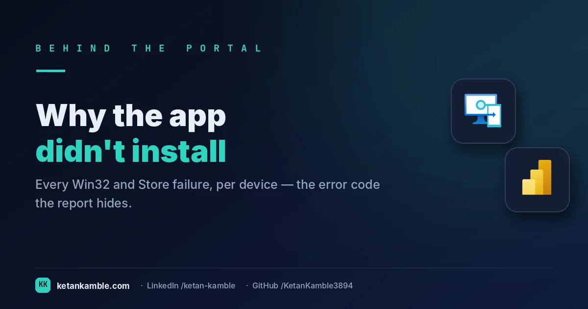
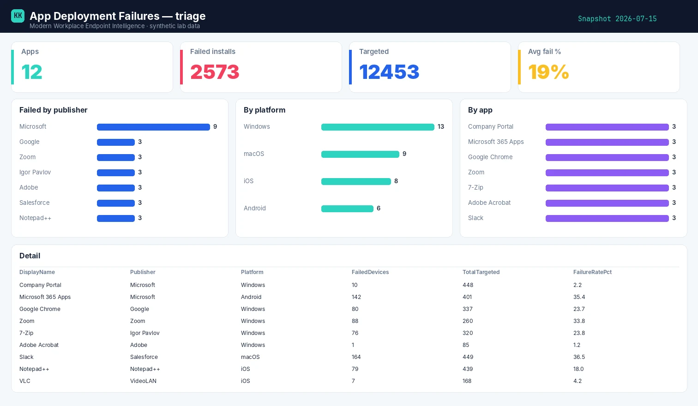

# Which app is failing, and why: turning Intune app errors into a triage board

{ .post-cover width="1200" height="630" fetchpriority=high }

Intune's app install status is a sea of red per-device rows. What it won't tell you at a glance is *which app is the problem*, *how bad*, and *who should fix it*. This is the read-only collector that rolls every failure up per app and triages it into a category, an owner, and a remediation.

<!-- more -->

<iframe scrolling="no" src="/assets/hooks/app-deployment-failures.html" title="Animated: 10,000 per-device app errors versus a per-app triage board" loading="lazy" style="display:block;width:100%;aspect-ratio:1200/470;border:0;border-radius:16px;box-shadow:0 10px 30px rgba(0,0,0,.35)"></iframe>

!!! success "The payoff"
    Triaging app-install failures device-by-device is hours of scrolling per incident. Rolling them up per app surfaces the worst offender in one view — fix a single package with a 25–40% failure rate and thousands of individual device errors clear at once. *(Illustrative.)*

!!! tip "The short version"
    Intune shows app failures device-by-device. This read-only collector aggregates per app — failed vs installed vs targeted, a failure rate, and a triage category with an owner and a fix — so you act on the worst app, not scroll rows. **No write access, no live tenant in the report.**

## Why the portal doesn't hand you this

- **It's per-device, not per-app.** You can see one machine failed an install; you can't easily see "this app is failing on 40% of targets".
- **Error codes aren't answers.** A hex code per device isn't a plan — it needs mapping to a category, a likely cause, and an owner.
- **No prioritisation.** The console doesn't rank apps by blast radius, so the loudest failure — not the biggest — gets attention.

## What's different about this report

One row per **app** — from the `AppInstallStatusAggregate` report: failed devices, installed, total targeted, and a **failure rate**, plus the publisher and platform. The rate is *failed ÷ applicable*, where *applicable* is every device the app should have reached — failed + installed + notInstalled + pending. Devices marked **notApplicable** (wrong platform, or unmet requirement rules) are left out, so they can't dilute the number. Sort by failed count and the worst offender is line one — the triage the per-device view can't give you.

For example, one row might read **Contoso VPN Client · 412 targeted (400 applicable) · 96 failed · 24.0% fail rate**, and the next **Adobe Reader · 2,000 applicable · 12 failed · 0.6%** — telling you at a glance to chase the VPN client, not the noisy-but-harmless Reader errors. (96 ÷ 400 = 24.0%; the 12 non-applicable devices are excluded from the denominator.)

## How it works: a read-only collector

--8<-- "assets/diagrams/app-deployment-failures.svg"

The read-only Graph roles are all `.Read.All`: `DeviceManagementApps.Read.All` for the apps and install reports, and `DeviceManagementManagedDevices.Read.All` for the device join. Nothing writes — the `POST` to `/deviceManagement/reports/exportJobs` is simply how Intune hands you a report (you request the export, then `GET` the file); it's a read-*export* that changes nothing in the tenant. (Graph's beta reporting endpoints don't cleanly document the scope the export call maps to, so confirm the exact read role against your own app.)

!!! warning "Verify before you trust it"
    The rollup uses the **`AppInstallStatusAggregate`** reports export job (per-app counts); for
    device-level detail on a single app it's `DeviceInstallStatusByApp` filtered to that `applicationId`
    (one export per app — you can't pull the whole fleet at once). Export schemas evolve, so confirm the
    report and columns in your **own lab tenant**. Every figure in the screenshots is **synthetic lab data** (`@contoso.com`).

## The Power BI report

The report ranks the fleet's app pain: failed installs by publisher, by platform, and by app, with a table sorted so the highest-impact failure sits at the top.

{ .kk-zoom loading=lazy width="1512" height="880" }

*Template + build kit on the **[App Deployment Failures report page](../../powerbi/app-deployment-failures-report.md)**.*

## Gotchas from the lab

- **Rate without volume misleads.** 100% failure on a 2-device pilot isn't your fire; 20% on a 600-device rollout is.
- **Platform matters.** The same app can be healthy on Windows and broken on iOS — always keep the platform column.
- **Count devices, not attempts.** A device that retried five times is one failing device, not five.

## Reproduce it yourself

The [synthetic fleet generator](../../scripts/synthetic-fleet.md) can emit a realistic, entirely
fictional `App_Deployment_Failures.csv` so you can build and demo the whole report before pointing it at real data.

## FAQ

**How is the failure rate calculated?** failed ÷ applicable, where applicable excludes notApplicable devices (wrong platform / unmet requirements) so they don't dilute the number.

**Can I get device-level detail for one app?** Yes — a separate `DeviceInstallStatusByApp` export filtered to that `applicationId`, one app at a time.

**Does a retrying device count multiple times?** No — count devices, not attempts; a device that retried five times is one failing device.

## More in this series

- [Where Autopilot actually breaks](../autopilot-operations/)
- [Which devices can't take Windows 11](../windows11-readiness/)

## Related

- :material-script-text: **The script** → [App Deployment Failures](../../scripts/app-deployment-failures.md)
- :material-chart-box: **The report + template** → [App Deployment Failures report](../../powerbi/app-deployment-failures-report.md)
- :material-shield-lock: **The bigger picture** → [Zero-Access Agent](../../projects/zero-access-agent/index.md)
- :material-robot-outline: **The capstone** → [The read-only AI agent that can't touch your tenant](../the-read-only-ai-agent-that-cant-touch-your-tenant/)

---

*Screenshots use synthetic data from a personal lab — no real tenant, users, or devices. Independent
content, not affiliated with, sponsored by, or endorsed by Microsoft. Microsoft, Intune, Entra,
Microsoft Graph, Azure, Defender and Power BI are trademarks of the Microsoft group of companies.*
