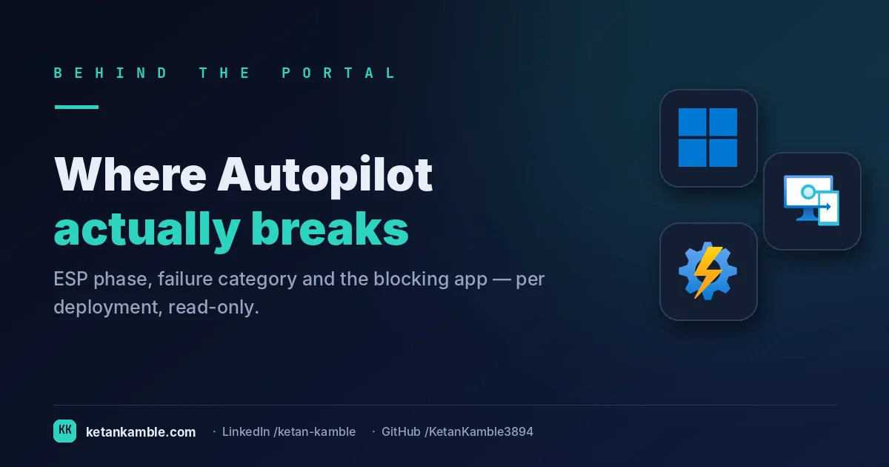
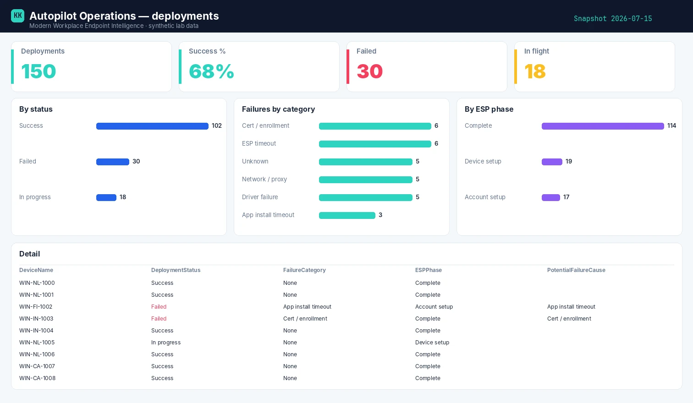

# Where Autopilot actually breaks: ESP phase, failure category, per deployment

{ .post-cover width="1200" height="630" fetchpriority=high }

When an Autopilot build fails, the technician sees a spinning ESP and a vague error. What the fleet owner needs is the pattern: *which phase* deployments die in, *which category* of failure dominates, and *which app* keeps timing out. This read-only collector turns Autopilot events into that operational picture.

<!-- more -->

!!! tip "The short version"
    Autopilot failures are opaque one device at a time. This read-only collector reads deployment events and ESP state, classifies each into a **phase** and a **failure category** with a likely cause, and flags what's still **in flight** — so you fix the pattern, not the panic. **No write access, no live tenant in the report.**

## Why the portal doesn't hand you this

- **The ESP hides the phase.** A stuck build looks the same whether it died in **device preparation**, **device setup**, or **account setup** — the console won't tell you which of the three dominates your failures.
- **App timeouts are the usual culprit, unnamed.** Most ESP failures trace to a blocking app, but you can't see *which app* across the fleet from the portal.
- **No in-flight vs done split.** "Failed" and "still running" blur together, so you can't tell a real failure rate from deployments simply mid-build.

## What's different about this report

One row per deployment: the **status**, the **ESP phase** it reached, a **failure category** and cause, the count of blocking app failures, and an **in-flight** flag — the operational breakdown that turns "Autopilot is flaky" into "fix the app that times out in device setup".

For example, a row might read **Deployment 8821 · Failed · phase: Device setup · category: App install timeout (Contoso VPN) · 1 blocking app** — the ESP didn't fail because Autopilot is flaky, it died waiting on one Win32 app. Find that app across the failures and the rate collapses.

## How it works: a read-only collector

--8<-- "assets/diagrams/autopilot-operations.svg"

The read-only Graph roles are all `.Read.All`: `DeviceManagementManagedDevices.Read.All` covers the `autopilotEvents` (the least-privileged permission that endpoint accepts — Microsoft doesn't document a dedicated scope for it, but this read-only role is what Graph grants it under), `DeviceManagementConfiguration.Read.All` the ESP and enrolment configuration, and `DeviceManagementApps.Read.All` the blocking apps. Nothing writes.

!!! warning "Verify before you trust it"
    `autopilotEvents` and ESP run states are **beta** endpoints and evolve. The failure **categories are
    derived** by the runbook from the event state plus the blocking-app join — they're operator-defined,
    not a native Graph field — so confirm the event states and phase names in your **own lab tenant**
    before trusting the categorisation. Every figure in the screenshots is **synthetic lab data** (`@contoso.com`).

## The Power BI report

The report is an operations dashboard: deployments by status, failures by category, and by ESP phase, with a table that filters to any failing phase so you can chase the one blocking app.

{ .kk-zoom loading=lazy width="1512" height="880" }

*Template + build kit on the **[Autopilot Operations report page](../../powerbi/autopilot-operations-report.md)**.*

## Gotchas from the lab

- **In-flight isn't failed.** Exclude live builds from your failure rate or every busy enrolment day looks like an outage.
- **The phase points at the cause.** Device *preparation* failures are usually enrolment / Entra join; *device setup* is device-targeted apps, drivers and certs; *account setup* is user-targeted apps and policy — the phase is your first triage.
- **One app can dominate.** A single blocking Win32 app timing out can account for most ESP failures — find it and the rate collapses.

## Reproduce it yourself

The [synthetic fleet generator](../../scripts/synthetic-fleet.md) can emit a realistic, entirely
fictional `Autopilot_Operations_Detailed.csv` so you can build and demo the whole report before pointing it at real data.

!!! question "Want your Autopilot failures broken down like this?"
    Turning ESP failures into a phase-and-cause operations report is hands-on Intune work I do in the open. This runs today against real multi-thousand-device tenants. **[Work with me →](../../work-with-me.md)**

## FAQ

**Does it read live Autopilot state?** It reads `autopilotEvents` and ESP status through Graph, read-only — no live control-plane connection in the report.

**Are the failure categories official Graph fields?** No — they're derived by the runbook from the event state plus the blocking-app join, so confirm the event states in your lab.

**Why separate in-flight from failed?** A live build isn't a failure; excluding in-flight keeps a busy enrolment day from looking like an outage.

## More in this series

- [Which app is failing, and why](../app-deployment-failures/)
- [Which devices can't take Windows 11](../windows11-readiness/)

## Related

- :material-script-text: **The script** → [Autopilot Operations](../../scripts/autopilot-operations.md)
- :material-chart-box: **The report + template** → [Autopilot Operations report](../../powerbi/autopilot-operations-report.md)
- :material-shield-lock: **The bigger picture** → [Zero-Access Agent](../../projects/zero-access-agent/index.md)
- :material-robot-outline: **The capstone** → [The read-only AI agent that can't touch your tenant](../the-read-only-ai-agent-that-cant-touch-your-tenant/)

---

*Screenshots use synthetic data from a personal lab — no real tenant, users, or devices. Independent
content, not affiliated with, sponsored by, or endorsed by Microsoft. Microsoft, Intune, Entra,
Microsoft Graph, Azure, Defender and Power BI are trademarks of the Microsoft group of companies.*
