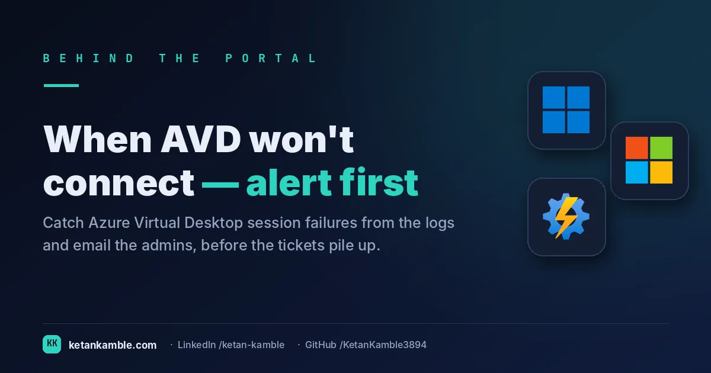

# When AVD won't connect: alerting on the failure before the tickets

{ .post-cover width="1200" height="630" fetchpriority=high }

When Azure Virtual Desktop stops letting people in, you usually find out the worst way: a wave of "I can't connect" tickets, twenty minutes after it started. But the session hosts already *told* you — the failure is sitting in the `WVDErrors` table in Log Analytics the moment it happens. This is a small, read-only Log Analytics alert that watches for the two errors that actually mean "sessions are failing" and emails the AVD admins the instant they appear. Call it version 1: deliberately simple, and shipped early.

<!-- more -->

<div class="hook-embed" markdown="0">
<iframe src="/assets/hooks/avd-connection-failure-alert.html" title="Animated: AVD failures found from the ticket wave — versus an alert that fires from the logs first" loading="lazy" style="width:100%;aspect-ratio:1200/470;border:0;border-radius:16px;box-shadow:0 10px 30px rgba(0,0,0,.35)"></iframe>
</div>

!!! success "The payoff"
    Without it, you learn about an AVD outage from a wave of tickets about **20 minutes** in; with it, the
    alert fires at the **first failure**. On a busy host pool that's the difference between a ~20-minute
    blind window — dozens of tickets, users stuck — and a **near-zero time-to-know**, fixing it before the
    queue forms. *(Illustrative.)*

!!! tip "The short version"
    A scheduled **Log Analytics alert rule** runs a short KQL query against `WVDErrors` every few
    minutes. If it sees `ERROR_SHARING_VIOLATION` or `ConnectionFailedNoHealthyRdshAvailable`, it fires
    a **Critical** alert to an action group that emails the AVD admins — with the host pool, machine and
    user already extracted. It only **reads** the logs; it changes nothing.

## Why these two errors

Not every AVD error means users are blocked. These two do, and they're the ones worth waking someone for:

- **`ConnectionFailedNoHealthyRdshAvailable`** — the connection broker couldn't find a healthy session host to place the user on. When this shows up, people are being turned away at the door: no capacity, drained hosts, or hosts failing their health check.
- **`ERROR_SHARING_VIOLATION`** — a file/profile sharing violation, classically FSLogix profile-container contention. It's the quiet one that strands *specific* users mid-login while everyone else looks fine.

Alerting only on these keeps the signal high. You're not drowning in every transient blip — you're catching the two conditions that generate tickets.

## The query

The whole detector is a few lines of KQL. It filters to the two error symbols, pulls the **machine name** out of the message text and the **host pool** out of the resource ID, and projects a tidy row per failure:

```kusto
WVDErrors
| where CodeSymbolic contains "ERROR_SHARING_VIOLATION"
    or Message contains "ERROR_SHARING_VIOLATION"          // Win32 code 32 can land in Message, not CodeSymbolic
    or CodeSymbolic contains "ConnectionFailedNoHealthyRdshAvailable"
| extend MachineName  = extract("'(.*?)'", 1, Message)      // machine name out of the message text
| extend HostPoolName = extract("hostpools/(.*)", 1, _ResourceId)  // host pool out of the resource id
| project TimeGenerated, HostPoolName, MachineName, UserName, CodeSymbolic
```

The two `extract()` calls are the useful part: instead of an alert that just says "an error happened", the fired alert already carries *which host pool*, *which machine* and *which user* — so whoever gets the email can act without first going to dig through logs.

## How it works: a read-only alert

<div class="mermaid-live" markdown="0">
--8<-- "assets/diagrams/avd-connection-failure-alert.svg"
</div>

Wire the query into a **Log Analytics scheduled query alert** (Azure Monitor): scope it to your AVD Log Analytics workspace, set the condition to **table rows > 0** to catch every failure (raise it — say `> 1`, or a count over a window — if a busy tenant makes it chatty), evaluate every few minutes, severity **Critical**, and point it at an **action group** that emails your AVD admin distribution list. That's the entire moving part — the session hosts do the logging, Azure Monitor does the watching, and the alert does nothing to the environment but tell you.

!!! warning "Verify before you trust it"
    The `WVDErrors` table only exists if your AVD **diagnostic settings** are sending the *Errors*
    category to the workspace — confirm that first (the *Connections* category populates a different
    table, `WVDConnections`), or the alert will simply never fire. Confirm the two symbols match your
    data, too: `ConnectionFailedNoHealthyRdshAvailable` is a `CodeSymbolic` value, but
    `ERROR_SHARING_VIOLATION` is a Win32 error (code 32) that can surface in the **`Message`** rather
    than `CodeSymbolic` — which is why the query matches it on **both** fields. The `extract()` patterns
    depend on the **shape of the message text and resource ID**, which can change; validate them against
    a few real rows in *Logs* first. And tune the **threshold and frequency**: `rows > 0` catches every
    occurrence — raise it (`> 1`, or a count over a window) if a busy tenant makes it chatty.

## Gotchas from the lab

- **`contains` is broad on purpose, but check it.** `CodeSymbolic contains` matches substrings — fine
  here, but confirm you're not swallowing an unrelated symbol that happens to share the text.
- **No data is not the same as no errors.** If diagnostics break or the workspace stops ingesting, the
  query returns nothing and the alert stays quiet — a silent alert can mean "all healthy" *or* "I've
  gone blind." Pair it with a heartbeat check on ingestion.
- **It tells you, it doesn't fix.** Deliberately. The alert's job is to shorten the gap between "sessions
  are failing" and "a human knows"; the remediation (scale, drain, restart, FSLogix cleanup) stays a
  human decision.
- **Room to grow.** The obvious next steps — dedupe repeated alerts, correlate by host pool, or
  enrich with host health — are exactly that: next versions. Shipping the simple, reliable one first
  beats a clever one that never gets finished.

## Reproduce it yourself

Confirm AVD diagnostics are flowing to a workspace, paste the KQL into **Logs** and run it against a
recent window to see the shape of the results, then create the scheduled alert rule around it and test
with a low threshold. No portal screenshots here on purpose — the query and the rule settings are the
whole recipe, and they're yours to point at your own workspace.

## FAQ

**Does this change anything in my AVD environment?** No. It's a read-only Log Analytics alert — it queries logs and sends an email. Remediation stays a human decision.

**Why alert on only two errors?** They're the two that actually mean users are being blocked (no healthy host, or a profile sharing violation). Alerting narrowly keeps the signal high and the noise low.

**What if the alert never fires?** Check that AVD diagnostic settings are sending errors to the workspace — no `WVDErrors` data means nothing to match. Pair it with an ingestion heartbeat so silence is trustworthy.

## More in this series

- [Where Autopilot actually breaks](../where-autopilot-actually-breaks-esp-phase-failure-category-per-deployment/)

<script type="application/ld+json">
{
  "@context": "https://schema.org",
  "@type": "FAQPage",
  "mainEntity": [
    {
      "@type": "Question",
      "name": "Does this change anything in my AVD environment?",
      "acceptedAnswer": {
        "@type": "Answer",
        "text": "No. It's a read-only Log Analytics alert — it queries logs and sends an email. Remediation stays a human decision."
      }
    },
    {
      "@type": "Question",
      "name": "Why alert on only two errors?",
      "acceptedAnswer": {
        "@type": "Answer",
        "text": "They're the two that actually mean users are being blocked (no healthy host, or a profile sharing violation). Alerting narrowly keeps the signal high and the noise low."
      }
    },
    {
      "@type": "Question",
      "name": "What if the alert never fires?",
      "acceptedAnswer": {
        "@type": "Answer",
        "text": "Check that AVD diagnostic settings are sending errors to the workspace — no WVDErrors data means nothing to match. Pair it with an ingestion heartbeat so silence is trustworthy."
      }
    }
  ]
}
</script>

## Related

- :material-script-text: **The query** → [AVD Connection-Failure Alert](../../scripts/avd-connection-failure-alert.md)
- :material-robot-outline: **The capstone** → [The read-only AI agent that can't touch your tenant](../the-read-only-ai-agent-that-cant-touch-your-tenant/)

---

*Examples use synthetic data from a personal lab — no real tenant, users, or devices. Independent
content, not affiliated with, sponsored by, or endorsed by Microsoft. Microsoft, Azure, Azure Virtual
Desktop and Azure Monitor are trademarks of the Microsoft group of companies.*
