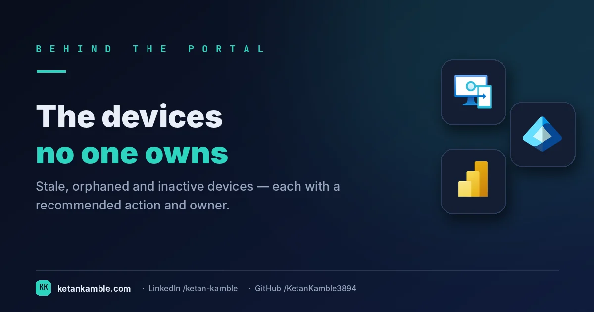
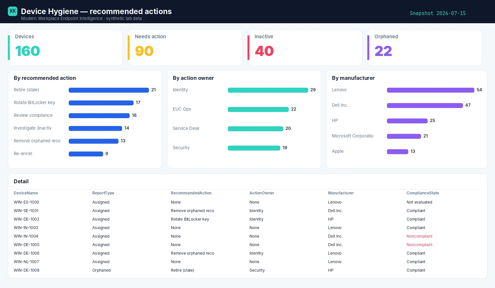

# The devices no one owns anymore: a read-only hygiene report with recommended actions

{ .post-cover width="1200" height="630" fetchpriority=high }

Every fleet accumulates cruft: laptops that stopped checking in months ago, records for devices that were wiped, machines whose owner left the company. Intune lists them all as if they're equal. This is the read-only collector that separates the living from the stale and tells you **what to do about each one**.

<!-- more -->

<iframe scrolling="no" src="/assets/hooks/device-hygiene.html" title="Animated: ghost devices counted as fleet versus a routed hygiene worklist" loading="lazy" style="display:block;width:100%;aspect-ratio:1200/470;border:0;border-radius:16px;box-shadow:0 10px 30px rgba(0,0,0,.35)"></iframe>

!!! success "The payoff"
    Every stale or orphaned device left on the books clutters your inventory and skews your compliance number. A scheduled hygiene report turns hundreds of ghosts into a routed worklist — a retire / re-enrol decision with an owner — instead of a manual audit that never quite happens. *(Illustrative.)*

!!! tip "The short version"
    Intune's device list treats a healthy laptop and a six-months-stale orphan the same. This read-only collector classifies each device — assigned vs orphaned, active vs inactive — joins the owner's account status, and emits a **recommended action** and an **owner team** per row. **No write access, no live tenant in the report.**

## Why the portal doesn't hand you this

- **Stale isn't a column.** The console shows *last check-in*, but not "inactive > 30 days" as a filterable state you can act on across the fleet.
- **Orphaned records look real.** A managed-device record whose **primary user is gone (or was never set)** still shows up — and a deleted Entra *device* object is caught by correlating `managedDevice.azureADDeviceId` against Entra, one extra lookup. Either way it clutters counts and compliance numbers until someone notices.
- **"Who should fix this" is never answered.** The portal tells you a device is unhealthy; it never says *retire it*, *re-enrol it*, or *hand it to Identity*.

## What's different about this report

One row per device with a **classification** (assigned / orphaned), an **inactivity flag**, the compliance state — and crucially a computed **RecommendedAction** and **ActionOwner**. It's an offboarding worklist, not just an inventory.

For example, a row might read **ThinkPad-4471 · orphaned · inactive 142 days · owner account disabled · RecommendedAction: Retire · ActionOwner: Identity** — a leaver's laptop still on the fleet, already routed to the team that can offboard it. That single row is the whole point: the classification, the evidence, and the next action in one line.

## How it works: a read-only collector

--8<-- "assets/diagrams/device-hygiene.svg"

The read-only Graph roles are all `.Read.All`: `DeviceManagementManagedDevices.Read.All` for the devices, and `User.Read.All` / `Directory.Read.All` for the owner's account status and manager. Nothing writes.

!!! warning "Verify before you trust it"
    The recommended-action logic is **opinionated** — the thresholds (what counts as inactive, when to retire) are yours to set. Confirm they match your policy in your **own lab tenant** first. Every figure in the screenshots is **synthetic lab data** (`@contoso.com`).

## The Power BI report

The report is a triage board: devices by recommended action, by owner team, and by manufacturer, with a table you can hand straight to whoever owns the cleanup.

{ .kk-zoom loading=lazy width="1512" height="880" }

*Template + build kit on the **[Device Hygiene report page](../../powerbi/device-hygiene-report.md)**.*

## Set it up, step by step

You don't build this one from scratch. Every collector shares the same read-only plumbing, so you set that up **once** — after that, adding this report is about a five-minute job.

1. **One-time — stand up the collection layer.** Follow **[Setting up the collection layer](../../projects/zero-access-agent/azure-automation-setup.md)**: an Azure Automation account, a system-assigned **Managed Identity** (no secrets, no app registration), and a storage account for the CSV snapshots. You only do this once, however many collectors you end up running.
2. **Grant this collector's read-only scopes.** In that guide's role-assignment step, add the scopes this one needs — `DeviceManagementManagedDevices.Read.All`, `Directory.Read.All` and `User.Read.All`. Every one ends in `.Read.All`: it reads, and never writes to your tenant. (Running more than one collector? Scopes are **additive** — add the new ones, don't replace what's already granted.)
3. **Import the script as a runbook.** Take **[the script](../../scripts/device-hygiene.md)**, import it into the Automation Account as a PowerShell 7 runbook, and publish it.
4. **Schedule it.** Attach a daily (or weekly) schedule the same way the setup guide shows. It then runs unattended, dropping a dated CSV into your `root/` container each time.
5. **Point Power BI at the CSV.** Open the **[report template](../../powerbi/device-hygiene-report.md)** in Power BI Desktop and start with the bundled **synthetic sample**, so you can build the whole thing before touching real data. To switch to live data, use **Get Data → Azure Blob Storage** and point it at the dated CSV in your `root/` container (the setup guide has the storage account and connection details). Refresh, and that's your dashboard.

No secrets, no app registration, nothing that can change your tenant — just a scheduled read and a CSV that Power BI draws from.

## Gotchas from the lab

- **Inactivity is a threshold, not a fact.** Pick a day count and own it — 30 days for laptops may be wrong for rarely-used kiosks.
- **Orphaned records skew every other report.** Filter them out of compliance percentages, or they drag your numbers down for devices that don't exist.
- **A disabled — or deleted — owner is the strongest signal.** Device still enrolled + owner's account disabled = a leaver's machine still on the fleet. Watch for hard-deleted users too: `GET /users/{id}` then returns **404**, which you should treat as "gone", not skip.

## Reproduce it yourself

The [synthetic fleet generator](../../scripts/synthetic-fleet.md) can emit a realistic, entirely
fictional `IntuneDeviceHygiene.csv` so you can build and demo the whole report before pointing it at real data.

## FAQ

**How do you decide a device is "inactive"?** You set the threshold — the runbook flags it, but the day count (say 30 days) is your policy to own.

**What makes a record "orphaned"?** A managed device whose primary user is gone or was never set, or whose Entra device object was deleted — it clutters counts until someone acts.

**Is the recommended action automatic?** The report computes a suggested action and owner from your thresholds; acting on it is still a human decision.

## More in this series

- [Who's missing an Intune license](../whos-missing-an-intune-license-finding-the-devices-slipping-through/)
- [One row per device](../one-row-per-device-building-the-inventory-intune-wont-hand-you/)

## Related

- :material-script-text: **The script** → [Device Hygiene](../../scripts/device-hygiene.md)
- :material-chart-box: **The report + template** → [Device Hygiene report](../../powerbi/device-hygiene-report.md)
- :material-shield-lock: **The bigger picture** → [Zero-Access Agent](../../projects/zero-access-agent/index.md)
- :material-robot-outline: **The capstone** → [The read-only AI agent that can't touch your tenant](../the-read-only-ai-agent-that-cant-touch-your-tenant/)

---

*Screenshots use synthetic data from a personal lab — no real tenant, users, or devices. Independent
content, not affiliated with, sponsored by, or endorsed by Microsoft. Microsoft, Intune, Entra,
Microsoft Graph, Azure, Defender and Power BI are trademarks of the Microsoft group of companies.*
