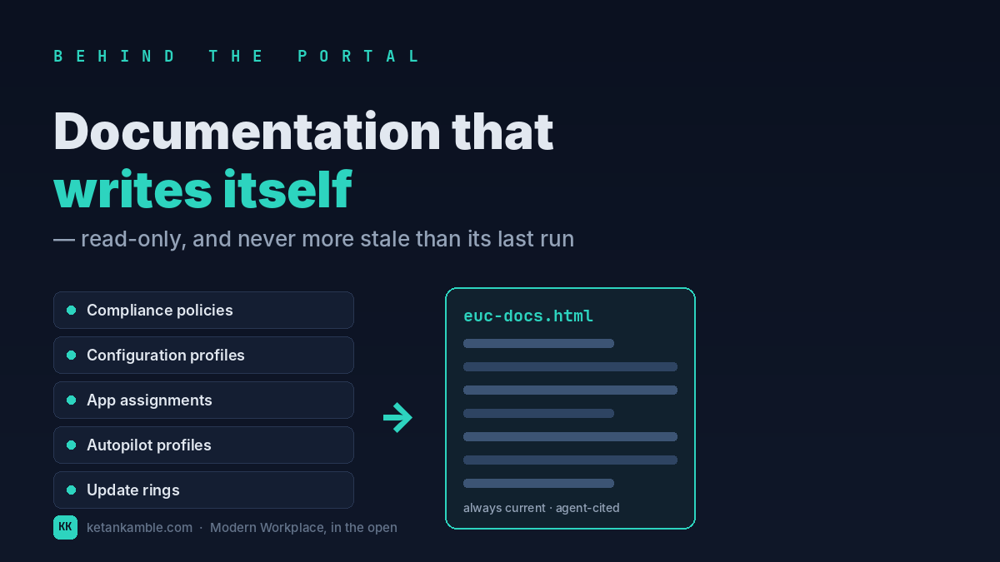
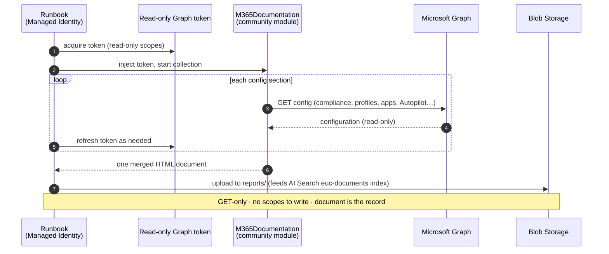

# Documentation that writes itself: a read-only snapshot of your whole Intune config

{ .post-cover }

Ask an admin for "the documentation" of their Intune tenant and you'll get a nervous laugh. It's in
the portal — spread across compliance policies, configuration profiles, app assignments, Autopilot
profiles, update rings — and the moment anyone writes it down in a Word doc, it's out of date. This
is a scheduled, **read-only** collector that renders the *entire* Intune and Windows 365 configuration
into one always-current, human-readable document.

<!-- more -->

!!! tip "The short version"
    Nobody hand-documents Intune, because it's stale before you save the file. This runbook injects a
    **read-only** Graph token into the community **M365Documentation** module, walks the config section
    by section, and renders one merged HTML document — refreshed on a schedule, **no write access, no
    live tenant in the output.** It's the *prose* half of the Zero-Access Agent's knowledge (the CSV
    snapshots are the structured half).

## Why "just look in the portal" isn't documentation

The portal always shows the *current* state — that's the problem, not the solution. It's a live
control surface, not a record. When you need to answer "what did our compliance baseline look like
before the change last month?", or hand a new engineer a single readable map of the tenant, or prove
to an auditor what was configured, the portal gives you none of it:

- **It's navigation, not narrative.** Config is scattered across a dozen blades. There's no one
  document that says, top to bottom, *here is everything this tenant enforces*.
- **Manual docs die on contact.** The instant someone edits a policy, your lovingly-maintained
  runbook or Word export is wrong — and you won't know which parts.
- **Export is per-object and lossy.** You can export a profile as JSON, but that's machine data for
  one object, not a readable account of the whole estate.

So the job is to generate the documentation *from the tenant itself*, on a schedule, read-only — so
it's never more stale than its last run.

## Standing on community shoulders

This collector doesn't reinvent the documentation engine — it uses the excellent, open-source
**[M365Documentation](https://github.com/ThomasKur/M365Documentation)** module by **Thomas Kurth**,
which already knows how to walk Intune and Windows 365 section by section and render them. The runbook's
job is narrower and specific to the Zero-Access Pattern: sign in as a **Managed Identity**, mint a
**read-only** Graph token, hand that token to the module, refresh it as the collection runs, and drop
the finished HTML where the agent can cite it.

!!! note "Licensing, done right"
    M365Documentation is **GPL-3.0**. This runbook only *calls* it at runtime — you install it yourself
    from the PowerShell Gallery — so the module's source is never copied into the project, and the
    runbook stays MIT. Credit where it's due — and because you install the module yourself, its source
    never enters this repo.

## How it works: a read-only collector

The read-only Graph app roles are all `.Read.All`:
`DeviceManagementConfiguration.Read.All`, `DeviceManagementApps.Read.All`,
`DeviceManagementManagedDevices.Read.All`, `Directory.Read.All`, and `Organization.Read.All` for the
connectivity self-test. Nothing writes.

!!! warning "Verify before you trust it"
    The exact scopes the module needs can shift between its versions — check against the
    [module's docs](https://github.com/ThomasKur/M365Documentation) for the version you install, and
    confirm each section renders in your **own lab tenant** first.

## Where it goes

The rendered HTML lands in the storage account's `reports/` container and feeds the **documentation**
side of the agent's knowledge — the `euc-documents` index in Azure AI Search. That's the deliberate
split at the heart of the Zero-Access Agent: **structured CSV snapshots** answer *"how many, which,
where"*; this **prose documentation** answers *"how is it configured, and why"*. The agent reads both,
and holds no live connection to either.

## Gotchas from the lab

- **It's a document, not a dashboard.** There's no Power BI here on purpose — the output is prose you
  read (or the agent cites), not numbers you slice.
- **Install the module's dependencies first.** M365Documentation leans on MSAL.PS, PSWriteOffice and
  PSHTML — load them into the Automation Account from PSGallery before the first run, or the runbook
  stops at import.
- **Token refresh mid-collection matters.** A full tenant walk can outlast a single token; the runbook
  refreshes as it goes, so long collections don't die halfway.

## Related

- :material-script-text: **The script** → [Intune Documentation](../../scripts/intune-documentation.md)
- :material-shield-lock: **The bigger picture** → [Zero-Access Agent](../../projects/zero-access-agent/index.md) — where the prose and the snapshots come together.
- :material-open-source-initiative: **Credit** → [M365Documentation by Thomas Kurth](https://github.com/ThomasKur/M365Documentation)
