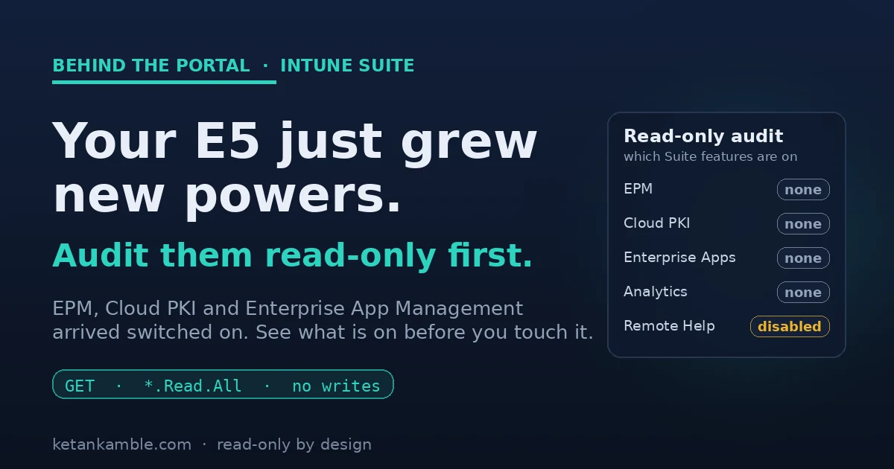

# Audit your new Intune Suite features, read-only first

{ .post-cover width="1200" height="630" fetchpriority=high }

Around the start of July, a few of our Microsoft 365 E5 tenants quietly grew some new powers. Nobody deployed anything. Microsoft just included a batch of advanced Intune Suite capabilities as part of the license, and there they were. My first reaction was not "great, let's turn them on". It was "hang on, what exactly is available now, and who can already touch it?"

That question, what is on before I start changing things, is the whole point of this post. Before you configure a single new policy, it is worth taking a read-only look at what the license just handed you.

<!-- more -->

<div class="hook-embed" markdown="0">
<iframe scrolling="no" src="/assets/hooks/intune-suite-read-only-audit.html" title="Before and after: advanced Intune Suite features arrive switched on at the license level with their state unknown; a read-only Graph audit then lists which are actually present and assigned before anyone enables them" loading="lazy" style="display:block;width:100%;aspect-ratio:1200/470;border:0;border-radius:16px;box-shadow:0 10px 30px rgba(0,0,0,.35)"></iframe>
</div>

!!! tip "The short version"
    On 1 July 2026 Microsoft started including advanced Intune capabilities in Microsoft 365 E3 and E5 at no extra cost. E3 gets Remote Help, Advanced Analytics and Intune Plan 2. E5 gets those plus Endpoint Privilege Management, Cloud PKI and Enterprise App Management. Before you enable any of it, run a read-only Graph audit (one identity, only `*.Read.All` scopes, five GET calls) to see which features are already present and assigned in your tenant. Reading first is the cheapest governance there is.

## What actually changed, and the tier split people keep getting wrong

On 1 July 2026, Microsoft started including a defined set of advanced Intune capabilities in Microsoft 365 E3 and E5, at no extra cost. It was announced back in December 2025, it rolls out per tenant with a 30-day notice in the Message Center, and by late August most existing tenants already have it. It's an inclusion, not a trial, and nobody has to click anything to receive it.

The bit that trips people up is that E3 and E5 do not get the same things.

Microsoft 365 E3 (through EMS E3) gets:

- Remote Help
- Advanced Analytics. This is the Device Query and near-real-time analytics capability. It layers on top of the classic Endpoint Analytics reports rather than replacing them, so do not read one as the other.
- Intune Plan 2, which brings Microsoft Tunnel for MAM, specialty and purpose-built device management, and firmware-over-the-air updates for supported Zebra devices.

Microsoft 365 E5 gets all of the above, plus three that are E5 only:

- Endpoint Privilege Management (EPM)
- Microsoft Cloud PKI
- Enterprise App Management

So if you read a post telling you E3 now has EPM or Cloud PKI, it's wrong. Those three are E5. (Security Copilot in Intune is a separate story and may still need its own licensing.)

## Why read-only first, and not "let's enable it"

Here's the thing about a capability that arrives switched on at the license level. It's available, but that doesn't mean anyone configured it, assigned it, or is watching it. EPM is the sharp example. The moment your admins realise it's there, someone will want to build an elevation rule. Before that happens you want to know whether an EPM policy already exists and who it's assigned to. Cloud PKI, is there a certification authority sitting there already? Enterprise App Management, any catalog apps in the tenant?

None of that needs you to change anything. It's a read, and a read can't push a policy or hand an admin the wrong answer. You can't make a sensible call about a feature you haven't inventoried.

## A gotcha before you start: your admin role is not the scope

Here is something worth knowing before you run anything, because it caught me out and it makes the whole point for me. I opened Graph Explorer signed in as Global Administrator and Intune Administrator, ran the first read, and got a flat `403 Forbidden`:

```text
"code": "Forbidden",
"message": "Application is not authorized to perform this operation.
 Application must have one of the following scopes:
 DeviceManagementConfiguration.Read.All ..."
```

My account had every role you could want, and it still could not read. That is because the role I hold and the scope the app holds are two different things. Graph Explorer (the app acting on my behalf) had not been granted `DeviceManagementConfiguration.Read.All`, so the read was refused no matter who I was. You consent the scope to the app once, and then it works.

That is least privilege doing its job, and it is exactly the model this whole audit runs on: the thing doing the reading gets a specific read scope and nothing more, and even an all-powerful human is bound by what the app was granted.

## What the audit looks like end to end

<div class="mermaid-live" markdown="0">
--8<-- "assets/diagrams/intune-suite-read-only-audit.svg"
</div>

On the left are the five capabilities the license switched on, none of which anyone has looked at yet. In the middle sits the audit. It only holds `*.Read.All` scopes and only fires GET calls, so it can list all five without touching them. On the right is what comes back, a plain list of what's actually there. Nothing in that path writes.

## The read-only audit

It's not complicated. One identity that only holds `*.Read.All` scopes, a few GET calls, and one line per feature saying whether it's there and, where it applies, what state it's in. It doesn't enable or change anything.

The scopes it needs, all read. I ran each of these against a live Intune Plan 1 tenant to confirm the paths resolve and the scopes are right. Everything came back empty, which is the clean-baseline case shown below:

- `DeviceManagementConfiguration.Read.All` (EPM policies)
- `DeviceManagementApps.Read.All` (Enterprise App Management)
- `DeviceManagementCloudCA.Read.All` (Cloud PKI)
- `DeviceManagementManagedDevices.Read.All` (Advanced Analytics)
- `DeviceManagementServiceConfig.Read.All` (Remote Help)

```powershell
# READ-ONLY Intune Suite audit. Only *.Read.All scopes. Nothing here enables or changes anything.
Connect-MgGraph -Scopes `
  "DeviceManagementConfiguration.Read.All","DeviceManagementApps.Read.All", `
  "DeviceManagementCloudCA.Read.All","DeviceManagementManagedDevices.Read.All", `
  "DeviceManagementServiceConfig.Read.All"

$b = "https://graph.microsoft.com/beta"
function Get-All($uri) {
  $out=@(); do { $p=Invoke-MgGraphRequest -Method GET -Uri $uri; $out+=$p.value; $uri=$p.'@odata.nextLink' } while ($uri); $out
}
$rows = @()

# EPM: match the template family client-side, so we do not depend on a beta $filter expression.
$pol = Get-All "$b/deviceManagement/configurationPolicies"
$epm = $pol | Where-Object { "$($_.templateReference.templateFamily)" -match 'PrivilegeManagement' }
$rows += [pscustomobject]@{ Feature="Endpoint Privilege Management"; State= if ($epm) { "$(@($epm).Count) policy(ies)" } else { "none" } }

# Enterprise App Management: catalog-sourced apps carry a *Catalog @odata.type.
$apps = Get-All "$b/deviceAppManagement/mobileApps"
$eam  = $apps | Where-Object { "$($_.'@odata.type')" -match 'Catalog' }
$rows += [pscustomobject]@{ Feature="Enterprise App Management"; State= if ($eam) { "$(@($eam).Count) catalog app(s)" } else { "none" } }

# Cloud PKI: any certification authorities present?
$ca = Get-All "$b/deviceManagement/cloudCertificationAuthority"
$rows += [pscustomobject]@{ Feature="Cloud PKI"; State= if ($ca) { "$(@($ca).Count) CA(s)" } else { "none" } }

# Endpoint Analytics baselines answer even without the Advanced Analytics Suite feature, so this only proves the analytics surface responds.
$base = Get-All "$b/deviceManagement/userExperienceAnalyticsBaselines"
$rows += [pscustomobject]@{ Feature="Endpoint Analytics baselines"; State= if ($base) { "$(@($base).Count) baseline(s)" } else { "none" } }

# Remote Help is a singleton with a real on/off state, not a collection.
$rh = Invoke-MgGraphRequest -Method GET -Uri "$b/deviceManagement/remoteAssistanceSettings"
$rows += [pscustomobject]@{ Feature="Remote Help"; State= $rh.remoteAssistanceState }

$rows | Format-Table -AutoSize
```

## What it looks like on a clean tenant

Run it against a tenant where nobody has touched these yet and you get exactly the baseline you want to capture:

```text
Feature                        State
-------                        -----
Endpoint Privilege Management  none
Enterprise App Management      none
Cloud PKI                      none
Endpoint Analytics baselines   none
Remote Help                    disabled
```

That is the "before" picture. Nothing is configured, Remote Help is off, and now anything that appears later is a deliberate change you can point at, not a surprise. On a tenant where people have already started, the same table tells you who got there first.

## What a populated result looks like

Empty is the easy case. Here's the shape you get on a tenant where people have already started, with synthetic values:

```text
Feature                        State
-------                        -----
Endpoint Privilege Management  2 policy(ies)
Enterprise App Management      5 catalog app(s)
Cloud PKI                      1 CA(s)
Endpoint Analytics baselines   3 baseline(s)
Remote Help                    enabled
```

Now the audit is earning its keep. Two EPM policies and a live CA are things someone stood up, and you found them by reading rather than by waiting for an incident. The two matches that do the real work here are documented values, not guesses: an EPM policy carries `templateReference.templateFamily = endpointPrivilegeManagement`, and a catalog app from Enterprise App Management shows an `@odata.type` of `#microsoft.graph.win32CatalogApp`. That's why the script matches on those strings.

For anything that shows up, the next read is the assignment. Add `?$expand=assignments` to the EPM call and you get who the elevation actually lands on:

```text
Policy:      Standard user elevation
Assigned to: grp-Standard-Users  (include)
Excluded:    grp-Pilot-IT        (exclude)
```

Still a read. You now know a policy exists, roughly what it does, and who it hits, and you haven't touched a thing.

## What to look for in the results

- EPM showing policies already? Someone has been experimenting. Add `?$expand=assignments` to that call and find out who the elevation hits.
- Cloud PKI with a live CA? That is issuing certificates. Know it exists before it becomes load-bearing.
- Enterprise App Management catalog apps? Check whether any are set to auto-update, so a silent update wave does not catch you out.
- Remote Help `enabled` when you expected `disabled`? Worth a conversation about who can start a remote session and against which devices.
- Everything `none`? Good. You have a clean baseline, and you enable things on purpose instead of by accident.

## The honest caveats

- Read-only takes the write risk off the table, but it doesn't remove every risk. These reads still surface configuration and assignments, so keep the audit identity on least privilege and put its output somewhere access-controlled.
- These are beta Graph endpoints today. I confirmed each path resolves and each scope is right on a live Intune Plan 1 tenant, but pin to them on purpose, expect the shape to change, and re-check in your own.
- "None" means different things by tier, so read the result in context. On my Plan 1 tenant every call returned cleanly and empty, which is the useful part: the audit is safe to run anywhere, it doesn't error just because a feature isn't licensed. But on E5, a `none` against EPM, Cloud PKI or Enterprise App Management means you have the feature and haven't configured it yet. On E3 or standalone Intune, those three aren't in your tier, so `none` there means not licensed, not just not set up.
- Advanced Analytics is the soft one. The baseline analytics endpoints respond whether or not the Suite feature is licensed, so that line confirms the analytics surface is there, not that the paid Device Query capability is active. Confirm that part in the portal.
- Availability is per tenant and phased. If a feature is not showing yet, your tenant may still be inside the rollout window through August 2026.

## Why this is the pattern, not a one-off

This is the same move I make with everything on this site. When something new shows up, the first thing I point at it can only read. It shows me what's there and who it's assigned to, and it can't change a thing even if I fat-finger it. I'd rather know what's on before I touch it.

## References, Microsoft documentation

- **Microsoft 365 adds advanced Microsoft Intune solutions at scale** (Microsoft Intune Blog, 4 December 2025): [techcommunity.microsoft.com](https://techcommunity.microsoft.com/blog/microsoftintuneblog/microsoft-365-adds-advanced-microsoft-intune-solutions-at-scale/4474272)
- **Advanced Microsoft Intune capabilities now available in Microsoft 365 E3 and E5** (Microsoft Intune Blog, 1 July 2026): [techcommunity.microsoft.com](https://techcommunity.microsoft.com/blog/microsoftintuneblog/advanced-microsoft-intune-capabilities-now-available-in-microsoft-365-e3-and-e5/4529335)
- **Microsoft Graph permissions reference**, the `.Read.All` scopes this audit holds: [learn.microsoft.com](https://learn.microsoft.com/en-us/graph/permissions-reference)

<script type="application/ld+json">
{
  "@context": "https://schema.org",
  "@type": "FAQPage",
  "mainEntity": [
    {
      "@type": "Question",
      "name": "Does Microsoft 365 E3 include Endpoint Privilege Management or Cloud PKI?",
      "acceptedAnswer": {
        "@type": "Answer",
        "text": "No. Endpoint Privilege Management, Cloud PKI and Enterprise App Management are Microsoft 365 E5 only. Microsoft 365 E3 gains Remote Help, Advanced Analytics and Intune Plan 2 (Microsoft Tunnel for MAM, specialty device management and Zebra firmware-over-the-air updates)."
      }
    },
    {
      "@type": "Question",
      "name": "When did advanced Intune Suite features arrive in Microsoft 365 E3 and E5?",
      "acceptedAnswer": {
        "@type": "Answer",
        "text": "Effective 1 July 2026, announced in December 2025. It rolls out per tenant with a 30-day notice in the Message Center, and is auto-provisioned at no extra cost for eligible E3 and E5 tenants. It is an inclusion, not a trial."
      }
    },
    {
      "@type": "Question",
      "name": "Why do I get a 403 in Graph Explorer even as Global Administrator?",
      "acceptedAnswer": {
        "@type": "Answer",
        "text": "Your directory role and the app's scope are two different things. Graph Explorer acts as an application, and until you consent the specific delegated scope (for example DeviceManagementConfiguration.Read.All) to it, the read is refused no matter which admin roles you hold."
      }
    },
    {
      "@type": "Question",
      "name": "Does a read-only Intune Suite audit change anything in my tenant?",
      "acceptedAnswer": {
        "@type": "Answer",
        "text": "No. It runs with only .Read.All scopes and issues GET calls, so it can list which features are present and assigned but cannot enable, configure or change anything."
      }
    }
  ]
}
</script>

---

*Personal lab pattern. All examples use synthetic values, there is no real tenant, user or device here. Uses Microsoft Graph beta endpoints that can change, so verify in your own tenant. Independent content, not affiliated with, sponsored by, or endorsed by Microsoft. Microsoft, Intune, Entra, Microsoft Graph and Azure are trademarks of the Microsoft group of companies.*
