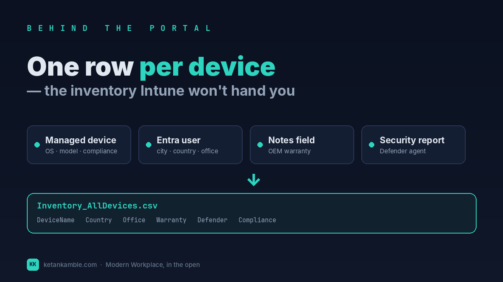
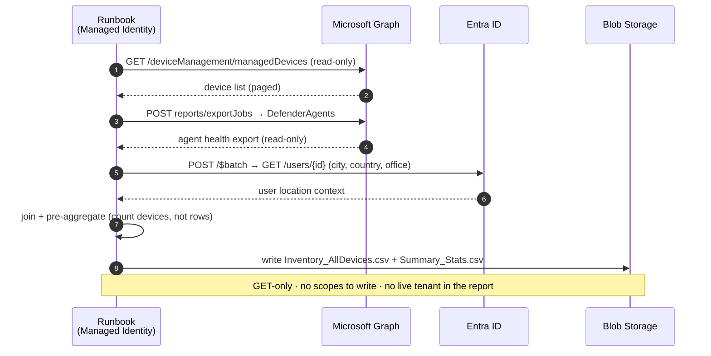

# One row per device: building the inventory Intune won't hand you

{ .post-cover }

Every fleet question starts the same way — *how many devices, running what, owned by whom, and
where do they sit?* Intune knows all of it. The problem is it knows each part in a **different
place**: the OS on the device blade, the user's country in Entra, the warranty in a Notes field, the
Defender agent in a security report. This is the read-only collector that joins them into **one flat
row per device** you can actually slice.

<!-- more -->

!!! tip "The short version"
    Intune's **All devices** list is a *screen*, not a *dataset*. This scheduled, read-only collector
    joins managed devices with the user's location (Entra), OEM warranty (Notes) and Defender agent
    health into a single sliceable table — **no write access, no stored secrets, no live tenant
    connection.** It's the backbone snapshot every other report in this series leans on.

## Why this one comes first

If the non-compliance post was the flashy one, this is the *foundation*. Almost every question a
manager asks — "how old is the Lenovo estate in India?", "which offices still run Windows 10?", "how
many personal devices are unencrypted?" — is really a question about **one enriched inventory table**.
Build this once, build it well, and the rest of the reports are just different slices of it.

## The portal already has "All devices" — so what's missing?

Fair challenge. Open **Devices → All devices** and you get a perfectly good *list*: device name,
managed-by, ownership, compliance, OS, last check-in. For eyeballing a handful of machines, it's
fine. It stops being fine the moment you need to **answer a question across the fleet**, and here's
exactly where it runs out of road:

- **It's a grid, not a model.** You can sort and filter columns, but you can't *cross-tabulate* —
  "Dell devices, out of warranty, in the Madrid office, still on Windows 10" is four filters the list
  view won't combine into a number.
- **The columns you most need aren't there.** The user's **city / country / office** lives in
  **Entra**, not on the device. **OEM warranty** lives in a **Notes** field you have to open each
  device to read. **Defender agent health** lives in a **separate security report** entirely. The All
  devices list shows none of them.
- **Export gives you the list, not the joins.** Yes, you can export — but you export *those same
  columns*. The enrichment that makes the data useful still isn't in the file; you'd be VLOOKUP-ing
  three exports together by hand.
- **It's live and shape-shifting.** The list reflects this instant. There's no clean, dated snapshot
  to trend against or hand to a report that expects a stable schema.

None of this is a knock on Intune — the console is built for *managing devices*, one at a time. It
was never meant to be your reporting warehouse. So the job is to lift the same facts out **once**,
enrich them, and freeze them into a table.

## What's different about this inventory

The collector produces **one row per device** with the scattered facts already joined:

| What the portal splits up | Where it really lives | In our row |
| --- | --- | --- |
| OS, model, serial, compliance, ownership, last sync | Managed device object | ✅ columns |
| City · Country · Office | Entra user (org assignment) | ✅ `UserCity`, `UserCountry`, `UserOfficeLocation` |
| OEM warranty start / end / state | Device **Notes** field | ✅ `WarrantyState`, dates |
| Defender agent state, real-time, tamper, signature age | Intune **security report** | ✅ `Defender*` columns |

And crucially, it also writes a second file — **pre-aggregated summary stats** — that count
**devices, not rows**. (Group a joined table naïvely and one laptop with two policies becomes "two
devices"; the runbook does the distinct-count *before* the AI or the report ever sees it.)

The result is a table you can pivot any direction: devices by country, by manufacturer, by warranty
state, by OS build, by office × ownership — the slices are yours, because the joins already happened.

## How it works: a read-only collector

The shape is the same zero-access pattern as every collector in this series — **a scheduled job that
only ever reads**, pre-shapes the data, and drops a sanitized CSV where a report (or the agent) can
pick it up. Nothing is written back to the tenant.

The least-privilege scopes are read-only by design:
`DeviceManagementManagedDevices.Read.All` for the devices, Notes and reports (confirm the Defender
export-job scope in your own tenant), and `User.Read.All` for the location enrichment. Both are
**`.Read.All`** — there is no write role anywhere in the chain.

!!! warning "Verify before you trust it"
    Some device properties and the Defender export come from Graph's **beta** endpoint, which can
    change without notice. Pin to `/v1.0` where an equivalent exists and re-confirm every field in
    your **own lab tenant** before you rely on the numbers. Every figure in the screenshots below is
    **synthetic lab data** (`@contoso.com`).

## The Power BI report

Because the runbook already did the joining and the counting, the Power BI side stays thin: point at
the CSV, refresh, slice. One page answers the fleet questions the All devices list couldn't —
device counts by country and office, the manufacturer and OS-build mix, warranty exposure, and
Defender coverage — all cross-filterable from a single click.

{ .kk-zoom }

*Want the template? The **[Inventory — All Devices report page](../../powerbi/inventory-all-devices-report.md)**
has the `.pbit` and the exact build kit.*

## Gotchas from the lab

- **Count devices, not rows.** The single biggest reporting mistake here. Do your distinct counts on
  `DeviceName` (or the device id), and do them *before* the visual — not by trusting a row count.
- **"Unknown" is a finding, not a bug.** Devices with no assigned user, or a user with no office set
  in Entra, come back as `Unknown`. That blank *is* the insight — it's the shadow inventory nobody
  owns.
- **Warranty only exists where the OEM wrote it.** Warranty parsing reads the device **Notes** field;
  it's populated by a separate enrichment step, so non-OEM or un-enriched devices read `N/A`. That's
  expected, not missing data.
- **Beta drift.** A property that was there last quarter can move or vanish. Re-run the collector
  after Graph updates and diff the columns.

## Reproduce it yourself

No tenant required. The [synthetic fleet generator](../../scripts/synthetic-fleet.md) produces a
realistic `Inventory_AllDevices.csv` — the same schema, entirely fictional — so you can build and
test the whole report before you ever point it at real data.

## Related

- :material-script-text: **The script** → [Inventory — All Devices](../../scripts/inventory-all-devices.md)
- :material-chart-box: **The report + template** → [Inventory — All Devices report](../../powerbi/inventory-all-devices-report.md)
- :material-shield-lock: **The bigger picture** → [Zero-Access Agent](../../projects/zero-access-agent/index.md) — where all ten snapshots come together.
