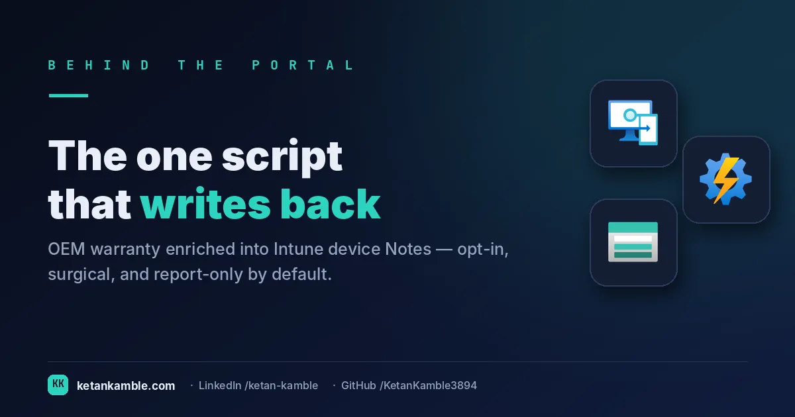

# The one script that writes: enriching Lenovo warranty into device Notes

{ .post-cover width="1200" height="630" fetchpriority=high }

Lenovo warranty isn't a field Intune gives you — so this tool looks it up by serial number and writes it into each device's **Notes**, where the read-only inventory collector and Power BI can then simply read it. It's also the one deliberate exception in this project: everything else is **read-only by construction**, with no write scope anywhere in the chain, but this single, human-run, opt-in tool *does* write to the tenant. It's fenced off in `tools/` on purpose, and being honest about it is the whole point.

<!-- more -->

<iframe src="/assets/hooks/lenovo-warranty-enrichment.html" title="Animated: warranty by hand, one device at a time — versus one runbook that writes it into Notes for the whole fleet" loading="lazy" style="width:100%;aspect-ratio:1200/470;border:0;border-radius:16px;box-shadow:0 10px 30px rgba(0,0,0,.35)"></iframe>

!!! success "The payoff"
    Looking Lenovo warranty up by hand runs about **2 minutes per device** on the support site — for a
    ~2,340-device fleet that's **~78 hours per refresh cycle**, and it's stale the moment you finish. This
    writes it into Notes **once, unattended**, so warranty lands in the Intune report *and* the CMDB with
    zero manual lookups. *(Illustrative — your fleet size sets the real number.)*

!!! tip "The short version"
    Lenovo warranty isn't a first-class Intune property. This tool looks it up per device by serial and records `WarrantyStartDate=` / `WarrantyEndDate=` lines in the device **Notes**. It's **report-only by default** (looks up warranty, writes a CSV, touches nothing); you have to *opt in* to the write. The write is a **surgical append** that never overwrites existing Notes. It's the only place in the whole project a `ReadWrite` scope appears.

## Why this one breaks the read-only rule (on purpose)

The rest of the pattern guarantees "read-only by construction" across the **collection → agent** path — no collector can write, because none holds a write scope. Warranty is the awkward field that doesn't fit that model cleanly, because Intune has nowhere native to store it. You have two honest options:

- **Write it back once** into Notes, then let every downstream consumer (the collector, Power BI, an admin looking at the device blade) simply *read* it. That costs one write step.
- **Look it up live** during each read-only collection and emit it straight to the CSV — never touching Intune. That keeps the tenant pristine, but every run re-scrapes Lenovo and the value is never visible in the Intune console.

This tool is option one, and it lives in `tools/` — separate from the read-only collectors — so the boundary stays obvious. If you'd rather keep the tenant strictly untouched, run it in report-only mode and join the CSV instead; that's the "purer" zero-access variant.

## What's different about this tool

It's the only script here with two modes and a real safety story:

- **`-ReportOnly $true` (default): read-only.** It looks up warranty and writes a CSV report **locally** for you to inspect — it's pure Graph, no Azure storage. It touches nothing in Intune and is safe to run any time.
- **`-ReportOnly $false`: update.** It additionally `PATCH`es device Notes to append the warranty fields. This is the write, and it needs `DeviceManagementManagedDevices.ReadWrite.All` — the single write scope in the entire project, granted only if you deliberately run update mode. Be aware that this app role is broad: it also authorises `wipe`, `retire` and `delete` on managed devices, so the in-code "surgical append" protects the Notes field, not the scope's reach. That's exactly why the tool is fenced off in `tools/` and defaults to report-only.

For example, a device whose Notes already reads `Model=ThinkPad X1 Carbon` comes back as `Model=ThinkPad X1 Carbon` **plus** `WarrantyStartDate=2023-04-01` and `WarrantyEndDate=2026-03-31` — the existing `Model=` content preserved (line endings are normalised to `\n`), the warranty lines appended.

## How it works

--8<-- "assets/diagrams/lenovo-warranty-enrichment.svg"

It authenticates as a **Managed Identity**, filters managed devices to `manufacturer eq 'lenovo'` on Windows, looks each one up against Lenovo's support endpoint by serial, and — in report mode — writes a warranty CSV **locally** for you to inspect. In update mode it also appends the warranty lines to Notes. Either way it's **pure Graph — no Azure storage** anywhere: the warranty reaches Power BI later, when the [inventory collector](../one-row-per-device-building-the-inventory-intune-wont-hand-you/) reads it back out of the Notes field. This tool's only job is to *put it there*.

!!! note "First time standing up a runbook?"
    The [Collection layer setup](../../projects/zero-access-agent/azure-automation-setup.md) covers the groundwork once: create the Automation Account, enable the **Managed Identity**, and grant the Graph app role — there's no portal blade for that, it's `New-MgServicePrincipalAppRoleAssignment`. This tool needs no storage, so that's all the setup it takes.

!!! warning "The destructive path is never the default"
    The write only happens when you explicitly set `-ReportOnly $false`. Everything ships defaulting to the safe, read-only report. Grant the `ReadWrite` scope *only* if you intend to run update mode — otherwise the tool runs perfectly well with `DeviceManagementManagedDevices.Read.All`.

## The safety design worth stealing

Writing to a free-text Notes field is genuinely risky — one careless `PATCH` overwrites whatever an admin put there. So the write is built to be paranoid:

- **Surgical append, never overwrite.** `Add-WarrantyFieldsSurgically` only *adds* a warranty line if it's absent, and preserves everything already in Notes. Because the Graph `PATCH` sends the whole Notes value, "don't clobber" has to be enforced in code — and it is.
- **Individual `$select` query per device.** It fetches each device's Notes one at a time with `$select=id,deviceName,serialNumber,notes` rather than trusting the bulk list, because the list and per-device views can disagree on the Notes field. Accuracy over speed matters a lot when the next step rewrites that field.
- **Rate limiting.** A short pause between devices keeps it a good citizen toward the warranty endpoint.

## Gotchas from the lab

- **The Lenovo lookup is unofficial and fragile.** It calls an undocumented support endpoint and parses the warranty out of HTML. Lenovo can change or block it without notice — check their terms before running it at any scale. The robust long-term route is Lenovo's **official Warranty API** (needs a key).
- **Lenovo-only.** Other OEMs need their own lookup. The `WarrantyStartDate=` / `WarrantyEndDate=` Notes convention is generic; the *lookup* isn't.
- **It rides `/beta`** for the device list and the `PATCH` — re-verify after Graph updates.
- **Notes-as-a-datastore is a hack**, and an honest one. It's cheap and console-visible, but if that offends you, the report-only CSV path exists precisely so you never have to touch the tenant.

## Reproduce it yourself

Run it in **report-only mode** first — no write scope, no risk. Run it interactively to keep the CSV for inspection; in an Azure Automation run the sandbox's temp file is discarded when the job ends, so read the verbose `WARRANTY RESULT` log lines instead. Only once you're happy with the lookup accuracy should you consider granting the write scope and enabling update mode against a **lab tenant**. Every value in the examples is synthetic (`@contoso.com`).

## FAQ

**Does this break the "read-only" promise of the project?** Only deliberately, and only in update mode. The read-only guarantee covers the collection → agent path; this tool sits outside it in `tools/`, is opt-in, and defaults to a read-only report.

**Will it overwrite my existing device Notes?** No. It appends warranty lines only if they're absent and preserves all existing Notes content — the "surgical append" is enforced in code because the `PATCH` sends the whole field.

**Do I have to grant a write scope?** Only if you run update mode. In the default report-only mode it needs just `DeviceManagementManagedDevices.Read.All`.

## More in this series

- [One row per device](../one-row-per-device-building-the-inventory-intune-wont-hand-you/) — where the warranty column gets read

## Related

- :material-script-text: **The script** → [Lenovo Warranty Enrichment](../../scripts/lenovo-warranty-enrichment.md)
- :material-book-open-variant: **The full teardown** → [Enrichment tool — the one that writes](../../projects/zero-access-agent/lenovo-warranty-enrichment.md)
- :material-robot-outline: **The capstone** → [The read-only AI agent that can't touch your tenant](../the-read-only-ai-agent-that-cant-touch-your-tenant/)

---

*Examples use synthetic data from a personal lab — no real tenant, users, or devices. Independent
content, not affiliated with, sponsored by, or endorsed by Microsoft or Lenovo. Microsoft, Intune, Entra,
Microsoft Graph and Azure are trademarks of the Microsoft group of companies; Lenovo is a trademark of Lenovo.*
