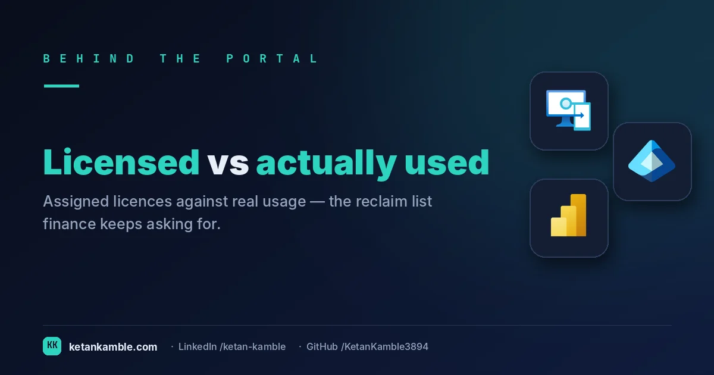
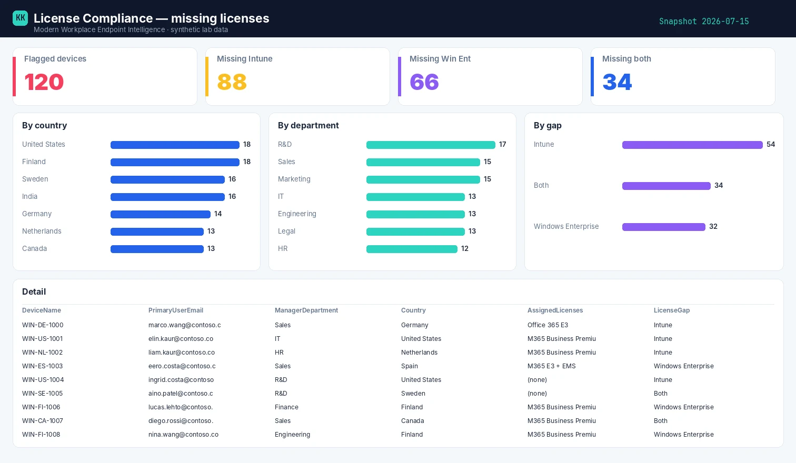

# Who's missing an Intune license: finding the devices slipping through

{ .post-cover width="1200" height="630" fetchpriority=high }

A corporate Windows device whose primary user has no Intune (or Windows Enterprise) license is a compliance and cost problem hiding in plain sight — it enrols, it looks managed, but it's out of licensing bounds. Intune won't cross-reference devices against user licences. This read-only collector does.

<!-- more -->

<iframe scrolling="no" src="/assets/hooks/license-compliance.html" title="Animated: enrolled-but-unlicensed devices found and owned" loading="lazy" style="display:block;width:100%;aspect-ratio:1200/470;border:0;border-radius:16px;box-shadow:0 10px 30px rgba(0,0,0,.35)"></iframe>

!!! success "The payoff"
    An enrolled device whose user is missing the Intune / Windows Enterprise licence is a gap you can’t spot by eye across thousands of users. The joined report surfaces each one with its manager and department, so the fix is a targeted licence assignment — not a fleet-wide audit. *(Illustrative.)*

!!! tip "The short version"
    Intune manages devices; licences live on users. This read-only collector joins **user-affinity** corporate Windows devices to their primary user's licences and flags where the **Intune service plan** (or Windows Enterprise) is absent or disabled — with the manager and location for follow-up. **No write access, no live tenant in the report.**

## Why the portal doesn't hand you this

- **Devices and licences are different objects.** The device blade shows the user; it doesn't show whether that user holds the licence the device needs.
- **"Assigned" isn't "licensed correctly".** A user can have M365 E3 but be missing the specific SKU a scenario requires — you need the gap, not the list.
- **No accountability path.** Even when you spot it, the console won't hand you the manager and department to route the fix.

## What's different about this report

One row per **flagged device**: the primary user's email, the **licence gap** (Intune / Windows Enterprise / Both), what they *do* have, and the **manager's department and location** so the request goes to the right place.

For example, a row might read **j.doe@contoso.com · gap: Intune · has: M365 E3 (Intune plan disabled) · manager: A. Smith, Sales** — a device that enrols and looks managed, but whose user's Intune service plan is switched off, with the exact person to route the fix to.

## How it works: a read-only collector

--8<-- "assets/diagrams/license-compliance.svg"

The read-only Graph roles are all `.Read.All`: `DeviceManagementManagedDevices.Read.All` for the devices, and `User.Read.All` / `Directory.Read.All` for the user licences and manager (map SKU GUIDs via `subscribedSkus`). Nothing writes.

!!! warning "Verify before you trust it"
    "Intune" isn't a SKU — it's the **INTUNE_A service plan**, bundled inside SKUs like EMS and M365
    E3/E5. So don't match `skuId` GUIDs: expand each assigned SKU to its **service plans**, confirm the
    Intune plan isn't in `disabledPlans` and shows `provisioningStatus = Success` (use
    `licenseAssignmentStates` to tell group-based from direct). And **exclude no-user-affinity devices**
    (kiosk, shared, self-deploying Autopilot) — those are licensed at the *device* level and would
    false-flag. Confirm all of this in your **own lab tenant**. Every figure in the screenshots is **synthetic lab data** (`@contoso.com`).

## The Power BI report

The report is a remediation list: flagged devices by country, by manager's department, and by the type of licence gap — so procurement and the right manager get exactly their slice.

{ .kk-zoom loading=lazy width="1512" height="880" }

*Template + build kit on the **[License Compliance report page](../../powerbi/license-compliance-report.md)**.*

## Set it up, step by step

You don't build this one from scratch. Every collector shares the same read-only plumbing, so you set that up **once** — after that, adding this report is about a five-minute job.

1. **One-time — stand up the collection layer.** Follow **[Setting up the collection layer](../../projects/zero-access-agent/azure-automation-setup.md)**: an Azure Automation account, a system-assigned **Managed Identity** (no secrets, no app registration), and a storage account for the CSV snapshots. You only do this once, however many collectors you end up running.
2. **Grant this collector's read-only scopes.** In that guide's role-assignment step, add the scopes this one needs — `DeviceManagementManagedDevices.Read.All`, `Directory.Read.All` and `User.Read.All`. Every one ends in `.Read.All`: it reads, and never writes to your tenant. (Running more than one collector? Scopes are **additive** — add the new ones, don't replace what's already granted.)
3. **Import the script as a runbook.** Take **[the script](../../scripts/license-compliance.md)**, import it into the Automation Account as a PowerShell 7 runbook, and publish it.
4. **Schedule it.** Attach a daily (or weekly) schedule the same way the setup guide shows. It then runs unattended, dropping a dated CSV into your `root/` container each time.
5. **Point Power BI at the CSV.** Open the **[report template](../../powerbi/license-compliance-report.md)** in Power BI Desktop and start with the bundled **synthetic sample**, so you can build the whole thing before touching real data. To switch to live data, use **Get Data → Azure Blob Storage** and point it at the dated CSV in your `root/` container (the setup guide has the storage account and connection details). Refresh, and that's your dashboard.

No secrets, no app registration, nothing that can change your tenant — just a scheduled read and a CSV that Power BI draws from.

## Gotchas from the lab

- **Group-based licensing lags.** A user may be *entitled* via a group but not yet *assigned* — check effective licences, not just direct ones.
- **Scope discipline keeps it actionable.** Personal and non-Windows devices don't belong here at all — filter to user-affinity corporate Windows so the report stays a clean worklist (the no-user-affinity exclusion from the warning above is the other half of this).
- **Windows Enterprise is per-*user*, not per-device.** Win Ent E3/E5 lights up through **subscription activation** — the *user's* licence activates Enterprise on whatever corporate device they sign into. So a device that reads "missing Windows Enterprise" really means its **primary user** lacks the plan; there's no device-level Enterprise entitlement to check, which is exactly why this report joins devices to their user's licences.
- **The SKU map is yours.** "Missing Intune" depends on which SKUs your org treats as Intune-bearing — get that list right first.

## Reproduce it yourself

The [synthetic fleet generator](../../scripts/synthetic-fleet.md) can emit a realistic, entirely
fictional `License_Compliance.csv` so you can build and demo the whole report before pointing it at real data.

## FAQ

**Isn't "Intune" a license?** It's a service plan (`INTUNE_A`) bundled inside SKUs like EMS and M365 E3/E5 — so expand each SKU to its service plans rather than matching SKU GUIDs.

**Why are some devices excluded?** No-user-affinity devices (kiosk, shared, self-deploying Autopilot) are licensed at the device level and would false-flag — scope to user-affinity corporate Windows.

**Windows Enterprise is per-device, right?** No — it's per-user subscription activation; a device "missing" it really means its primary user lacks the plan.

## More in this series

- [The devices no one owns](../the-devices-no-one-owns-anymore-a-read-only-hygiene-report-with-recommended-actions/)
- [One row per device](../one-row-per-device-building-the-inventory-intune-wont-hand-you/)

## Related

- :material-script-text: **The script** → [License Compliance](../../scripts/license-compliance.md)
- :material-chart-box: **The report + template** → [License Compliance report](../../powerbi/license-compliance-report.md)
- :material-shield-lock: **The bigger picture** → [Zero-Access Agent](../../projects/zero-access-agent/index.md)
- :material-robot-outline: **The capstone** → [The read-only AI agent that can't touch your tenant](../the-read-only-ai-agent-that-cant-touch-your-tenant/)

## References — Microsoft documentation

The Microsoft Learn documentation behind this one, if you want to go to the source:

- **Assign Intune licenses** — how licenses are granted: [Assign Microsoft Intune licenses](https://learn.microsoft.com/en-us/intune/fundamentals/licensing/assign-licenses)
- **License requirements** — the plans that qualify for Intune: [Microsoft Intune licensing](https://learn.microsoft.com/en-us/intune/fundamentals/licensing)
- **Group-based licensing** — assigning licenses at scale: [What is group-based licensing in Microsoft Entra?](https://learn.microsoft.com/en-us/entra/fundamentals/concept-group-based-licensing)
- **assignLicense (Graph)** — add/remove a license via API: [user: assignLicense](https://learn.microsoft.com/en-us/graph/api/user-assignlicense?view=graph-rest-1.0)
- **List subscribedSkus (Graph)** — enumerate tenant SKUs: [List subscribedSkus](https://learn.microsoft.com/en-us/graph/api/subscribedsku-list?view=graph-rest-1.0)
- **List licenseDetails (Graph)** — per-user assigned licenses: [List licenseDetails](https://learn.microsoft.com/en-us/graph/api/user-list-licensedetails?view=graph-rest-1.0)

---

*Screenshots use synthetic data from a personal lab — no real tenant, users, or devices. Independent
content, not affiliated with, sponsored by, or endorsed by Microsoft. Microsoft, Intune, Entra,
Microsoft Graph, Azure, Defender and Power BI are trademarks of the Microsoft group of companies.*
