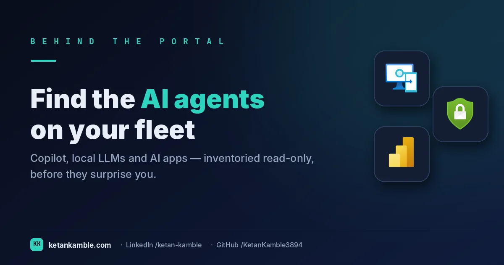
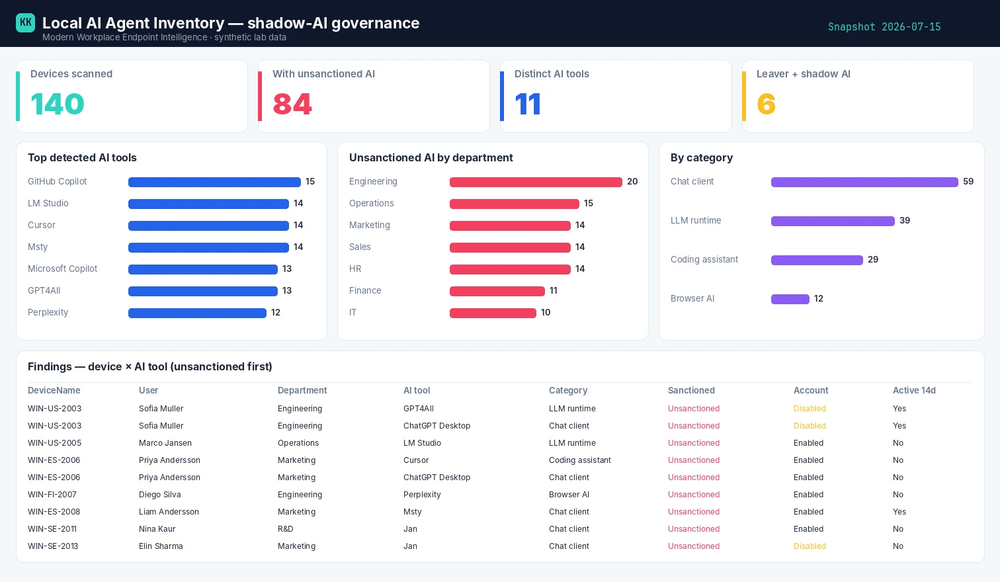

# Who's running Ollama on your fleet? A read-only shadow-AI inventory

{ .post-cover width="1200" height="630" fetchpriority=high }

Somewhere on your fleet right now, someone has quietly installed a local LLM. Maybe it's Ollama
pulling a model, maybe LM Studio, maybe a coding assistant quietly indexing your repos into a local
model that sits on the laptop — and never gets wiped when they leave.
Intune won't tell you — it doesn't inventory "AI tools" as a thing. This is a scheduled, **read-only**
collector that turns *shadow AI* into a governance report: who's running what, sanctioned or not, and
the finding that should worry you most — **leavers who still have it installed**.

<!-- more -->

<iframe scrolling="no" src="/assets/hooks/local-ai-agent-inventory.html" title="Animated: a shadow-AI blind spot versus a read-only inventory with leavers flagged" loading="lazy" style="display:block;width:100%;aspect-ratio:1200/470;border:0;border-radius:16px;box-shadow:0 10px 30px rgba(0,0,0,.35)"></iframe>

!!! success "The payoff"
    You can’t manually poll every endpoint for Ollama or a local LLM. A read-only inventory turns an ungovernable blind spot into a list — and flags the leaver whose departed account still has shadow AI installed, which is the row security actually cares about. *(Illustrative.)*

!!! tip "The short version"
    Local AI tooling is the new shadow IT, and the portal has no view for it. A companion **Proactive
    Remediation detection** script flags AI tools on each device; this **read-only** collector reads
    those results from Graph, enriches them with the user's department, location and **account status**,
    and produces a sliceable governance report — **no write access, no live tenant in the report.**

## Why the portal can't answer this

"Which of my devices are running unsanctioned local AI?" is a question Intune simply wasn't built to
answer. There's no *AI tools* inventory in the console. The pieces you'd need are scattered and, on
their own, useless for governance:

- **App inventory misses most of it.** Discovered apps catch some installers, but local LLM runtimes,
  portable builds, VS Code extensions and browser-based assistants often don't show up as neat
  "installed applications" at all.
- **Detection exists, but it's buried.** Proactive Remediations *can* detect this on-device — but the
  output lands per-device, per-script-run, behind a blade. You can't slice "unsanctioned AI by
  department" from there.
- **The risk question is a join the portal never makes.** The scary version isn't "who has AI tools" —
  it's "who has **unsanctioned** AI tools **and a disabled account**": a leaver whose laptop still has
  a local model and cached data. That answer needs device detection joined to Entra account status.
  Nothing in the portal joins them.

So the job is to read the detection results the fleet already produces, join them to the user context
that makes them a *governance* signal, and freeze it into a report you can act on.

## What's different about this report

The detection runs **on the device** (a Proactive Remediation you deploy separately). This collector
never touches an endpoint — it reads the **reported results** through Graph, read-only, and turns a
pile of per-device script output into governance:

- **One tall table, device × AI tool** — every detected tool, its category, its detection signals, and
  whether it's **sanctioned** or shadow.
- **Enriched with the user** — department, job title, office, country, and crucially **account status**.
- **The leaver join, pre-made** — disabled account **+** unsanctioned AI is a single, sliceable flag.
- **Counting guards built in** — the table is tall (one row per device per tool), so an
  `IsPrimaryDeviceRow` marker means device counts stay honest instead of multiplying by tool count.

For example, a row might read **LAT-2093 · Ollama (llama3) · shadow / unsanctioned · Engineering · owner account: disabled** — a local LLM on a leaver's laptop. That single row is the one that belongs in front of your security team.

## How it works: a read-only collector

--8<-- "assets/diagrams/local-ai-agent-inventory.svg"

The read-only Graph roles are all `.Read.All`: `DeviceManagementConfiguration.Read.All` for the
remediation run states, `DeviceManagementManagedDevices.Read.All` as a device fallback, and
`User.Read.All` + `Directory.Read.All` for the department, location and **account status** enrichment.

!!! warning "Verify before you trust it"
    The `deviceHealthScripts` run states use Graph's **beta** endpoint (devices/users are `/v1.0`).
    Beta can change without notice — re-confirm in your **own lab tenant**. And note the hard
    dependency: a **companion detection script** must be deployed as a Proactive Remediation; this
    collector only *parses its output*, it doesn't do the detecting. Every figure below is synthetic
    lab data (`@contoso.com`).

## The Power BI report

Point Power BI at the CSV and the governance questions answer themselves: how many devices carry
unsanctioned AI, which tools lead, which departments concentrate the risk, and the leaver count that
belongs in front of your security team.

{ .kk-zoom loading=lazy width="1512" height="880" }

*Template + build kit on the **[report page](../../powerbi/local-ai-agent-inventory-report.md)**.*

## Set it up, step by step

You don't build this one from scratch. Every collector shares the same read-only plumbing, so you set that up **once** — after that, adding this report is about a five-minute job.

1. **One-time — stand up the collection layer.** Follow **[Setting up the collection layer](../../projects/zero-access-agent/azure-automation-setup.md)**: an Azure Automation account, a system-assigned **Managed Identity** (no secrets, no app registration), and a storage account for the CSV snapshots. You only do this once, however many collectors you end up running.
2. **Grant this collector's read-only scopes.** In that guide's role-assignment step, add the scopes this one needs — `DeviceManagementConfiguration.Read.All`, `DeviceManagementManagedDevices.Read.All`, `Directory.Read.All` and `User.Read.All`. Every one ends in `.Read.All`: it reads, and never writes to your tenant. (Running more than one collector? Scopes are **additive** — add the new ones, don't replace what's already granted.)
3. **Import the script as a runbook.** Take **[the script](../../scripts/local-ai-agent-inventory.md)**, import it into the Automation Account as a PowerShell 7 runbook, and publish it.
4. **Schedule it.** Attach a daily (or weekly) schedule the same way the setup guide shows. It then runs unattended, dropping a dated CSV into your `root/` container each time.
5. **Point Power BI at the CSV.** Open the **[report template](../../powerbi/local-ai-agent-inventory-report.md)** in Power BI Desktop and start with the bundled **synthetic sample**, so you can build the whole thing before touching real data. To switch to live data, use **Get Data → Azure Blob Storage** and point it at the dated CSV in your `root/` container (the setup guide has the storage account and connection details). Refresh, and that's your dashboard.

No secrets, no app registration, nothing that can change your tenant — just a scheduled read and a CSV that Power BI draws from.

## Gotchas from the lab

- **The detection script is the hard part.** This collector is only as good as the Proactive
  Remediation feeding it — decide what "AI tool" means and what "sanctioned" means *there*.
- **Count devices, not rows — same discipline as the inventory snapshot, but the table's taller.**
  Slice devices on `IsPrimaryDeviceRow = "Yes"`, tool instances on the full table — never mix them.
- **"Sanctioned" is your policy, not mine.** GitHub Copilot may be blessed in your org and banned in
  the next. The sanctioned/unsanctioned split lives in your detection logic; the report just reflects it.
- **Leavers are the headline.** If you build one visual, build "disabled account + unsanctioned AI."
  That's the slide that gets budget.

## Reproduce it yourself

The [synthetic fleet generator](../../scripts/synthetic-fleet.md) can emit a realistic, entirely
fictional `AIAgentInventory.csv` so you can build and demo the whole governance report before pointing
it at real detection data.

## FAQ

**Does the collector scan my endpoints?** No. Detection runs on-device as a Proactive Remediation you deploy separately; this collector only reads the reported results through Graph, read-only.

**What counts as "unsanctioned"?** That's your policy, defined in the detection script — the report just reflects the sanctioned/unsanctioned split you set.

**What's the single most useful view?** "Disabled account + unsanctioned AI" — a leaver whose laptop still has a local model and cached data. That's the slide that gets budget.

## More in this series

- [The devices no one owns](../the-devices-no-one-owns-anymore-a-read-only-hygiene-report-with-recommended-actions/)
- [Which setting actually failed?](../which-setting-actually-failed-turning-intune-non-compliance-into-a-report/)

## Related

- :material-script-text: **The script** → [Local AI Agent Inventory](../../scripts/local-ai-agent-inventory.md)
- :material-chart-box: **The report + template** → [Local AI Agent Inventory report](../../powerbi/local-ai-agent-inventory-report.md)
- :material-shield-lock: **The bigger picture** → [Zero-Access Agent](../../projects/zero-access-agent/index.md)
- :material-robot-outline: **The capstone** → [The read-only AI agent that can't touch your tenant](../the-read-only-ai-agent-that-cant-touch-your-tenant/)

## References — Microsoft documentation

The Microsoft Learn documentation behind this one, if you want to go to the source:

- **Discovered apps** — the read-only installed-app inventory: [Discovered apps in Microsoft Intune](https://learn.microsoft.com/en-us/intune/app-management/discovered-apps)
- **Windows app inventory** — enhanced per-device inventory: [App inventory for Windows devices](https://learn.microsoft.com/en-us/intune/app-management/deployment/enhanced-app-inventory)
- **Defender software inventory** — installed software across the fleet: [Software inventory — Defender Vulnerability Management](https://learn.microsoft.com/en-us/defender-vulnerability-management/tvm-software-inventory)
- **Advanced hunting** — query installed software by name: [DeviceTvmSoftwareInventory table](https://learn.microsoft.com/en-us/defender-xdr/advanced-hunting-devicetvmsoftwareinventory-table)
- **Export software inventory (API)** — pull inventory programmatically: [Export software inventory per device](https://learn.microsoft.com/en-us/defender-endpoint/api/get-assessment-software-inventory)

---

*Screenshots use synthetic data from a personal lab — no real tenant, users, or devices. Independent
content, not affiliated with, sponsored by, or endorsed by Microsoft. Microsoft, Intune, Entra,
Microsoft Graph, Azure, Defender and Power BI are trademarks of the Microsoft group of companies.*
