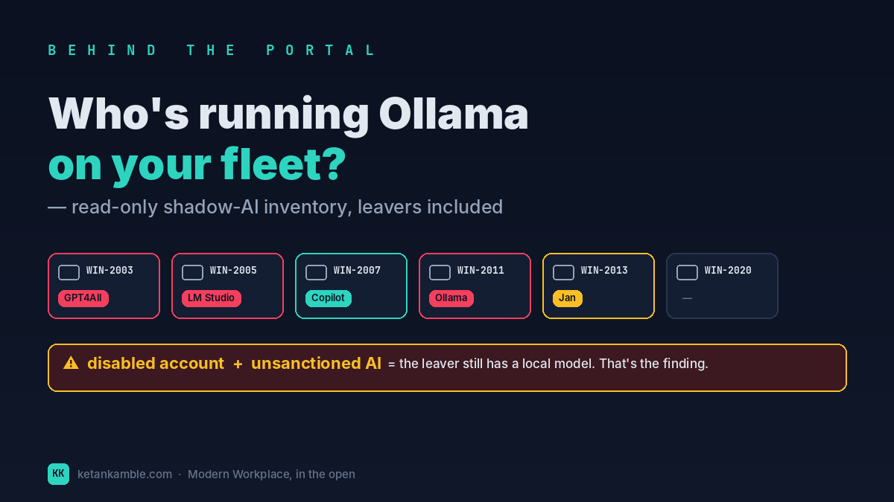
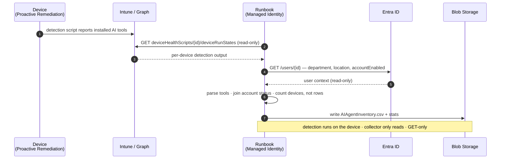

# Who's running Ollama on your fleet? A read-only shadow-AI inventory

{ .post-cover }

Somewhere on your fleet right now, someone has quietly installed a local LLM. Maybe it's Ollama
pulling a model, maybe LM Studio, maybe a coding assistant quietly indexing your repos into a local
model that sits on the laptop — and never gets wiped when they leave.
Intune won't tell you — it doesn't inventory "AI tools" as a thing. This is a scheduled, **read-only**
collector that turns *shadow AI* into a governance report: who's running what, sanctioned or not, and
the finding that should worry you most — **leavers who still have it installed**.

<!-- more -->

!!! tip "The short version"
    Local AI tooling is the new shadow IT, and the portal has no view for it. A companion **Proactive
    Remediation detection** script flags AI tools on each device; this **read-only** collector reads
    those results from Graph, enriches them with the user's department, location and **account status**,
    and produces a sliceable governance report — **no write access, no live tenant in the report.**

## Why the portal can't answer this

"Which of my devices are running unsanctioned local AI?" is a question Intune simply wasn't built to
answer. There's no *AI tools* inventory in the console. The pieces you'd need are scattered and, on
their own, useless for governance:

- **App inventory misses most of it.** Discovered apps catch some installers, but local LLM runtimes,
  portable builds, VS Code extensions and browser-based assistants often don't show up as neat
  "installed applications" at all.
- **Detection exists, but it's buried.** Proactive Remediations *can* detect this on-device — but the
  output lands per-device, per-script-run, behind a blade. You can't slice "unsanctioned AI by
  department" from there.
- **The risk question is a join the portal never makes.** The scary version isn't "who has AI tools" —
  it's "who has **unsanctioned** AI tools **and a disabled account**": a leaver whose laptop still has
  a local model and cached data. That answer needs device detection joined to Entra account status.
  Nothing in the portal joins them.

So the job is to read the detection results the fleet already produces, join them to the user context
that makes them a *governance* signal, and freeze it into a report you can act on.

## What's different about this report

The detection runs **on the device** (a Proactive Remediation you deploy separately). This collector
never touches an endpoint — it reads the **reported results** through Graph, read-only, and turns a
pile of per-device script output into governance:

- **One tall table, device × AI tool** — every detected tool, its category, its detection signals, and
  whether it's **sanctioned** or shadow.
- **Enriched with the user** — department, job title, office, country, and crucially **account status**.
- **The leaver join, pre-made** — disabled account **+** unsanctioned AI is a single, sliceable flag.
- **Counting guards built in** — the table is tall (one row per device per tool), so an
  `IsPrimaryDeviceRow` marker means device counts stay honest instead of multiplying by tool count.

## How it works: a read-only collector



??? note "Want a prettier diagram? Paste this into eraser.io"
    Eraser's AI turns this prompt into an editable cloud-architecture diagram:

    ```text
    Create a cloud architecture diagram titled
    "Local AI Agent Inventory — the Zero-Access Pattern".

    Nodes (use Azure/Microsoft icons):
    - Managed Device (Windows) running a Proactive Remediation detection script
    - Microsoft Intune / Microsoft Graph
    - Entra ID
    - Azure Automation Runbook (system-assigned Managed Identity)
    - Azure Blob Storage
    - Power BI

    Flows (label each; every Graph/Entra call is READ-ONLY, GET only):
    1. Managed Device → Intune: detection script reports installed AI tools
    2. Runbook → Microsoft Graph: GET deviceHealthScripts/{id}/deviceRunStates (read-only)
    3. Microsoft Graph → Runbook: per-device detection output
    4. Runbook → Entra ID: GET /users/{id} — department, location, accountEnabled (read-only)
    5. Runbook (internal): parse tools, join account status, count devices not rows
    6. Runbook → Blob Storage: write AIAgentInventory.csv + stats
    7. Blob Storage → Power BI: report refresh

    Style: dark background, teal accent (#2dd4bf), red for "unsanctioned",
    a callout box reading "no write scopes · no live tenant in the report".
    ```

The read-only Graph roles are all `.Read.All`: `DeviceManagementConfiguration.Read.All` for the
remediation run states, `DeviceManagementManagedDevices.Read.All` as a device fallback, and
`User.Read.All` + `Directory.Read.All` for the department, location and **account status** enrichment.

!!! warning "Verify before you trust it"
    The `deviceHealthScripts` run states use Graph's **beta** endpoint (devices/users are `/v1.0`).
    Beta can change without notice — re-confirm in your **own lab tenant**. And note the hard
    dependency: a **companion detection script** must be deployed as a Proactive Remediation; this
    collector only *parses its output*, it doesn't do the detecting. Every figure below is synthetic
    lab data (`@contoso.com`).

## The Power BI report

Point Power BI at the CSV and the governance questions answer themselves: how many devices carry
unsanctioned AI, which tools lead, which departments concentrate the risk, and the leaver count that
belongs in front of your security team.

{ .kk-zoom }

*Template + build kit on the **[report page](../../powerbi/local-ai-agent-inventory-report.md)**.*

## Gotchas from the lab

- **The detection script is the hard part.** This collector is only as good as the Proactive
  Remediation feeding it — decide what "AI tool" means and what "sanctioned" means *there*.
- **Count devices, not rows — same discipline as the inventory snapshot, but the table's taller.**
  Slice devices on `IsPrimaryDeviceRow = "Yes"`, tool instances on the full table — never mix them.
- **"Sanctioned" is your policy, not mine.** GitHub Copilot may be blessed in your org and banned in
  the next. The sanctioned/unsanctioned split lives in your detection logic; the report just reflects it.
- **Leavers are the headline.** If you build one visual, build "disabled account + unsanctioned AI."
  That's the slide that gets budget.

## Reproduce it yourself

The [synthetic fleet generator](../../scripts/synthetic-fleet.md) can emit a realistic, entirely
fictional `AIAgentInventory.csv` so you can build and demo the whole governance report before pointing
it at real detection data.

## Related

- :material-script-text: **The script** → [Local AI Agent Inventory](../../scripts/local-ai-agent-inventory.md)
- :material-chart-box: **The report + template** → [Local AI Agent Inventory report](../../powerbi/local-ai-agent-inventory-report.md)
- :material-shield-lock: **The bigger picture** → [Zero-Access Agent](../../projects/zero-access-agent/index.md)
