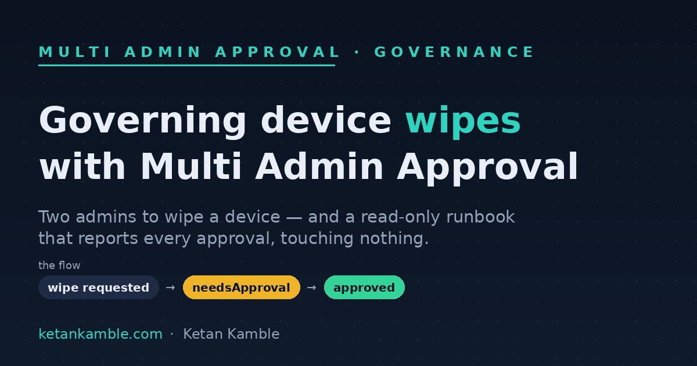

# Governing device wipes with Multi Admin Approval

{ .post-cover width="1200" height="630" fetchpriority=high }

A device **wipe** is the most destructive button in Intune, and by default one admin, one click, is all it takes. **Multi Admin Approval (MAA)** turns that single click into a two-person action — the wipe waits for a second admin to approve it. Microsoft gives you that gate for free. What it *doesn't* give you is the **doorbell**: MAA assumes an approver remembers to open *Tenant administration → Multi Admin Approval → Received requests* and check. Nobody builds that habit reliably. This post keeps the gate and adds the missing half — a read-only layer that **pings** you on every request, raises a ticket, and keeps the audit trail — without granting a single new permission.

<!-- more -->

<div class="hook-embed" markdown="0">
<iframe scrolling="no" src="/assets/hooks/maa-wipe-retire-governance.html" title="Animated: a device-wipe request stops at a Multi Admin Approval gate; instead of an admin watching the queue, a read-only runbook pings the service desk and records it" loading="lazy" style="display:block;width:100%;aspect-ratio:1200/470;border:0;border-radius:16px;box-shadow:0 10px 30px rgba(0,0,0,.35)"></iframe>
</div>

!!! success "The payoff"
    Multi Admin Approval stops a lone admin from wiping a device — but it makes *someone* babysit the approvals queue, and "keep an eye on the portal" is not a control. A read-only Azure Automation runbook, holding **no permission to approve, reject, or wipe**, watches the requests over Graph, emails the service desk on each new one (which auto-raises a ticket), and keeps a durable history for Power BI. You get the alert, the ticket, and the audit trail — and add **zero** new blast radius.

!!! tip "The short version"
    Turn on an MAA **access policy** for Device wipe / retire so both need a second admin. Scope approvals to a **custom Intune role → approver group → Entra PIM** so approver rights are just-in-time. Then a scheduled runbook, running as a **Managed Identity with only `DeviceManagementConfiguration.Read.All`**, lists `operationApprovalRequests`, emails the service desk on new pending ones, and writes a merged history CSV that outlives Intune's own retention — and feeds the read-only AI agent. Nothing in the reporting path can approve or act.

## The problem: one admin, one click, gone

Intune's **Wipe** and **Retire** remote actions are irreversible from the user's side — wipe resets the device to factory, retire pulls company data and management off it. A single admin with the right role can fire either on any device in scope. That's fine until it isn't: a fat-fingered bulk action, a compromised admin account, or a leaver on their last day. For destructive actions, **two-person control** is the standard answer, and Intune has it built in.

**Scope note:** MAA here protects **Device wipe and retire only**. Selective wipe (app-protection data removal), deleting the device record, and Autopilot reset are *out of scope* and behave exactly as before — worth stating so nobody thinks every remote action is now gated.

## The gate: an MAA access policy for wipe & retire

Multi Admin Approval works by **access policies**. You create a policy that says "this class of action now requires approval," and from then on any admin who triggers it doesn't perform the action — they raise an **approval request** that a *different* admin has to approve first.

For destructive device actions the policy protects the **Device wipe / retire** action type. Once it's on:

1. Admin A selects **Wipe** on a device and adds a business justification (include the ticket number).
2. Instead of wiping, Intune creates an **approval request** with status `needsApproval`.
3. Admin B — who is **not** Admin A; self-approval is blocked — reviews the justification and approves or rejects.
4. **Approval does not run the action.** This is the single most-misunderstood part: once approved, the **original requestor** must go back to *My requests* and **complete** the action. Only then does the wipe execute. "Approved" ≠ "wiped".

That request object is the thing this whole governance layer observes — read-only.

## Microsoft gave you the gate, not the habit

Here's the gap the built-in feature leaves. MAA raises a request and… waits. There's no native email, no ticket, no dashboard. The design quietly assumes an approver is *watching* the Received-requests blade. In practice that means:

- **Legitimate wipes stall.** A stolen-laptop wipe sits pending because nobody happened to be looking at the portal.
- **"Wipe not working" tickets pile up.** Service desk troubleshoots a wipe that isn't broken — it's just waiting for approval.
- **There's no record.** Six months later, "who approved wiping that device, and why?" has no answer.

None of that is a reason to skip MAA — it's a reason to stop relying on a human habit and let a read-only runbook be the doorbell.

## Azure Automation account permission: how the read-only reporter works

The reporter reads Intune with **no stored secret and no human sign-in**, using a **system-assigned Managed Identity** on the Azure Automation account, granted a single read-only Graph *application* permission.

The grant is the important part. The Automation account's Managed Identity is a service principal in Entra; you give it the **least-privilege** app role for this job — **`DeviceManagementConfiguration.Read.All`** — which is all that's needed to *list* approval requests. You do **not** grant `DeviceManagementRBAC.ReadWrite.All` or any approve/wipe permission. The identity that reports on approvals is structurally incapable of approving one.

App-role grants aren't in the portal UI, so assign it once with Graph (run as an admin who can consent):

```powershell
# One-time: grant the Automation account's Managed Identity a READ-ONLY Graph scope.
Connect-MgGraph -Scopes "Application.Read.All","AppRoleAssignment.ReadWrite.All"

$graphSpId  = (Get-MgServicePrincipal -Filter "appId eq '00000003-0000-0000-c000-000000000000'").Id
$miObjectId = "<automation-account-managed-identity-object-id>"   # Automation account > Identity blade
$roleValue  = "DeviceManagementConfiguration.Read.All"            # least privilege to LIST requests

$appRole = (Get-MgServicePrincipal -ServicePrincipalId $graphSpId).AppRoles |
    Where-Object { $_.Value -eq $roleValue -and $_.AllowedMemberTypes -contains "Application" }

New-MgServicePrincipalAppRoleAssignment -ServicePrincipalId $miObjectId -BodyParameter @{
    principalId = $miObjectId; resourceId = $graphSpId; appRoleId = $appRole.Id
}
```

That is the entire standing permission this solution holds against your tenant: **read approval requests, nothing else.**

## The runbook: list, alert, keep history

With the identity in place, the runbook authenticates *as* the Managed Identity, lists the requests over the **beta** endpoint, spots new pending ones, notifies the service desk, and appends to a durable history. The essence, sanitized:

```powershell
# READ-ONLY. MI holds only DeviceManagementConfiguration.Read.All. All values synthetic.
Connect-MgGraph -Identity        # no secret

# 1) READ — list every approval request (beta). Nothing here can approve or wipe.
$graph = "https://graph.microsoft.com/beta/deviceManagement/operationApprovalRequests"
$live  = @(); $u = $graph
do { $p = Invoke-MgGraphRequest -Method GET -Uri $u; $live += $p.value; $u = $p.'@odata.nextLink' } while ($u)

# 2) ALERT — email the service desk about NEW pending requests (watermark dedupe).
$lastCheck  = try { [datetime](Get-AutomationVariable -Name 'MAA-LastCheck') } catch { (Get-Date).AddDays(-1) }
$runStart   = (Get-Date).ToUniversalTime()
$pendingNew = $live | Where-Object { $_.status -eq 'needsApproval' -and [datetime]$_.requestDateTime -gt $lastCheck }

if ($pendingNew) {
    $html = ($pendingNew | ForEach-Object {
        "<tr><td>$($_.requiredOperationApprovalPolicyTypes -join ',')</td>" +
        "<td>$($_.requestor.user.displayName)</td><td>$($_.requestJustification)</td>" +
        "<td>$($_.requestDateTime)</td><td>$($_.id)</td></tr>" }) -join "`n"
    Send-MailMessage -SmtpServer "smtp.contoso.com" -From "intune-maa@contoso.com" `
        -To "servicedesk@contoso.com" -BodyAsHtml `
        -Subject "ACTION REQUIRED: Intune wipe/retire approval pending ($($pendingNew.Count))" `
        -Body "<table border=1><tr><th>Operation</th><th>Requestor</th><th>Justification</th><th>Submitted</th><th>Id</th></tr>$html</table>"
}
Set-AutomationVariable -Name 'MAA-LastCheck' -Value $runStart.ToString('o')   # advance only after success

# 3) HISTORY — merge with existing CSV so records survive Intune's retention; upload for Power BI.
$history = Merge-ApprovalHistory -New $live -ExistingCsv "MAA_Requests_History.csv"   # upsert by RequestId
$history | Export-Csv "MAA_Requests_History.csv" -NoTypeInformation
# + a summary-stats CSV (counts by status, approval rate, by approver, time-to-decision).
```

Two design choices matter. The Graph call is **GET only** — the identity can't approve, reject, or wipe, so even a compromised runbook can't act. And the history is **merged and kept by you**, because Intune ages approval requests out of its own store; your CSV is the durable audit record.

The **full, hardened runbook** — Managed-Identity token via `IDENTITY_ENDPOINT`, 401/429 retry with `Retry-After`, schema-tolerant property parsing (the `requestor.user` object exposes `Upn`, not `userPrincipalName`), device details parsed from `displayPayload`, and the size-gated summary-stats export — is on GitHub in the [zero-access-agent repo](https://github.com/KetanKamble3894/zero-access-agent).

!!! info "One reporter for every MAA policy — not just wipe/retire"
    Wipe and retire are the example here, but the runbook lists **all** `operationApprovalRequests` regardless of type. Multi Admin Approval can protect other action classes too — **app deployments and scripts** among them — and this same read-only reporter covers every one of them automatically. Turn on more MAA access policies and you don't build a new automation per policy; the one runbook alerts, tickets and reports on them all.

## From alert to ticket to KB

The email isn't the end — it's the entry point to your existing ITSM. The generic, synthetic flow:

- The runbook emails a **monitored service-desk address** (`servicedesk@contoso.com`) via an **SMTP relay** (`smtp.contoso.com`).
- Your ITSM watches that inbox and **auto-creates an incident** — so each pending wipe becomes a tracked item with an owner and an SLA, even if nobody is looking at the Intune portal.
- A short **Knowledge Base article** tells the service desk what the alert means and, crucially, that a "wipe not working" report is usually just a request *waiting for approval* — not a fault.

None of that touches Intune. It's a read, a notification, and a record — the tenant is never written to.

## How it works

<div class="mermaid-live" markdown="0">
--8<-- "assets/diagrams/maa-wipe-retire-governance.svg"
</div>

The bottom half is the **gate**: an admin raises a wipe, the MAA access policy intercepts it into an approval request, a PIM-activated approver approves or rejects, and — only then — the *requestor completes* the action so it runs. The top half is the **read-only governance layer**: the Managed Identity lists those requests over Graph, alerts the service desk (which raises a ticket), and writes a durable history that Power BI reports on. The two halves meet only through a **read** — the reporter watches the gate, it never operates it.

## Set it up, step by step

The gate (1–3) changes your tenant; the reporting (4–7) is entirely read-only.

1. **Create the MAA access policy** *(changes tenant)* — add a Multi Admin Approval access policy for **Device wipe / retire**, assigned to the admins in scope.
2. **Create the approver role + group** *(changes tenant)* — a **custom Intune role** ("MAA Approvers") granting only the approval permission, assigned to a group (`grp-MAA-Approvers`).
3. **Put the group behind PIM** *(changes tenant)* — enable Entra PIM over the group so approver membership is just-in-time and audited.
4. **Stand up Azure Automation + Managed Identity** — if you don't already run the collection layer, follow **[Setting up the collection layer](../../projects/zero-access-agent/azure-automation-setup.md)** to create the Automation account and enable its **system-assigned Managed Identity** (no app registration, no secret). Every collector on this site shares that one setup — you build it once.
5. **Grant the read-only Graph scope** — assign the MI **`DeviceManagementConfiguration.Read.All`** and nothing else (the one-time script above).
6. **Import and schedule the runbook** — import it as a PowerShell 7 runbook, publish, and schedule it (every 15 minutes for timely alerts). Create a String Automation variable `MAA-LastCheck` for the watermark.
7. **Wire the outputs** — point your ITSM at the service-desk mailbox for auto-ticketing, and point Power BI at the history CSV in Blob.

No secret is ever stored, and nothing in steps 4–7 can approve, reject, or wipe.

## The report — and the AI agent

Because the runbook keeps a merged history plus a summary-stats CSV, **Power BI** turns it into the view Intune won't give you: approval **volume over time**, **approval vs rejection rate**, **time-to-decision**, **who requested** and **who approved**, and a filterable audit table. Every figure comes from the read-only CSV; the report holds no tenant connection.

The same summary-stats snapshot also drops into the `agent-data/` feed for the [read-only AI agent](the-ai-agent-that-cant-touch-your-tenant.md). So "how many wipe approvals are pending right now?" becomes a plain-English question answered from the dated snapshot — by an agent that, like this runbook, holds no Graph scope and cannot approve or act. The governance data and the agent share the same principle: **read-only all the way down.**

## Gotchas from the lab

- **"Approved" is not "done."** After approval, the *requestor* must complete the action from *My requests* — approval alone changes nothing. Most "it was approved but the device is fine" confusion is a request that was never completed.
- **The API is `beta`.** `operationApprovalRequests` lives on Graph's beta endpoint today — pin to it deliberately, expect shape changes, and re-verify in your own tenant.
- **Requests expire on a Microsoft-controlled clock.** Unactioned requests auto-expire; the exact window is set by Microsoft and has changed over time, so confirm the current value in your tenant rather than hard-coding a number.
- **Least privilege is a choice, not a default.** It's tempting to grant `DeviceManagementRBAC.ReadWrite.All` "to be safe" — that would let the runbook *approve* requests. Grant `DeviceManagementConfiguration.Read.All` so it structurally can't.
- **Intune ages requests out** — so the runbook *merges and keeps* its own history CSV; don't treat the tenant as your long-term audit store.
- **Sending mail is a side effect** — the alert uses an SMTP relay, not a Graph write, but scope the sender so it can only mail the service desk.

## FAQ

**What does Multi Admin Approval protect here?** The **Device wipe and retire** actions. A protected action becomes an approval request a second, different admin must approve — and then the requestor must complete.

**Does this only work for wipe and retire?** No — that's just the example. The runbook lists every approval request regardless of type, so it covers any action you protect with a Multi Admin Approval access policy (app deployments and scripts included). One runbook, all your MAA policies.

**Does the reporting runbook need write access to Intune?** No. It holds only **`DeviceManagementConfiguration.Read.All`** and does a `GET`. It cannot approve, reject, or wipe — that's the point.

**A wipe was approved but the device is untouched — is it broken?** Almost certainly not. Approval doesn't run the action; the original requestor has to go to *My requests* and **complete** it. Until they do, nothing happens.

**Why keep your own history CSV?** Because Intune ages approval requests out of its own store. Merging each run into a durable CSV gives you an audit trail that outlives retention, and a stable source for Power BI and the AI agent.

**Can the runbook approve requests to speed things up?** Deliberately not — auto-approval would defeat two-person control. Approvals stay human, via the PIM-activated approver group; the runbook only observes and reports.

## More in this series

- [Graph 412: Intune MAA gates writes](multi-admin-approval-graph-api.md) — what MAA does to *app-authenticated* Graph writes
- [The read-only AI agent that can't touch your tenant](the-ai-agent-that-cant-touch-your-tenant.md) — where the summary-stats snapshot goes next
- [The 403 that started Zero-Access](zero-access-origin-story.md) — where "read-only by design" came from

## References — Microsoft documentation

- **Multi Admin Approval overview** — the access-policy model for protected actions: [Use multi-admin approval in Intune](https://learn.microsoft.com/en-us/intune/intune-service/fundamentals/multi-admin-approval)
- **MAA with the Graph API** — how protected actions become approval requests: [Use Multi Admin Approval with the Microsoft Graph API](https://learn.microsoft.com/en-us/intune/fundamentals/role-based-access-control/multi-admin-approval-graph-api)
- **List operationApprovalRequests (beta)** — the read call this runbook makes: [List operationApprovalRequests](https://learn.microsoft.com/en-us/graph/api/intune-rbac-operationapprovalrequest-list?view=graph-rest-beta)
- **Azure Automation managed identity** — how the runbook runs with no stored secret: [Managed identities for an Azure Automation account](https://learn.microsoft.com/en-us/azure/automation/enable-managed-identity-for-automation)
- **Entra Privileged Identity Management** — just-in-time approver membership: [What is Privileged Identity Management?](https://learn.microsoft.com/en-us/entra/id-governance/privileged-identity-management/pim-configure)
- **Microsoft Graph permissions reference** — the `.Read.All` scope the identity holds: [Microsoft Graph permissions reference](https://learn.microsoft.com/en-us/graph/permissions-reference)

---

*Personal-lab pattern — all names, addresses and identifiers are synthetic (`@contoso.com`, `WIN-*`); no real
tenant, users, or devices. Uses a Microsoft Graph **beta** endpoint that may change — verify in your own
tenant. Independent content, not affiliated with, sponsored by, or endorsed by Microsoft. Microsoft, Intune,
Entra, Microsoft Graph, Azure and Power BI are trademarks of the Microsoft group of companies.*
