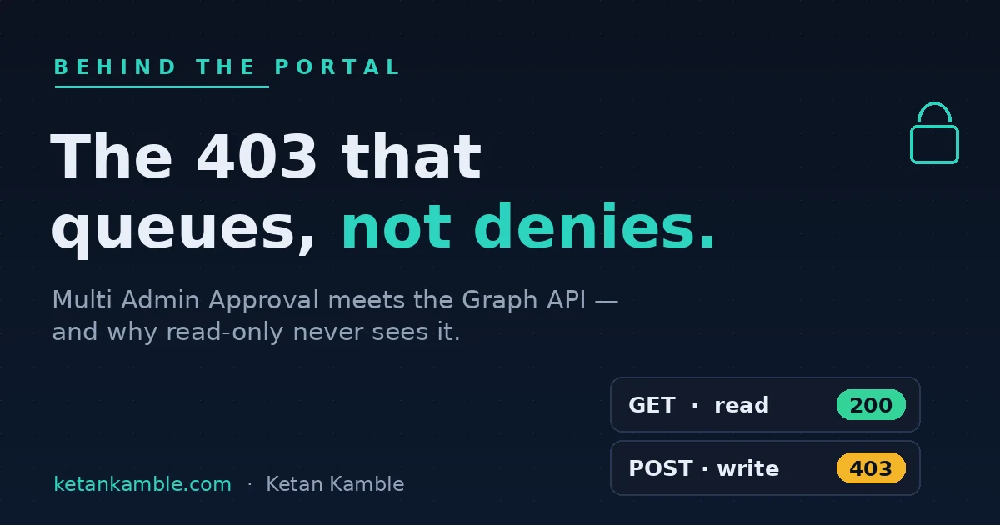

# MAA now intercepts Graph API calls — and why read-only never sees it

{ .post-cover width="1200" height="630" fetchpriority=high }

My automation broke in June with a `403` I'd never seen before. Not `Authorization_RequestDenied` — I
know that one, that's a missing scope. This was `ApprovalRequired`, and my first instinct was that
Microsoft had shipped a new permission I hadn't consented to yet. It hadn't. What shipped was a change to
**Multi Admin Approval (MAA)** — previously an interactive-admin-only gate — that extended it to
**app-authenticated Graph calls**. If your tenant has an MAA access policy on a protected workload, your
service principal now hits exactly the same wall a human admin does.

<!-- more -->

<div class="hook-embed" markdown="0">
<iframe scrolling="no" src="/assets/hooks/multi-admin-approval-graph-api.html" title="Animated: a Graph GET returns 200 and sails through, while a POST is intercepted by Multi Admin Approval and queued as 403 ApprovalRequired" loading="lazy" style="display:block;width:100%;aspect-ratio:1200/470;border:0;border-radius:16px;box-shadow:0 10px 30px rgba(0,0,0,.35)"></iframe>
</div>

!!! success "The payoff"
    MAA changes how Intune treats **writes**, not how it treats **reads**. A governance control designed
    to slow down `POST` / `PATCH` / `PUT` / `DELETE` leaves a read-only reporting layer structurally
    untouched — it was never in the blast radius to begin with. That asymmetry isn't a workaround I
    engineered; it's the Zero-Access Pattern holding up under a stress test I didn't build.

It's opt-in — per workload, per tenant. Nothing changes until an admin actually creates an access policy.
But if you're reading this because your pipeline just started failing, someone did. Here's the whole
thing: the call, the 403, the approval loop, and the one detail that turns this from a headache into a
validation of how I build automation in the first place.

## The portal action, and the call underneath it

Every click in the Intune admin center fires a Graph call. Creating a PowerShell script — **Devices →
Scripts and remediations → Add** — fires this one (I captured it with
[Graph X-Ray](https://graphxray.merill.net/), Merill Fernando's tool for showing the REST call a blade
actually makes):

```http
POST https://graph.microsoft.com/beta/deviceManagement/deviceManagementScripts
Content-Type: application/json
x-msft-approval-justification: dGVzdGluZyBNQUEgaW50ZXJjZXB0aW9u

{
  "displayName": "MAA-test-script",
  "description": "Zero-Access lab probe — never intended to complete",
  "scriptContent": "V3JpdGUtT3V0cHV0ICJIZWxsbyBXb3JsZCI=",
  "runAsAccount": "system",
  "fileName": "TestScript.ps1",
  "roleScopeTagIds": ["0"]
}
```

That `x-msft-approval-justification` header is Base64 — it decodes to `testing MAA interception`. It's
required on the write once an MAA policy protects Scripts. Leave it off and you get a *different* failure
that just tells you the header is missing — a useful signpost that MAA is in play before you've even
worked out why.

## The 403 that isn't a permissions failure

With the header present and a policy active, the write comes back like this:

```http
HTTP/1.1 403 Forbidden
Content-Type: application/json

{
  "error": {
    "code": "ApprovalRequired",
    "message": "Approval Required. Request Approval using the request ID returned as part of the x-msft-approval-code response header. x-msft-approval-code: aabb1234-5678-9012-abcd-ef0123456789"
  }
}
```

This is the detail that separates it from an ordinary Graph failure: the request **queued** — it didn't
just die. The `x-msft-approval-code` GUID comes back both as a response header and embedded in the
message. That code is how you (or your automation) track the request from here.

Permission-wise, least privilege is precise:

| Call | Permission | Version |
| --- | --- | --- |
| Create script (the write MAA gates) | `DeviceManagementScripts.ReadWrite.All` | `beta` |
| Read scripts (the control, below) | `DeviceManagementScripts.Read.All` | `beta` |
| Poll approval status | `DeviceManagementRBAC.Read.All` | `beta` |

One rename worth flagging: this endpoint used to accept `DeviceManagementConfiguration.ReadWrite.All`,
deprecated for scripts as of mid-2025. If your automation is old enough, the permission name itself might
be your first symptom — before MAA is even the story.

## The approval loop

1. `POST` with the justification header.
2. `403 ApprovalRequired` + the approval code.
3. A **separate** interactive admin in the approver group approves it in the admin center.
4. Resubmit the identical request, swapping the justification header for `x-msft-approval-code`.

Step 3 is where Microsoft's own documentation contradicts itself, and it's worth stopping on. The how-to
guide says flatly: *"Applications can't approve or reject MAA requests."* But the API reference page for
the `approve` action itself lists **Application** permissions as valid for that exact call. Those can't
both be true.

!!! quote "Lab result — the approval tokens"
    In my personal lab tenant, the script-creation `POST` returned `ApprovalRequired` with an
    `x-msft-approval-code`, and the Intune Multi Admin Approval portal showed the request as *Needs
    review*. I validated the workflow with two admins: one submitted the script, the other approved it in
    the portal, and the resubmitted request completed successfully using the approval code.

    I did **not** test the `/approve` Graph action with an app-only token in this lab, and I'm
    deliberately not stating a result for that scenario until I've reproduced it end-to-end in a tenant
    where the `operationApprovalRequests` API surfaces the queued record. The contradiction between
    "applications can't approve" and the API listing application permissions still stands — treat this
    post as evidence of the **workflow**, not a final verdict on app-only approval.

That's the kind of thing you can only settle by firing the request, not by reading whichever doc you hit
first — and I'd rather leave it open than assert a result I haven't reproduced.

## Why the read-only path is the actual point

Here's the part that changes how I build, not just how I debug.

Every source on this feature — Microsoft's own documentation included — agrees on one line: **MAA only
fires on `POST` / `PATCH` / `PUT` / `DELETE`. `GET` is never gated.** I ran the control in Graph Explorer:

```http
GET https://graph.microsoft.com/beta/deviceManagement/deviceManagementScripts
```

Plain `200 OK`. Same resource family. No header, no interception, no queue.

That's not a footnote — that's the whole thesis of the **Zero-Access Pattern**, validated by Microsoft's
own architecture rather than by anything I'm asserting. A reporting and monitoring layer built entirely
on reads was never in MAA's blast radius to begin with. A governance control designed specifically to slow
down *writes* leaves a read-only automation structurally untouched. That isn't a workaround I engineered
around the feature — it's the design holding up under a stress test I didn't build.

## What breaks, and what doesn't

| Situation | Result | What it means |
| --- | --- | --- |
| Write to a protected resource, no justification header | Error: header required | MAA rejecting before it even evaluates the write |
| Write with header, MAA active | `403 ApprovalRequired` + approval code | Expected — queued, not denied |
| `GET` to the same resource | `200 OK` | MAA is write-only by design |
| Missing the actual Graph permission | `403 Authorization_RequestDenied` | Ordinary consent failure — *not* the same thing as `ApprovalRequired` |

Don't conflate those last two. `ApprovalRequired` means "a human needs to sign off." `Authorization_RequestDenied`
means "you never had the scope." They send you down completely different paths.

## The takeaway

Multi Admin Approval changes how Intune treats writes, not how it treats reads. In my lab tenant,
`GET /beta/deviceManagement/deviceManagementScripts` stayed a plain `200 OK`, while `POST` to the same
endpoint hit `ApprovalRequired` and queued a request visible in the MAA portal. That's exactly what the
Zero-Access Pattern bets on: if you build reporting and monitoring on reads, a governance control designed
to slow down writes simply never sees you.

If you've hit this in your own tenant, I'd genuinely like to compare notes — especially the exact status
code on the missing-header case, and whether an app-only token can drive `/approve`, because the docs
don't pin either down and I'd like to.

## Related

- :material-shield-lock: **The pattern** → [The 403 that started Zero-Access](the-403-that-started-the-zero-access-pattern.md)
- :material-robot-outline: **The capstone** → [The read-only AI agent that can't touch your tenant](the-read-only-ai-agent-that-cant-touch-your-tenant.md)

## References — Microsoft documentation and community

- **Use Multi Admin Approval with the Microsoft Graph API** — [Microsoft Learn](https://learn.microsoft.com/en-us/intune/fundamentals/role-based-access-control/multi-admin-approval-graph-api)
- **operationApprovalRequest resource type (beta)** — [Microsoft Graph reference](https://learn.microsoft.com/en-us/graph/api/resources/intune-rbac-operationapprovalrequest?view=graph-rest-beta)
- **Intune Multi Admin Approval now enforced on Graph API calls** — [Recast Software](https://www.recastsoftware.com/resources/intune-multi-admin-approval-now-enforced-on-graph-api-calls/)
- **The x-msft-approval-justification error** — [Patch My PC](https://patchmypc.com/blog/intune-multi-admin-approval-the-x-msft-approval-justification-error/)

---

*This article is based on a personal lab run verified on **2026-08-12**, using Microsoft Graph **beta**
endpoints and Intune's own Multi Admin Approval experience as the ground truth for the queue and its
status. Beta endpoints can change or be removed without notice and are not for production dependence.
Independent content — not affiliated with, sponsored by, or endorsed by Microsoft. Microsoft, Intune,
Entra and Microsoft Graph are trademarks of the Microsoft group of companies. Verify in your own tenant.*
