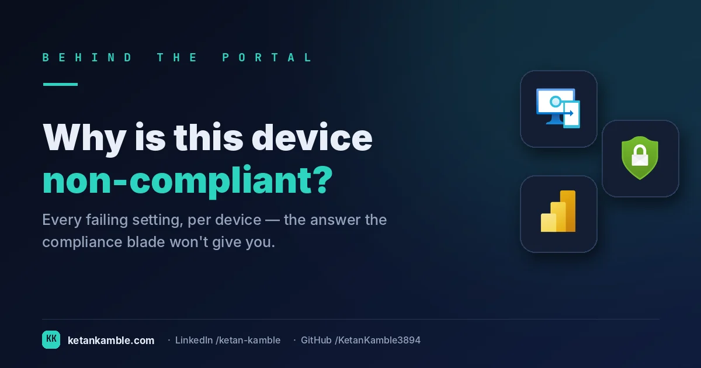
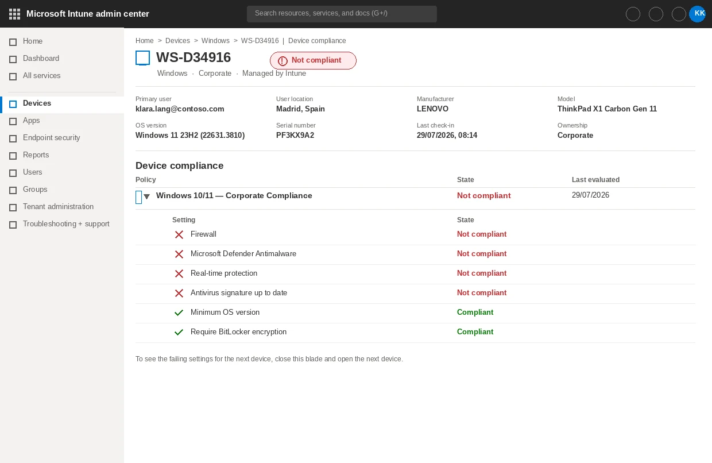
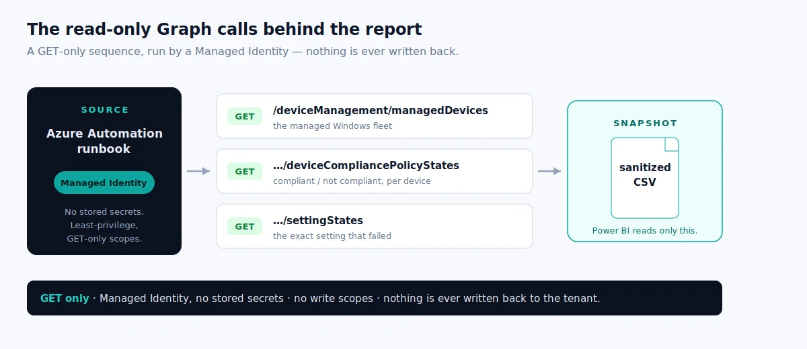
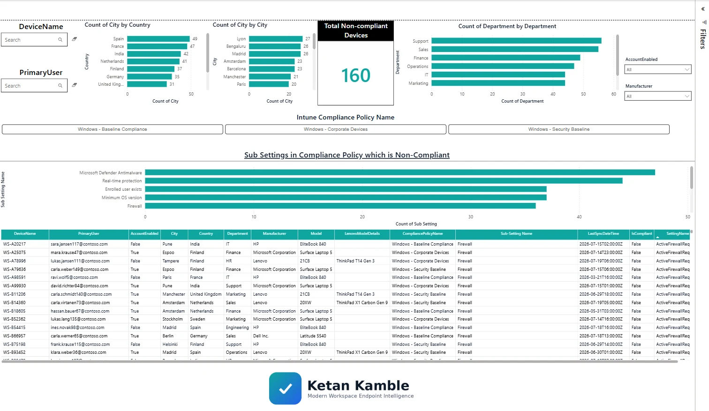

# Which setting actually failed? Turning Intune non-compliance into a report

{ .post-cover width="1200" height="630" fetchpriority=high }


Intune will happily tell you a device is **Not compliant**. What it won't hand you — as *data* you
can report on — is the **why**: which specific setting failed, where the user sits, and what make and
model they're on. To learn that, you open the device. Then the next one. Then the next.

<!-- more -->

<div class="hook-embed" markdown="0">
<iframe scrolling="no" src="/assets/hooks/noncompliant-devices.html" title="Animated: a non-compliance verdict with no reason versus the exact failed setting" loading="lazy" style="display:block;width:100%;aspect-ratio:1200/470;border:0;border-radius:16px;box-shadow:0 10px 30px rgba(0,0,0,.35)"></iframe>
</div>

!!! success "The payoff"
    “Non-compliant” with no reason means opening each device to hunt the setting that failed — minutes each, across thousands of devices. The setting-level report names the cause (BitLocker, firewall, min-OS…) up front, so you fix the policy instead of chasing devices. *(Illustrative.)*

!!! tip "The short version"
    Intune tells you a device is non-compliant — not *which setting*. This is a scheduled, read-only collector that turns setting-level failures into a sliceable Power BI report: **no write access, no standing credentials, no live tenant connection.**

## Non-compliant, but on *what*?

Here's the view every Intune admin knows. A device shows a red **Not compliant** badge, you open it,
and you finally see the truth: it's the Firewall, and Real-time protection, and the Defender
signature — but the OS version and BitLocker are fine.

{ width="1240" height="806" loading=lazy }

Look at everything that lives on this one blade: the **failing setting states**, the **primary
user's location** (Madrid), the **manufacturer and model** (a Lenovo ThinkPad X1 Carbon Gen 11). It's
all *there* — for **one device**. To answer a question any manager actually asks —
*"how many devices are failing Firewall, and in which countries?"* — you'd open this blade, read it,
note it down, close it, and open the next device. Across a two-thousand-device fleet, that drill-down
isn't a report. It's an afternoon. Several afternoons.

<span class="kk-anim">
  <input type="checkbox" id="anim-nc" class="kk-anim-toggle">
  
  
  <label for="anim-nc" class="kk-anim-btn">▶ Play / pause animation</label>
</span>

## Why the built-in report doesn't close the gap

"Just export it," you might say. And Intune *does* have a **Noncompliant devices** report under
Reports → Device compliance. But it gives you the device *list* — device name, user, compliance
state, last check-in. It does **not** give you, as exportable data, the **setting-level** detail:
*which* checks failed on *which* policy. That detail is the thing that makes the number actionable,
and it's exactly the part that stays trapped behind the per-device blade.

So the question becomes: can I get the failing **settings** — for every non-compliant Windows device
— as a single flat table I can slice? Yes. Just not from the portal's export button.

## How it works: a read-only collector

The approach is a scheduled **Azure Automation runbook**. It authenticates with a **Managed
Identity** — no stored secrets, no app registration keys — and calls **Microsoft Graph with GET
only**. Nothing is ever written back to the tenant. The shape is **list → per-device → per-policy** — three levels:

1. **Find the non-compliant Windows devices** (paged):

    ```
    GET /beta/deviceManagement/managedDevices
        ?$filter=operatingSystem eq 'Windows' and complianceState eq 'nonCompliant'
        &$select=id,deviceName,manufacturer,model,userPrincipalName,complianceState
    ```

2. **For each device, ask which policies it fails:**

    ```
    GET /beta/deviceManagement/managedDevices/{id}/deviceCompliancePolicyStates
    ```

3. **For each failing policy, ask which settings failed:**

    ```
    GET /beta/deviceManagement/managedDevices/{id}/deviceCompliancePolicyStates/{policyId}/settingStates
    ```

Each failing `settingState` becomes **one row** — `DeviceName`, the failing `SettingName`, its state,
plus the user's city, country, department, and the device's make and model, enriched from a single
cached `users` lookup. The runbook writes the result to a sanitized CSV in Blob storage.

{ width="1200" height="520" loading=lazy }

### The permissions (least-privilege, read-only)

`DeviceManagementManagedDevices.Read.All` · `User.Read.All`. Both read-only. Every call is a GET.

### The bit that surprises people: the N+1 fan-out

There is no single "give me all non-compliance detail" endpoint. It's a fan-out: **one** call for the
device list, then **one** `deviceCompliancePolicyStates` call **per device**, then **one**
`settingStates` call **per failing policy** on that device. On a large fleet that's thousands of
calls — which is exactly why setting-level detail lives on a **beta** endpoint and almost nobody
surfaces it. The payoff is the thing the portal won't give you: *"device X is non-compliant
**specifically** on Firewall and Real-time protection."*

For example, one row might read **CTS-4471 · Firewall · Not compliant · Madrid, ES · Lenovo ThinkPad X1** — one device, one failing setting, with the location and model already attached. Slice thousands of these by setting or by country in a single click.

**One number everyone gets wrong.** A device that fails three settings across two policies produces
*several rows*. Count rows and your "non-compliant devices" number is inflated. The report counts
**distinct `DeviceName`**, never rows — for the total, and for every per-setting, per-country and
per-manufacturer cut alike.

## The script

It's parameterised — no tenant, storage account, or container is hardcoded. Set three values at the
top and run it as a runbook on a schedule.

??? example "View the full script — Collect-NonCompliantDevices.ps1"
    ```powershell title="PowerShell"
    --8<-- "assets/scripts/Collect-NonCompliantDevices.ps1"
    ```

[:material-github: View / download on GitHub](https://github.com/KetanKamble3894/zero-access-agent/blob/main/scripts/Collect-NonCompliantDevices.ps1){ .md-button }

## The report

The afternoon of per-device clicking becomes one page. Point Power BI at the CSV the runbook
writes — no live tenant connection — and every question answers itself.

{ width="1512" height="877" loading=lazy }

The one clever bit is **friendly setting names**. Graph returns machine-readable values —
`ActiveFirewallRequired`, `RtpEnabled`, `OsMinimumVersion`. The report maps them to what an admin
actually sees in the portal — **Firewall**, **Real-time protection**, **Minimum OS version** — then
de-dupes so each device × setting counts once. Now the questions answer themselves: which setting
fails most, which countries and departments carry the most failing devices, and which manufacturers
concentrate the risk.

## The business value

The manual drill-down and the report answer the *same* question. The difference is what you can do
with the answer:

- **Target the fix.** "42 devices fail Firewall, mostly in two countries" is a work item. "We have
  some non-compliant devices" is not.
- **Trend it.** Because it's a snapshot on a schedule, you can watch the number move after a
  remediation — proof the fix worked, not a vibe.
- **Hand it over.** A filtered list per department goes to the person who can act, with the failing
  setting already named.
- **No standing access.** The report is a sanitized CSV. Whoever reads it — an analyst, a dashboard —
  never holds a credential that can touch the fleet.

## FAQ

**Does this change anything in my tenant?** No. Every Graph call is a GET, the identity is read-only,
and the output is a file. It cannot remediate, and it cannot be *used* to remediate.

**Why the /beta endpoint?** Setting-level compliance detail is only exposed on `/beta`. Beta shapes
can change — reproduce it in a lab before you depend on it, and expect the odd device that returns
policy states but no setting states (the script handles that case).

**Can I run it without Azure Automation?** Yes — it's plain PowerShell 7. Automation + Managed
Identity is just the cleanest way to run it on a schedule with no secrets.

## More in this series

- [The devices no one owns](../device-hygiene/)
- [Every policy, every target](../policy-assignments/)

<script type="application/ld+json">
{
  "@context": "https://schema.org",
  "@type": "FAQPage",
  "mainEntity": [
    {
      "@type": "Question",
      "name": "Does this change anything in my tenant?",
      "acceptedAnswer": {
        "@type": "Answer",
        "text": "No. Every Graph call is a GET, the identity is read-only, and the output is a file. It cannot remediate, and it cannot be used to remediate."
      }
    },
    {
      "@type": "Question",
      "name": "Why the /beta endpoint?",
      "acceptedAnswer": {
        "@type": "Answer",
        "text": "Setting-level compliance detail is only exposed on /beta. Beta shapes can change — reproduce it in a lab before you depend on it, and expect the odd device that returns policy states but no setting states (the script handles that case)."
      }
    },
    {
      "@type": "Question",
      "name": "Can I run it without Azure Automation?",
      "acceptedAnswer": {
        "@type": "Answer",
        "text": "Yes — it's plain PowerShell 7. Automation + Managed Identity is just the cleanest way to run it on a schedule with no secrets."
      }
    }
  ]
}
</script>

## Related

- :material-script-text: **The script, in detail** → [Non-Compliant Devices](../../scripts/noncompliant-devices.md)
- :material-book-open-variant: **The full teardown** → [how the Graph calls fit together](../../projects/zero-access-agent/collectors/noncompliant-devices.md)
- :material-chart-box: **The report** → [Non-Compliant Windows Devices — Power BI](../../powerbi/noncompliant-devices-report.md)
- :material-robot-outline: **The capstone** → [The read-only AI agent that can't touch your tenant](../the-read-only-ai-agent-that-cant-touch-your-tenant/)

---

*Screenshots use synthetic data from a personal lab — no real tenant, users, or devices. Independent
content, not affiliated with, sponsored by, or endorsed by Microsoft. Microsoft, Intune, Entra,
Microsoft Graph, Azure, Defender and Power BI are trademarks of the Microsoft group of companies.*
