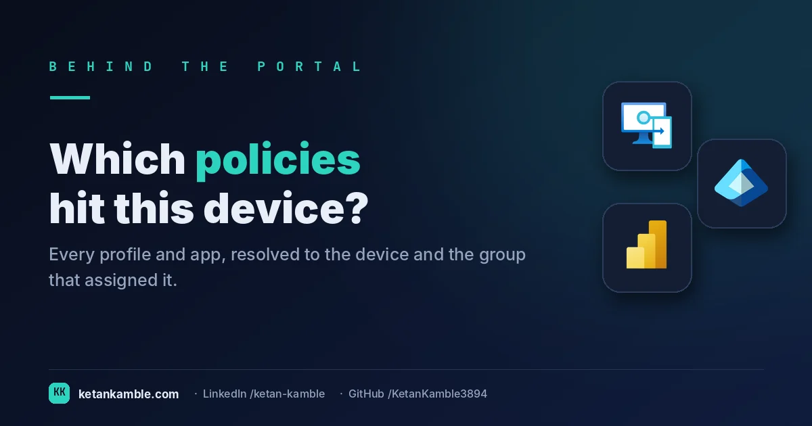
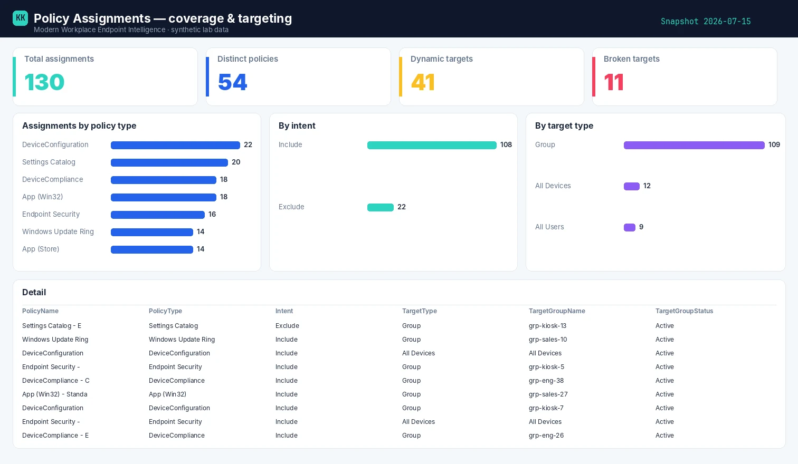

# Every policy, every target: the assignment map Intune won't draw for you

{ .post-cover width="1200" height="630" fetchpriority=high }

Open any compliance policy or configuration profile and Intune shows you *its* assignments. What it never shows is the **whole map** — every policy, every group it targets, which of those groups are dynamic, and which point at a group that no longer exists. This is the read-only collector that flattens all of it into one table.

<!-- more -->

!!! tip "The short version"
    Intune shows assignments one policy at a time. This scheduled, read-only collector walks every **compliance policy, configuration profile, Settings Catalog policy, endpoint-security intent and ADMX template**, resolves every target group (static or dynamic), flags broken and dynamic targets, and writes one flat assignment table — **no write access, no live tenant in the report.**

## Why the portal doesn't hand you this

- **It's per-policy, never fleet-wide.** You can see what a single profile targets, but not "every policy hitting the *Sales-Dynamic* group", or "every assignment pointing at a deleted group".
- **Dynamic groups hide their logic.** A policy assigned to a dynamic group tells you nothing about the *rule* that decides membership — that lives in Entra, on the group.
- **Broken targets are invisible.** Assign a policy, delete the target group later, and the assignment quietly points at nothing. The console won't surface it; your table will.

## What's different about this report

One row per **policy × target**, with the policy type, whether it's an **Include or Exclude** assignment (the assignment *mode* — not to be confused with app "intent"), the target type (group / All Devices / All Users), whether the group is **dynamic**, and the group's **status** (Active / missing / deleted). That's the coverage-and-gaps view the console can't assemble.

For example, a single row might read **Win-Compliance-Baseline · Exclude · Sales-Dynamic (dynamic) · Active** — which tells you at a glance that your compliance baseline is *excluding* a live dynamic group. Another might read **BitLocker-Config · Include · (deleted group) · missing** — an assignment quietly pointing at nothing. Neither is visible from any single policy blade.

## How it works: a read-only collector

--8<-- "assets/diagrams/policy-assignments.svg"

The read-only Graph roles are all `.Read.All`: `DeviceManagementConfiguration.Read.All` for the policies and assignments, and `Group.Read.All` / `Directory.Read.All` for the group metadata and dynamic rules. Nothing writes.

!!! warning "Verify before you trust it"
    Assignment shapes differ by policy type, and some newer policy types live on Graph's **beta** endpoint — confirm each type resolves in your **own lab tenant** and pin to `/v1.0` where you can. Every figure in the screenshots is **synthetic lab data** (`@contoso.com`).

## The Power BI report

Because the runbook already resolved every group, the Power BI side is a coverage map: assignments by policy type, by assignment mode (Include / Exclude), by target type, and a table you can filter down to any single broken or dynamic target.

{ .kk-zoom loading=lazy width="1512" height="880" }

*Template + build kit on the **[Policy Assignments report page](../../powerbi/policy-assignments-report.md)**.*

## Gotchas from the lab

- **Exclude assignments matter as much as includes.** An Exclude on a big group can silently gut a policy's reach — slice on the Include / Exclude mode to catch it.
- **"All Devices" is not a group.** It targets everything with no membership rule; treat it as its own target type, not a group lookup.
- **A missing target is a finding.** `(deleted group)` in the status column is an assignment doing nothing — clean it up.

## Reproduce it yourself

The [synthetic fleet generator](../../scripts/synthetic-fleet.md) can emit a realistic, entirely
fictional `PolicyAssignments.csv` so you can build and demo the whole report before pointing it at real data.

!!! question "Want the full assignment map for your tenant?"
    Flattening every policy-to-group assignment into one report is read-only tooling I build hands-on for Intune teams. In production now against real multi-thousand-device tenants. **[Work with me →](../../work-with-me.md)**

## FAQ

**Does it change any assignments?** No — it only reads policies, assignments and group metadata (`.Read.All`) and writes a CSV. Nothing is modified.

**What's a "broken" target?** An assignment pointing at a group that was later deleted — it quietly does nothing, and the portal won't surface it. The status column flags it.

**Does it resolve dynamic group rules?** Yes — it pulls each group's dynamic membership rule and status, so you can see what actually decides membership.

## More in this series

- [Which setting actually failed?](../noncompliant-devices/)
- [One row per device](../inventory-all-devices/)

## Related

- :material-script-text: **The script** → [Policy Assignments](../../scripts/policy-assignments.md)
- :material-chart-box: **The report + template** → [Policy Assignments report](../../powerbi/policy-assignments-report.md)
- :material-shield-lock: **The bigger picture** → [Zero-Access Agent](../../projects/zero-access-agent/index.md)

---

*Screenshots use synthetic data from a personal lab — no real tenant, users, or devices. Independent
content, not affiliated with, sponsored by, or endorsed by Microsoft. Microsoft, Intune, Entra,
Microsoft Graph, Azure, Defender and Power BI are trademarks of the Microsoft group of companies.*
