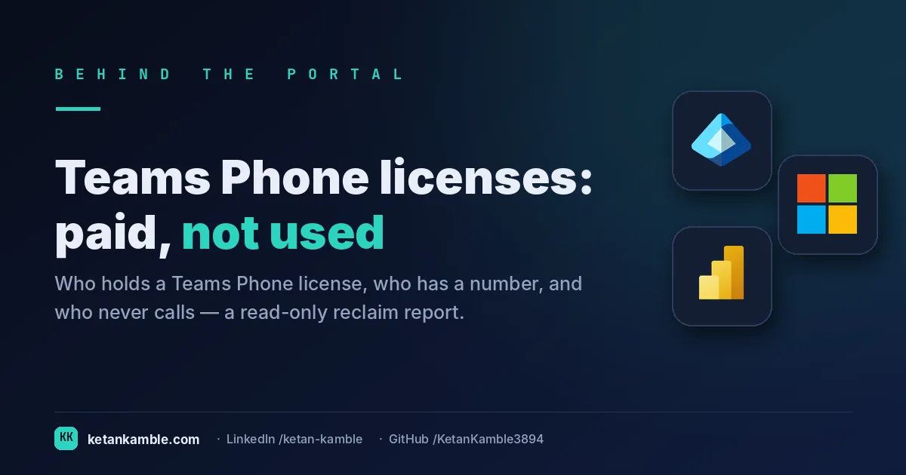

# Teams Phone licenses, paid for and never used: the reclaim report

{ .post-cover width="1200" height="630" fetchpriority=high }

A Teams Phone license on a **disabled account**, a user with **no number provisioned**, or someone who **hasn't made a call in 90 days** is money leaving the building every month for nothing. The licensing blade will tell you a SKU is *assigned*; it won't tell you it's *wasted*. This read-only report joins license assignment to sign-in, Teams usage and the phone number — and tiers every licensed user by how reclaimable they are.

<!-- more -->

<iframe scrolling="no" src="/assets/hooks/teams-phone-license-usage.html" title="Animated: Teams Phone licences leaking money monthly — versus a tiered, costed reclaim report" loading="lazy" style="display:block;width:100%;aspect-ratio:1200/470;border:0;border-radius:16px;box-shadow:0 10px 30px rgba(0,0,0,.35)"></iframe>

!!! success "The payoff"
    Teams Phone Standard lists at about **$8/user/month**. If a review surfaces **137** licences on
    disabled accounts, no number, or 90 days of silence, that's roughly **$1,096/month — about $13,000/year**
    you stop paying for — and the reclaim list is built **unattended** instead of a multi-hour analyst job
    every cycle. *(Illustrative — your seat count and contract price set the real number.)*

!!! tip "The short version"
    This scheduled, **read-only** runbook finds every user holding a Teams Phone SKU (MCOEV and
    friends), then joins **sign-in activity, Teams device + call usage (90 days), the directory phone
    number, and the user's manager** into one row per user — each tagged with an **observational risk
    tier** (disabled account, never signed in, inactive >90 days, no Teams activity, or active). It
    writes a CSV to Blob for Power BI. **No writes to the tenant.**

## Why "assigned" tells you nothing about "used"

Licensing shows you assignment. Reclaim decisions need *usage*, and the signals live in four different places:

- **Is the account even enabled?** A Phone license on a disabled account is pure waste — and the licensing view won't flag it.
- **Do they have a number?** `businessPhones[0]` is the user's **directory** phone attribute — a useful hint, but *not* the authoritative Teams line assignment (that lives in Teams, via `Get-CsPhoneNumberAssignment`). Treat an empty value as a flag to check, not proof telephony was never provisioned.
- **Have they signed in?** `signInActivity` (needs Entra ID P1/P2) tells you never / dormant / active.
- **Do they actually use Teams?** The **Teams usage reports** (device + activity, 90 days) tell you if they're calling at all, not just logged in.

No single blade combines those. The report does — and only then can you say "this license is reclaimable" with evidence, not a guess.

## What's different about this report

One row per licensed user, with the reclaim story already assembled: the **primary Phone SKU** (and any stacked ones), the **directory phone number** (or blank), **days since last sign-in**, **last Teams activity**, **90-day Teams call count**, the **manager** (so the reclaim request goes to the right person), and an **observational risk tier**:

| Tier | Meaning |
| --- | --- |
| **1 · Disabled account** | License on a disabled account — pure waste |
| **2 · Never signed in** | Account exists, never used |
| **3 · Inactive >90 days** | Dormant user, license not justified |
| **4 · No Teams activity** | Signed in, but no Teams use in 90 days |
| **5 · Active** | Healthy — signed in and using Teams |

The tiers are **observational, not prescriptive** — the report never says "remove this license." It hands the reviewer (Voice Services, or a Service Manager who knows the person and the context) the evidence to decide. The 90-day call count is an advisory column the reviewer weighs — the tier itself keys on sign-in and Teams device-activity presence, not the raw call number.

For example, a row reading **j.doe@contoso.com · MCOEV · no number · last sign-in 142 days ago · 0 calls · Tier 3** is an obvious candidate to review; a row reading **a.smith@contoso.com · MCOEV · +1 555… · 88 calls · Tier 5** clearly isn't. Same license, opposite verdict — and the manager column tells you who to ask.

## How it works: a read-only collector

--8<-- "assets/diagrams/teams-phone-license-usage.svg"

It authenticates as a **Managed Identity**, reads the SKU map from `subscribedSkus`, pulls every user holding a Phone SKU (with sign-in and phone number in one `$select`), resolves managers in bulk via **`$batch`** (20 per call, not one request per user), joins the two **Teams usage reports**, classifies each user, and writes the CSV to Blob for Power BI.

!!! note "First time standing up a runbook?"
    The [Collection layer setup](../../projects/zero-access-agent/azure-automation-setup.md) covers the groundwork once: create the Automation Account, enable the **Managed Identity**, grant the read-only Graph app roles (no portal blade — it's `New-MgServicePrincipalAppRoleAssignment`), import `Az.Accounts`/`Az.Storage`, and give the identity access to the storage account. This report needs four read scopes (`User.Read.All`, `Organization.Read.All`, `AuditLog.Read.All`, `Reports.Read.All`) plus Entra ID **P1/P2** for `signInActivity`.

!!! note "Why a `$batch` POST is still read-only"
    Manager lookup uses Graph's **JSON batch** endpoint — a `POST` that carries up to 20 *GET*
    sub-requests. It's a `POST` for transport only; every operation inside it reads. That's the same
    honest distinction the rest of this project makes: the guarantee is the **scopes** granted
    (all `.Read.All`), not the HTTP verb. The only write is the CSV to your own Blob container.

!!! warning "Verify before you trust it"
    `signInActivity` needs **Entra ID P1/P2** and `AuditLog.Read.All`, and can be null for brand-new or
    never-used accounts — treat null as "Never", not "recently". The Teams usage reports return **CSV
    with a UTF-8 BOM** that quietly corrupts the first column header unless you strip it (the script's
    `Save-CsvBytes` does). And confirm your tenant's exact **Phone SKU GUIDs** from `subscribedSkus`
    first — the ones in the script are common Microsoft product IDs, not a complete list. Every value
    in the examples is **synthetic lab data** (`@contoso.com`).

## Set it up, step by step

You don't build this one from scratch. Every collector shares the same read-only plumbing, so you set that up **once** — after that, adding this report is about a five-minute job.

1. **One-time — stand up the collection layer.** Follow **[Setting up the collection layer](../../projects/zero-access-agent/azure-automation-setup.md)**: an Azure Automation account, a system-assigned **Managed Identity** (no secrets, no app registration), and a storage account for the CSV snapshots. You only do this once, however many collectors you end up running.
2. **Grant this collector's read-only scopes.** In that guide's role-assignment step, add the scopes this one needs — `AuditLog.Read.All`, `Organization.Read.All`, `Reports.Read.All` and `User.Read.All`. Every one ends in `.Read.All`: it reads, and never writes to your tenant. (Running more than one collector? Scopes are **additive** — add the new ones, don't replace what's already granted.)
3. **Import the script as a runbook.** Take **[the script](../../scripts/teams-phone-license-usage.md)**, import it into the Automation Account as a PowerShell 7 runbook, and publish it.
4. **Schedule it.** Attach a daily (or weekly) schedule the same way the setup guide shows. It then runs unattended, dropping a dated CSV into your `root/` container each time.
5. **Point Power BI at the CSV.** In Power BI Desktop, start with the **synthetic sample** so you can build before touching real data. For live data, use **Get Data → Azure Blob Storage** and point it at the dated CSV in your `root/` container (the setup guide has the storage account and connection details). Refresh to get your dashboard.

No secrets, no app registration, nothing that can change your tenant — just a scheduled read and a CSV that Power BI draws from.

## Gotchas from the lab

- **Trim the CSVs.** Graph report CSVs embed trailing spaces in the UPN column — join on `UPN.Trim().ToLower()` or half your users silently won't match their usage rows.
- **`$top` maxes at 120 with `signInActivity`.** Graph caps the page size at **120** when `signInActivity` is in `$select`, and returns HTTP 400 above it — the script sets `$TopWithSignIn = 120` and paginates. (Ask for 500 and it fails on the first page.)
- **Turn off report name concealment, or every join fails.** By default the Microsoft 365 admin center pseudonymises user names in usage reports (*"Display concealed user, group, and site names"*), so the Teams usage CSVs come back with masked UPNs — the join matches nothing and **every otherwise-active user silently drops to Tier 4 "No Teams activity"** (sign-in-based tiers 1–3 still resolve, since `signInActivity` isn't concealed). A Global/Reports admin must disable that setting (or the report is meaningless). Spot it by eye first: if the usage CSV's UPN column comes back pseudonymised, the setting is still on.
- **Stacked SKUs are real.** A user can hold MCOEV *and* a Calling Plan bundle — dedupe by UPN and list all Phone SKUs, or you'll double-count licenses.
- **The tiers don't decide for you.** A dormant sign-in with a shared-device SKU might be legitimate. Keep the tiers observational and let a human who knows the context make the call.

## Reproduce it yourself

Run it read-only against a **lab tenant**, confirm the risk-tier counts in the verbose summary, and open the CSV before wiring up Power BI. The [synthetic fleet generator](../../scripts/synthetic-fleet.md) can stand in for user data so you can build the report with no real tenant.

## FAQ

**Does this remove any licenses?** No. It's read-only against Graph and writes only a CSV to your Blob. The risk tiers are observational — a human decides what to reclaim.

**Why join Teams usage as well as sign-in?** Because "signed in" isn't "using Teams to call". The 90-day device and activity reports separate a live phone user from someone who just logs into Windows.

**Do I need premium licensing for this?** Sign-in activity needs Entra ID P1/P2 and `AuditLog.Read.All`. Everything else uses standard read scopes.

## More in this series

- [Who's missing an Intune license](../whos-missing-an-intune-license-finding-the-devices-slipping-through/) — the device-side license gap
- [One row per device](../one-row-per-device-building-the-inventory-intune-wont-hand-you/)

## Related

- :material-script-text: **The script** → [Teams Phone License Usage](../../scripts/teams-phone-license-usage.md)
- :material-robot-outline: **The capstone** → [The read-only AI agent that can't touch your tenant](../the-read-only-ai-agent-that-cant-touch-your-tenant/)

## References — Microsoft documentation

The Microsoft Learn documentation behind this one, if you want to go to the source:

- **Teams Phone licensing** — what Teams Phone requires: [Teams Phone licensing](https://learn.microsoft.com/en-us/microsoftteams/teams-phone-licensing)
- **Assign Teams add-on licenses** — assigning Phone add-ons: [Assign Teams add-on licenses to users](https://learn.microsoft.com/en-us/microsoftteams/teams-add-on-licensing/assign-teams-add-on-licenses)
- **subscribedSku (Graph)** — read purchased vs consumed counts: [subscribedSku resource type](https://learn.microsoft.com/en-us/graph/api/resources/subscribedsku?view=graph-rest-1.0)
- **assignLicense (Graph)** — programmatic license changes: [user: assignLicense](https://learn.microsoft.com/en-us/graph/api/user-assignlicense?view=graph-rest-1.0)
- **PSTN usage report** — see actual calling activity: [Microsoft Teams PSTN usage report](https://learn.microsoft.com/en-us/microsoftteams/teams-analytics-and-reports/pstn-usage-report)

---

*Examples use synthetic data from a personal lab — no real tenant, users, or devices. Independent
content, not affiliated with, sponsored by, or endorsed by Microsoft. Microsoft, Teams, Entra,
Microsoft Graph, Azure and Power BI are trademarks of the Microsoft group of companies.*
