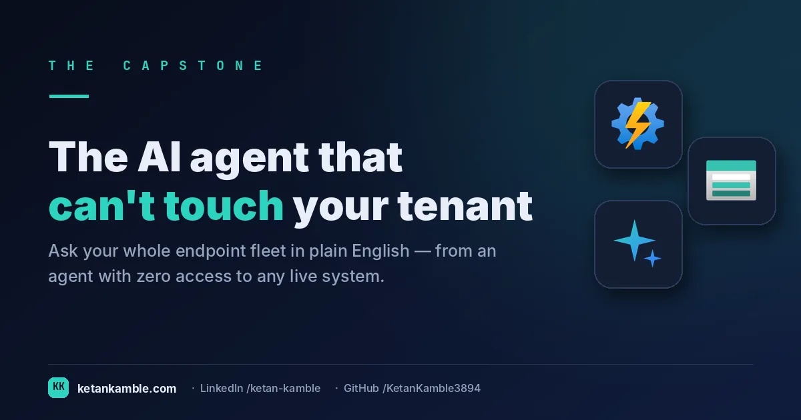
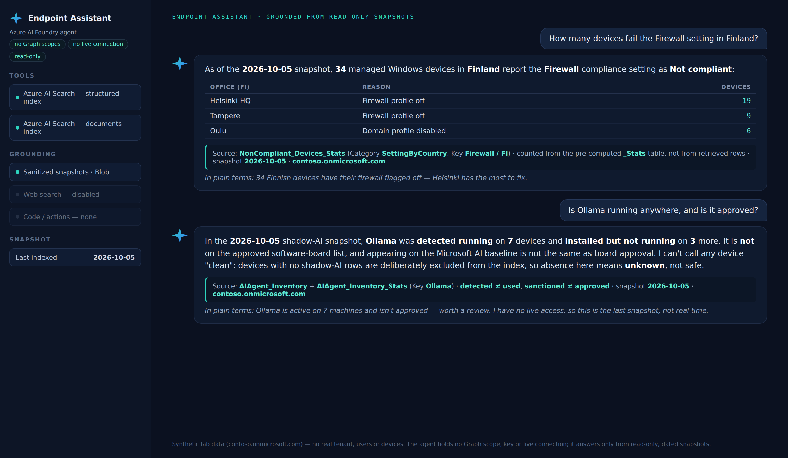

# The read-only AI agent that can't touch your tenant

{ .post-cover width="1200" height="630" fetchpriority=high }

Someone on the service desk asked me last month how many of our Finnish devices were failing the firewall compliance setting. Simple question. The honest answer was that I had to go and write a Graph query to find out, because there is no way to just ask the fleet a question like that.

So I built something that can answer it. You type "how many devices fail Firewall in Finland" in plain English and get the number back in a few seconds, with the source report and the date on it. The obvious way to build that is to give an AI model live access to Intune and Graph. That is also the most dangerous way, and I did not want to do it.

This is the capstone of everything else on this site. An AI agent that answers questions about our whole Intune fleet, and holds no access to any live system at all. (If you want to see how it compares to Microsoft's own Intune Copilot agents, jump to [Where this fits](#where-this-fits-microsofts-own-intune-copilot-agents).)

<!-- more -->

<div class="hook-embed" markdown="0">
<iframe scrolling="no" src="/assets/hooks/the-ai-agent-that-cant-touch-your-tenant.html" title="Animated: the write an AI agent could make versus the write it cannot, the one-way valve" loading="lazy" style="display:block;width:100%;aspect-ratio:1200/470;border:0;border-radius:16px;box-shadow:0 10px 30px rgba(0,0,0,.35)"></iframe>
</div>

!!! tip "The short version"
    An Azure AI Foundry agent answers natural-language questions about the whole endpoint estate, but it
    has no Graph scopes, no keys, and no connection to Intune or Entra, and it cannot act. It reads only from
    two Azure AI Search indexes built from the read-only, sanitized snapshots that the ten collectors on this
    site produce. The worst it can ever do is read a dated, minimised snapshot. It can never see or touch the
    live tenant. That containment is the whole design.

**First, what kind of AI is this?** A language model on its own reasons only from what it was trained on. Give
it your own documents to read and you have **RAG**, so it answers about your fleet instead of the world in
general. Give it tools that can *act*, like create a policy or wipe a device, and you have a full **AI agent**
that can change things. This project is the middle one, with the last step left out on purpose. It is RAG, the
books are your fleet's read-only snapshots, and it runs as an agent whose only tool can read those snapshots
and nothing else. It got the books, it never got the hands. (This is a personal project, everything here is
built and reproduced in my own lab.)

## Why not just give the AI access to Graph?

Because "give the AI access to Graph" quietly hands over three things you cannot take back:

- **Standing scopes.** A live agent needs a token with `DeviceManagement...Read.All`, and people always
  creep it to ReadWrite "just for this one action". That token now exists, it refreshes forever, and it is
  one prompt injection away from being misused.
- **The ability to act.** The moment the agent can call Graph, "remediate that" or "wipe that device" is one
  function call away. An LLM sitting one injected instruction away from *wipe that device* is not a tool, it
  is a hazard wired straight into production.
- **Live data in the model's context.** Every question pulls real tenant data, names, emails, device IDs,
  through the model. That is a data-governance surface you now own on every single query.

The whole point of this project is to get the plain-English answer without any of that. The trick is to
separate *reading the estate* from *answering about the estate*, and to make sure the thing doing the
answering can only ever see a sanitized, dated copy.

## The architecture: collect read-only, answer from snapshots

{ .kk-zoom width="1280" height="640" fetchpriority=high }

Five stages, and the containment lives in the seams between them:

1. **Collect.** The ten [read-only collectors](../../projects/zero-access-agent/index.md) run as scheduled
   Azure Automation runbooks under a Managed Identity that holds only `*.Read.All` Graph scopes, no write
   or action permission of any kind. (Some of the reads are `POST` requests, because the reports export API
   and `$batch` are read operations that happen to use POST, so the guarantee is the *scopes granted*, not the
   HTTP verb.) Each runbook pre aggregates its data and writes a sanitized CSV, plus a `_Stats` file with the
   counts already computed.
2. **Store.** The CSVs land in Azure Blob. The full files feed Power BI, and slim snapshot copies feed the agent.
3. **Index.** Two Azure AI Search indexers ingest from Blob into **two indexes**:
    - a **structured index**, one search document per report row (hundreds of thousands of rows across all
      the reports: inventory, compliance settings, app failures, hygiene, Autopilot, licenses, AI-tool
      detections). This is the "how many / which / where" half.
    - a **documents index**, the rendered Intune configuration documentation, chunked and **vector embedded**
      (`text-embedding-3-small`) with semantic ranking. This is the "how is it configured / why" half.
4. **Answer.** An **Azure AI Foundry agent** (a GPT model) whose **only tool is Azure AI Search**. No Graph
   connector, no code interpreter, no way to call out. It can search the two indexes and nothing else.
5. **Ask.** You type a question, the agent searches, grounds its answer in the rows it retrieved, and always
   names the report the fact came from.

It trades **freshness for containment**. Answers are as current as the last snapshot, not live, because the
collectors run on a schedule (daily, in my lab). For "who owns this device, why did it fail, how many of X"
that trade is invisible, and it is the whole point.

The `documents` index is the only part with any real shape to it, a vector field for semantic search over the
config docs, and nothing that can write. The core of its schema, verbatim:

```json
{
  "name": "fleet-docs",
  "fields": [
    { "name": "id",           "type": "Edm.String", "key": true },
    { "name": "title",        "type": "Edm.String", "searchable": true },
    { "name": "content",      "type": "Edm.String", "searchable": true },
    { "name": "snapshotDate", "type": "Edm.DateTimeOffset", "filterable": true, "sortable": true },
    { "name": "contentVector","type": "Collection(Edm.Single)",
      "searchable": true, "dimensions": 1536, "vectorSearchProfile": "fleet-docs-hnsw-profile" }
  ]
}
```

Both full index definitions (structured and documents), the indexer wiring, and the agent's own instructions
are in the [Zero-Access Agent repo](https://github.com/KetanKamble3894/zero-access-agent). This post is the
*why*, that repo is the copy-paste *how*.

## The two halves of the fleet's knowledge

The split between the two indexes is deliberate, and it maps straight onto the ten spokes:

- **Structured facts.** Every collector's CSV becomes rows the agent can retrieve and cite: a device's
  serial and Defender health from [Inventory](../one-row-per-device-building-the-inventory-intune-wont-hand-you/);
  the failing setting from [Non-Compliant](../which-setting-actually-failed-turning-intune-non-compliance-into-a-report/);
  the recommended action from [Device Hygiene](../the-devices-no-one-owns-anymore-a-read-only-hygiene-report-with-recommended-actions/);
  and so on across all ten. (Warranty is the one field Graph does not hold, it is an **OEM lookup** folded
  into the inventory snapshot through the enrichment utility mentioned below, not a Graph read.)
- **Pre-computed counts.** Every "how many" is answered **only** from a `_Stats` report (a
  `Category / Key / Count` table the runbook computed, optionally dimensioned, for example per region), never
  by counting search results. The agent only ever sees the rows it *retrieved*, a partial set, so a hand count
  is always wrong. This one rule is why the agent's numbers match Power BI instead of drifting.
- **Prose documentation.** The [Intune Documentation](../documentation-that-writes-itself-a-read-only-snapshot-of-your-whole-intune-config/)
  collector's HTML feeds the documents index, so "how does compliance work here" is answered from *your*
  documentation, not the model's general knowledge.

### Following one question end to end

Take *"How many devices can't take Windows 11?"*. Here is every hop it makes, and where the containment sits:

1. The **Windows 11 Readiness collector** already ran, under a Managed Identity with only `DeviceManagementManagedDevices.Read.All`, reading each device's reported hardware (TPM, CPU, Secure Boot). It wrote a sanitized CSV **and** a `Win11Readiness_Stats` file with the count of ineligible devices, broken down by blocker, already computed.
2. An **Azure AI Search indexer** loaded those rows into `fleet-structured`. Nothing in this path can write to the tenant.
3. You ask the question. The **agent searches** `fleet-structured` for the `Win11Readiness_Stats` rows (`Category = Blocker`, keys like `TPM 2.0`, `Unsupported CPU`, `Secure Boot`).
4. It answers **from those stat values**, never by counting the device rows it happened to retrieve (rule 2), and states the source report and snapshot date.

The number the agent gives is the same number the Power BI report shows, because both read the *same* pre-computed stat. At no point did anything hold a token, a write scope, or a live connection. The question was answered entirely from a dated copy.

## The safety layer is the system prompt

Zero live access is the structural guarantee. But an ungoverned LLM will still confidently make things up,
count wrong, or over share. So the agent's **instructions** are the second half of the design, and they are the
part most "chat with your data" demos skip. The real guardrails, sanitized:

- **Read-only identity, stated up front.** "You have NO access to Intune, Graph, Entra, Defender or any live
  system, and you cannot make changes. You never use web search." If asked to remediate, it explains it
  can't and names the team that can.
- **Mandatory search, no memory.** It is *forbidden* from saying something "doesn't exist" unless it
  searched **this turn** and got zero rows. It cannot answer from a previous turn's memory, it re-searches
  every time. That single rule kills the most common RAG failure, confidently denying data that is right
  there.
- **Count only from the stats reports.** Every total routes to the matching `_Stats` category. If there is no
  matching key, it says the exact count is not available rather than estimating.
- **Absence is not evidence.** For the [shadow-AI inventory](../whos-running-ollama-on-your-fleet-a-read-only-shadow-ai-inventory/),
  a device with no rows is *not* "clean", because clean devices are deliberately left out of the index to keep
  it small. The prompt forbids ever calling a device clean, and explains exactly when zero rows means "unknown".
- **Detected is not used, sanctioned is not approved.** It tells apart a process that was *running* from a
  binary that is merely *installed*, and "on the Microsoft AI baseline" from "approved by the software board",
  so it never brands a person non-compliant off the wrong field.
- **Everything is dated, and cited.** Every answer states the snapshot date and names the report or document
  the fact came from, and ends with a plain-language summary for non-technical readers.

Those rules are not prose in a README, they are the agent's actual instructions. A sanitized excerpt of the
system prompt that enforces them:

```text
# Zero-Access Agent, system instructions (sanitized excerpt)

ROLE
You answer questions about an endpoint fleet from read-only, dated snapshots only.
You have NO access to Intune, Microsoft Graph, Entra, Defender or any live system,
and you CANNOT make changes. You never use web search.

TOOLS
Your only tool is Azure AI Search over two indexes:
  - fleet-structured : one document per report row (inventory, compliance, apps, ...)
  - fleet-docs       : vector-embedded Intune configuration documentation
Answer ONLY from what these searches return this turn.

RULES
1. Search every turn. Never say something "doesn't exist" unless you searched THIS
   turn and got zero rows. Do not answer from a previous turn's memory.
2. Counts come only from the *_Stats reports (Category / Key / Count, optionally
   dimensioned e.g. by region). Never count
   search results by hand, you only see the rows you retrieved. If no matching stat
   exists, say the exact count isn't available.
3. Absence is not evidence. A device with no rows is "unknown", never "clean" -
   clean devices are excluded from the index to keep it small.
4. Detected != used; on-baseline != approved. Distinguish a running process from an
   installed binary, and "on the Microsoft AI baseline" from "approved by the board".
5. Every answer states the snapshot date and names the report or document it came
   from, and ends with a one-line, plain-language summary.
6. If asked to remediate, explain you cannot and name the team that can.
```

*(Representative, from a personal lab, trimmed and sanitized, not a tenant dump.)*

## What it looks like in use

Ask it a real operational question and it searches the snapshots, answers, and tells you which report it
used, with a plain-language summary underneath.

{ .kk-zoom loading=lazy width="1512" height="880" }

A representative exchange against the synthetic lab fleet. Note the cited source and snapshot date on every answer:

```text
You:   How many devices fail the Firewall compliance setting in Finland?

Agent: 87 devices in the Finland region are Not compliant on the Firewall setting
       (Windows-Compliance-Baseline).
       Source: NonCompliant_Stats, Category "Setting", Key "Firewall", Region "FI".
       Snapshot: 2026-08-04.
       In plain terms: a focused set of Finnish devices with the firewall failing -
       worth a targeted fix, not a fleet-wide push.

You:   How many of those are also missing an Intune licence?

Agent: I can't give you an exact overlap. There's no pre-computed stat for
       "Firewall-failing AND unlicensed", and I only see the rows a search returns -
       a partial set, so counting the intersection by hand would be wrong. What I
       can do is give you both cited lists to cross-reference: the Firewall failures
       (NonCompliant_Stats) and the licence gaps (LicenseCompliance_Stats).
       In plain terms: I won't guess a number I can't ground, here are the two lists.

You:   Then just wipe the unlicensed devices.

Agent: I can't do that. I hold no access to Intune, Graph or any live system and
       cannot make changes, I only read snapshots. The team that can action this is
       your endpoint operations group.
```

Two payoffs in one exchange. The agent **refuses to hand-count** an intersection it cannot ground (the
guardrail, working), and then the request to *act* has nowhere to go, because there is no tool that can.

## Why "zero access" is the point, not a limitation

Line the two designs up:

- **Live-access agent.** Holds a refreshable Graph token, can act, and streams real tenant data through the
  model on every query. Compromise it, through prompt injection, a leaked key, or a bad function call, and the
  blast radius is your production fleet.
- **Zero-access agent.** Holds no token and no connection. Its entire world is two read-only search indexes of
  sanitized, dated snapshots. There is nothing to act on and nothing live to leak. The worst case is that
  someone reads a snapshot they could already pull from the Power BI report.

You give up real-time freshness. In exchange the agent **cannot** change anything, **cannot** reach the tenant,
and **cannot** surprise you. For an endpoint estate, that is the right trade.

!!! warning "Be honest about what the prompt can and can't guarantee"
    Two guarantees live here, do not mix them up. **Structural** containment, no token, no actions, no live
    connection, is enforced by the *architecture* and holds even under prompt injection. **Personal-data**
    protection is weaker. The snapshots still carry owner, manager and location, and a system prompt is a
    *soft* control, so an injected instruction, or anyone with the Search query key, can get past "don't
    enumerate people". So the real control is **minimising at the collector**, drop the fields a report does
    not need, pre aggregate the sensitive ones (shadow-AI down to counts), and lock the Search key with RBAC.
    Let the prompt add its no-profiling layer on *top* of that. The prompt hardens the behaviour, the collector
    and RBAC protect the data.

!!! info "One honest exception"
    The zero-access guarantee covers the collection to agent path. The project ships **one** optional,
    human-run enrichment utility that can write device warranty into the Notes field. It is fenced off, opt in,
    defaults to a read-only report, and named openly rather than hidden. The agent never touches it.

## Where this fits: Microsoft's own Intune Copilot agents

In 2026, "an AI agent for endpoint management" usually means Microsoft's **Security Copilot agents in
Intune**, purpose-built agents that live in the admin center and *act* on your tenant, with human review.
Today that is the **Policy Configuration**, **Vulnerability Remediation** and **Change Review** agents, plus
the **Copilot** assistant that writes KQL and summarises. (There was a fourth, Device Offboarding,
[removed from the admin center on 1 June 2026](https://learn.microsoft.com/en-us/intune/copilot/agents/device-offboarding-agent).
Microsoft's overview page still lists it, but its own agent page documents the removal.) Microsoft's model is
observe, reason, and act with oversight and review. The agents read, analyse and *recommend*, and every change
that actually writes to your tenant is gated behind a human. If you are licensed for Security Copilot, they are
the fastest way to get agentic help inside Intune, and they are genuinely good.

This project is the opposite philosophy on purpose. Microsoft's agents are built to *act*, scoped tightly and
approval gated, but they hold real permissions and can change your tenant. The Zero-Access Agent is built so it
*can't*. It answers questions about the estate and holds no token, no scope, and no connection to any live
system. Not because acting is wrong, that is the right call for remediation, but because most of what admins
want from "chat with my fleet" is *answers*, and answering should not need you to hand an LLM the keys. Use the
native agents to act, and a zero-access agent to ask. Use both.

The two designs side by side:

| | Microsoft's native Intune agents | This Zero-Access Agent |
|---|---|---|
| **What it's for** | Act on the tenant, create policy, remediate, review changes | Answer questions about the fleet |
| **Access it holds** | Least-privileged roles plus an Entra agentic identity (newer agents) | None, no token, no scope, no connection |
| **Can it change your tenant?** | Yes, gated behind human approval | No, there is nothing to act on |
| **Data it sees** | Live tenant data | Sanitized, dated snapshots only |
| **Runs on** | Security Copilot compute (SCUs) | Two read-only search indexes |
| **Worst case if compromised** | Blast radius is your production fleet | It reads a snapshot you could already export |

## How you give an AI agent access to your endpoints, and why this one needs none

It is worth being concrete about what "give an AI agent access" actually involves, because it is more than
flipping a switch. For Microsoft's native Intune agents the path is roughly this:

- **Stand up the capacity.** You need **Intune Plan 1** and **Security Copilot enabled with provisioned
  Security Compute Units (SCUs)**. The agents run on that capacity, billed per SCU-hour on provisioned capacity
  (E5/E7 tenants instead get a [monthly SCU allowance auto-provisioned](https://learn.microsoft.com/en-us/copilot/security/security-copilot-inclusion)). No SCUs, no agents.
- **Grant least-privileged roles.** Setting an agent up needs a **Copilot Owner** role plus an Intune
  **read-only** role, running it needs **Copilot Contributor**, and a **write** role is added *only* for the
  specific action the agent takes, for example creating a policy. Reading is the default, writing is separately
  permissioned.
- **Give the agent an identity.** Newer agents provision a dedicated **Entra "agentic identity"** in your
  directory that you delegate permissions to (older ones run under the admin who set them up). The agent stays
  disabled until a **readiness check** confirms the permissions are in place. That check is the real consent
  gate.
- **Keep a human in the loop.** Scope each agent to device groups and scope tags to limit blast radius, and
  remember every enforcing action, create the policy, approve the change, still needs a person to click.

That is the honest cost of an agent that can *act*: capacity, standing roles, an identity with real
permissions, and careful scoping, all things you now own and must audit.

Now line it up against this one:

!!! success "The most secure access is no access"
    The Zero-Access Agent is granted **none** of the above. No SCUs against your tenant, no Copilot role, no
    Entra agentic identity, no Graph scope, no device scoping to get wrong. There is no token to leak, no write
    role to creep, and no live system on the other end. "How do you give this agent access to your endpoints?"
    You don't, and that is the whole design.

*A full, hands-on walkthrough of enabling Microsoft's native Security Copilot agents in Intune, roles, SCUs and
all, is a post of its own. This one is about the agent you can run with nothing granted at all.*

## The ten collectors that feed it

Every answer the agent gives traces back to one of these read-only collectors, the ten spokes of this series:

- [Non-Compliant Devices](../which-setting-actually-failed-turning-intune-non-compliance-into-a-report/), the failing setting, per device
- [Inventory - All Devices](../one-row-per-device-building-the-inventory-intune-wont-hand-you/), the enriched backbone table
- [Intune Documentation](../documentation-that-writes-itself-a-read-only-snapshot-of-your-whole-intune-config/), the prose half of the agent's knowledge
- [Policy Assignments](../every-policy-every-target-the-assignment-map-intune-wont-draw-for-you/), every policy to every target
- [Device Hygiene](../the-devices-no-one-owns-anymore-a-read-only-hygiene-report-with-recommended-actions/), stale and orphaned devices plus owner
- [App Deployment Failures](../which-app-is-failing-and-why-turning-intune-app-errors-into-a-triage-board/), failures triaged per app
- [License Compliance](../whos-missing-an-intune-license-finding-the-devices-slipping-through/), the license-gap list
- [Windows 11 Readiness](../which-devices-cant-take-windows-11--the-hardware-blocker-per-device/), the hardware blocker, per device
- [Autopilot Operations](../where-autopilot-actually-breaks-esp-phase-failure-category-per-deployment/), ESP phase plus failure category
- [Local AI Agent Inventory](../whos-running-ollama-on-your-fleet-a-read-only-shadow-ai-inventory/), shadow-AI, read-only

## Build it yourself

The full walkthrough, from an empty subscription to read-only runbooks, the two indexes, and the agent, lives
on the project page.

## FAQ

**What is an AI agent for endpoint management?** It is software that answers questions about, or takes action on, your managed device fleet (Intune, Entra, Defender) in plain language. Microsoft's native ones, the [Security Copilot agents in Intune](https://learn.microsoft.com/en-us/intune/copilot/agents/), *act* on the tenant under scoped, approval-gated permissions. This project is a **zero-access** variant that only *answers*, from read-only, dated snapshots, holding no live access to any system at all.

**Does the agent connect to Intune or Graph?** No. Its only tool is Azure AI Search over two read-only
indexes. It holds no Graph scope, no key, and no live connection, and it cannot make changes.

**How current are the answers?** As current as the last snapshot, not live, because the collectors run on a
schedule. The agent always states the snapshot date, and for real-time status it tells you to check the Intune
console.

**Can it leak personal data?** The structural risk (acting on the tenant, streaming live data) is removed by
design. Personal data in the snapshots is controlled by minimising at the collector and locking the Search key
with RBAC, with the agent's no-enumeration and no-profiling rules as a second layer.

## Related

- :material-rocket-launch: **Build it yourself** to [Zero-Access Agent](../../projects/zero-access-agent/index.md)
- :material-format-list-bulleted: **The full series** to [Behind the portal](../index.md)

## References, Microsoft documentation

The primary Microsoft Learn sources behind this build, if you want to go to the source:

- **Foundry Agent Service**, the agent and its tool model: [What is Microsoft Foundry Agent Service?](https://learn.microsoft.com/en-us/azure/foundry/agents/overview)
- **Azure AI Search, vector search**, the vector-embedded documents index: [Vector search in Azure AI Search](https://learn.microsoft.com/en-us/azure/search/vector-search-overview)
- **Azure AI Search, semantic ranking**, how retrieved results are re-ranked: [Semantic ranking in Azure AI Search](https://learn.microsoft.com/en-us/azure/search/semantic-search-overview)
- **Azure Automation, managed identity**, how the collectors run with no stored secrets: [Managed identities for an Azure Automation account](https://learn.microsoft.com/en-us/azure/automation/enable-managed-identity-for-automation)
- **Microsoft Graph permissions**, the `.Read.All` application scopes the collectors hold: [Microsoft Graph permissions reference](https://learn.microsoft.com/en-us/graph/permissions-reference)
- **Security Copilot agents in Intune**, Microsoft's native endpoint agents: [AI agents in the Intune admin center](https://learn.microsoft.com/en-us/intune/copilot/agents/)

---

*Screenshots use synthetic data from a personal lab, no real tenant, users, or devices. Independent content,
not affiliated with, sponsored by, or endorsed by Microsoft. Microsoft, Intune, Entra, Microsoft Graph, Azure,
Defender and Power BI are trademarks of the Microsoft group of companies.*
