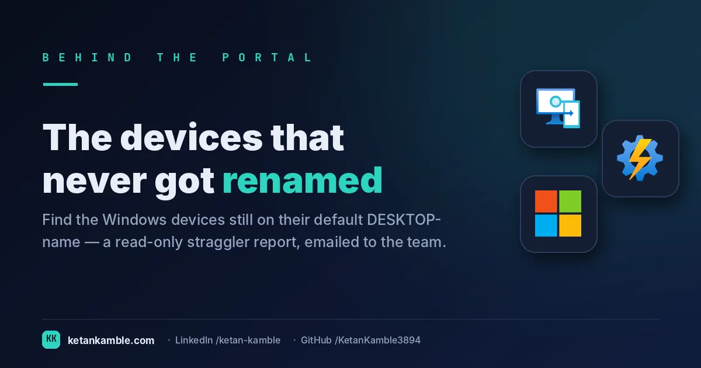

# The devices that never got renamed: finding the DESKTOP- stragglers

{ .post-cover width="1200" height="630" fetchpriority=high }

A Windows device that enrols and *keeps* its out-of-the-box `DESKTOP-XXXXX` name is a small red flag: it usually means the corporate naming step — the Autopilot rename to your standard convention — never completed. One or two don't matter. A slow drip of them across the fleet does, because a device stuck on the default name is often a device whose provisioning didn't finish cleanly. This is the read-only runbook that finds them and emails the list to the team.

<!-- more -->

<iframe scrolling="no" src="/assets/hooks/unrenamed-desktop-devices.html" title="Animated: DESKTOP- stragglers scrolled past — versus a read-only report that sorts and routes them" loading="lazy" style="display:block;width:100%;aspect-ratio:1200/470;border:0;border-radius:16px;box-shadow:0 10px 30px rgba(0,0,0,.35)"></iframe>

!!! success "The payoff"
    Every device that quietly never finished provisioning eventually becomes a ticket — roughly
    **30–60 minutes** of helpdesk time plus user downtime each. A scheduled read-only report turns that
    reactive ticket into a **two-minute rename** before anyone notices — and a handful a week adds up to
    **dozens of tickets a quarter** quietly avoided. *(Illustrative.)*

!!! tip "The short version"
    This scheduled, **read-only** runbook queries Intune for every managed device whose name still
    starts with `DESKTOP-`, pulls each one's serial, enrolment profile and primary user, and emails a
    tidy HTML table to the support queue — with the handling rules attached. It **reads and reports
    only**: the rename or reprovision is a human decision, not something the script does.

## Why the default name is a signal, not just cosmetics

When Autopilot (or your provisioning flow) works, the device gets renamed to your convention early. When it *doesn't*, the device sits on `DESKTOP-` and two very different problems hide behind the same symptom:

- **The enrolment profile is present** — an Autopilot device whose rename simply never applied. Benign: rename it to your standard and let it take on the next reboot.
- **The enrolment profile is blank** — the device isn't Autopilot-provisioned (no assigned profile). On an all-Autopilot fleet that often points at incomplete provisioning that may need re-enrolment — **but blank is also perfectly normal** for Hybrid Azure AD Join, GPO/bulk enrolment, or manual Entra join, where naming comes from elsewhere. So blank means "not Autopilot", **not** automatically "wipe it": investigate first.

The console won't separate those cases for you, and it won't hand you the list at all. So the job is to surface every `DESKTOP-` device *with the field that tells you which case it is* — the enrolment profile — and route it, knowing blank is a prompt to check, not a verdict.

## What's different about this report

It's not just "devices named DESKTOP-*". Each row carries the fields that decide the fix: **device name, serial, enrolment profile, primary user, manufacturer, model, OS and last sync**. The enrolment-profile column is the whole point — it tells you whether you're looking at an Autopilot rename that stalled or a device that isn't Autopilot at all.

For example, a row reading **DESKTOP-4F2K9 · SN 5CD… · profile: Corp-Autopilot · j.doe@contoso.com · Lenovo** is a straightforward rename; a row reading **DESKTOP-8H1V2 · SN 7LM… · profile: (blank)** is *not* Autopilot-provisioned — investigate before assuming a reprovision. One name, two different fixes — and the table makes the distinction obvious at a glance.

## How it works: a read-only collector + a mailer

--8<-- "assets/diagrams/unrenamed-desktop-devices.svg"

It authenticates as a **Managed Identity**, filters managed devices to `startswith(deviceName,'DESKTOP-')`, fetches each one's detail with a `$select` query, builds an HTML table, and emails it. The only Graph scope it needs is `DeviceManagementManagedDevices.Read.All` — there's no write anywhere. The rename and reprovision steps live in the email as *instructions for a human*, not as actions the runbook performs.

!!! note "First time standing up a runbook?"
    The [Collection layer setup](../../projects/zero-access-agent/azure-automation-setup.md) covers it once: create the Automation Account, enable the **Managed Identity**, and grant the read-only Graph app role — there's no portal blade for that, it's `New-MgServicePrincipalAppRoleAssignment`.

!!! warning "Verify before you trust it"
    The device list — and `enrollmentProfileName` in particular — lives on Graph's **beta** endpoint
    (`/beta/deviceManagement/managedDevices`); that field isn't on `/v1.0`, so treat it as subject to
    change and re-confirm in your **own lab tenant**. Sanity-check it against known-good devices first:
    confirm blank really does mean "not Autopilot" in *your* estate before routing on it, because
    hybrid-joined and manually-enrolled devices legitimately show blank. Every value in the examples is
    **synthetic lab data** (`@contoso.com`).

## Set it up, step by step

You don't build this one from scratch. Every collector shares the same read-only plumbing, so you set that up **once** — after that, adding this report is about a five-minute job.

1. **One-time — stand up the collection layer.** Follow **[Setting up the collection layer](../../projects/zero-access-agent/azure-automation-setup.md)**: an Azure Automation account, a system-assigned **Managed Identity** (no secrets, no app registration), and a storage account for the CSV snapshots. You only do this once, however many collectors you end up running.
2. **Grant this collector's read-only scopes.** In that guide's role-assignment step, add the scopes this one needs — `DeviceManagementManagedDevices.Read.All`. Every one ends in `.Read.All`: it reads, and never writes to your tenant. (Running more than one collector? Scopes are **additive** — add the new ones, don't replace what's already granted.)
3. **Import the script as a runbook.** Take **[the script](../../scripts/unrenamed-desktop-devices.md)**, import it into the Automation Account as a PowerShell 7 runbook, and publish it.
4. **Schedule it.** Attach a daily (or weekly) schedule the same way the setup guide shows. It then runs unattended, dropping a dated CSV into your `root/` container each time.
5. **Point Power BI at the CSV.** In Power BI Desktop, start with the **synthetic sample** so you can build before touching real data. For live data, use **Get Data → Azure Blob Storage** and point it at the dated CSV in your `root/` container (the setup guide has the storage account and connection details). Refresh to get your dashboard.

No secrets, no app registration, nothing that can change your tenant — just a scheduled read and a CSV that Power BI draws from.

## Gotchas from the lab

- **`DESKTOP-` isn't always broken.** A brand-new device caught mid-provisioning can legitimately show
  the default name for a short window. Weight the signal by **last sync / enrolment age** — a device
  that's been `DESKTOP-` for a week is the one to chase, not one enrolled an hour ago.
- **Route on the per-device read, not the list.** The bulk `managedDevices` list can lag or omit fields
  the single-device `$select` returns, so the enrolment profile you act on comes from the individual
  query — the list is only used to find the candidates.
- **The email is a nudge, not an action.** Keeping the rename/reprovision as a documented human step —
  rather than having the script rename devices automatically — is deliberate: a bad auto-rename across
  the fleet is far more expensive than a follow-up email.
- **Send only when there's something to send.** No stragglers, no email — so an empty inbox is itself
  the "all clear".
- **Mail from Automation isn't port 25.** The Automation sandbox can't reach an on-prem relay, and
  Exchange Online won't do unauthenticated relay — so `smtp.contoso.com:25` is a placeholder, not a
  working default. In production, send via Graph `sendMail`, an authenticated relay, or Azure
  Communication Services.

## Reproduce it yourself

Run it read-only against a **lab tenant** and inspect the console output before you wire up the mailer —
the device table logs to output as well as email. Point the SMTP and recipient CONFIG at your own values
(the script ships with `@contoso.com` placeholders).

## FAQ

**Does this rename or wipe any devices?** No. It's read-only against Graph and only sends an email report. The rename and reprovision are human steps described in the email, not actions the script takes.

**Why does the enrolment profile matter so much?** A present profile means an Autopilot rename that stalled (benign); a blank profile means the device isn't Autopilot-provisioned — which may need re-enrolment on an all-Autopilot fleet, but is also normal for hybrid-joined or manually-enrolled devices. Same `DESKTOP-` symptom, different next step — investigate blank, don't assume a wipe.

**Do I need a write scope?** No — `DeviceManagementManagedDevices.Read.All` is all it uses.

## More in this series

- [One row per device](../one-row-per-device-building-the-inventory-intune-wont-hand-you/) — the enriched inventory backbone
- [Where Autopilot actually breaks](../where-autopilot-actually-breaks-esp-phase-failure-category-per-deployment/) — when provisioning fails earlier, at the ESP

## Related

- :material-script-text: **The script** → [Unrenamed Device Report](../../scripts/unrenamed-desktop-devices.md)
- :material-robot-outline: **The capstone** → [The read-only AI agent that can't touch your tenant](../the-read-only-ai-agent-that-cant-touch-your-tenant/)

---

*Examples use synthetic data from a personal lab — no real tenant, users, or devices. Independent
content, not affiliated with, sponsored by, or endorsed by Microsoft. Microsoft, Intune, Entra,
Microsoft Graph, Windows Autopilot and Azure are trademarks of the Microsoft group of companies.*
