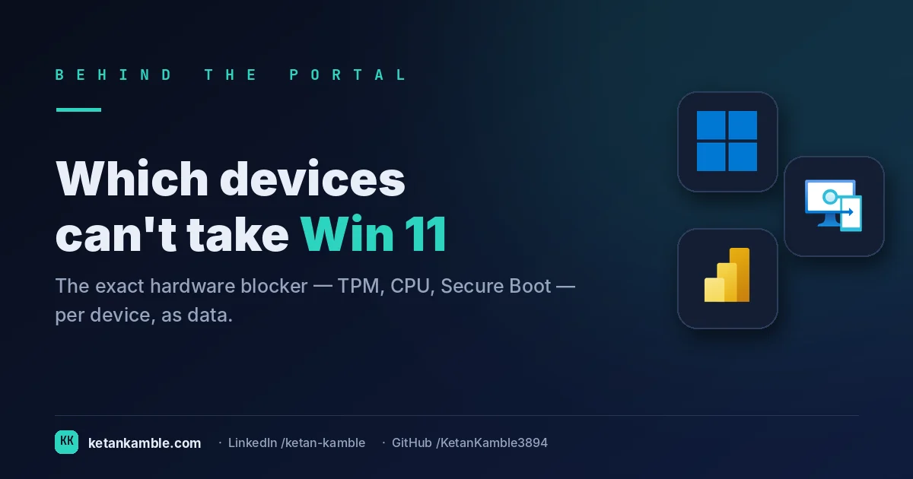
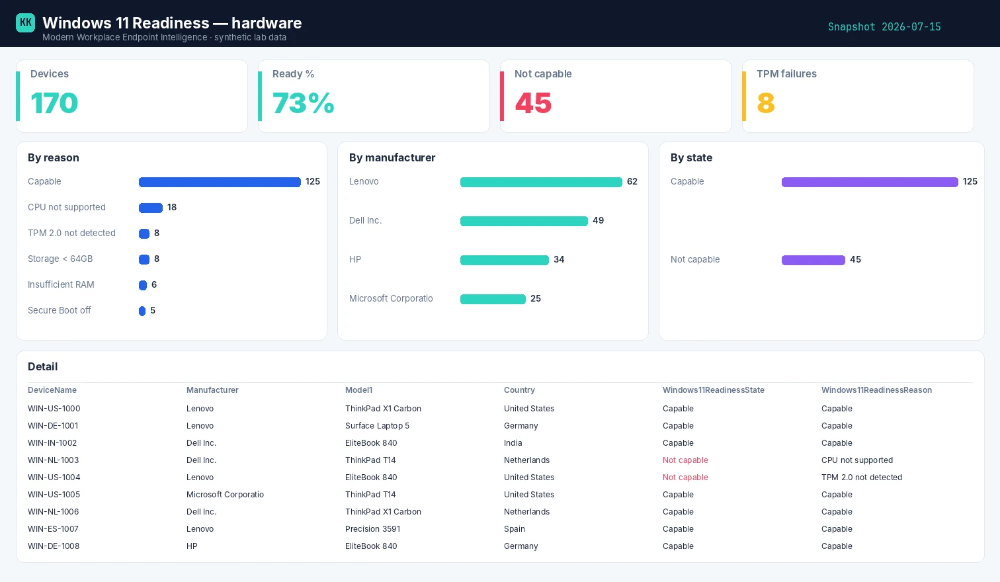

# Which devices can't take Windows 11 — the hardware blocker, per device

{ .post-cover width="1200" height="630" fetchpriority=high }

"How many of our devices are Windows 11 ready?" is a question that decides a hardware budget. Intune hints at readiness but won't hand you the **specific blocker** — TPM, CPU, Secure Boot, RAM — for every device, as data. This read-only collector does, so the refresh plan writes itself.

<!-- more -->

<iframe scrolling="no" src="/assets/hooks/windows11-readiness.html" title="Animated: an identical not-capable stamp versus the exact blocker per device" loading="lazy" style="display:block;width:100%;aspect-ratio:1200/470;border:0;border-radius:16px;box-shadow:0 10px 30px rgba(0,0,0,.35)"></iframe>

!!! success "The payoff"
    “39% not capable” with no reason turns a hardware-refresh budget into a guess. The per-device blocker splits a free BIOS toggle (TPM, Secure Boot) from a genuine replacement — often reclaiming a large share of devices from the “buy new” pile before a single PO is raised. *(Illustrative.)*

!!! tip "The short version"
    Windows 11 readiness is a per-device hardware verdict. This read-only collector pulls each device's readiness state and the **exact failing check** (TPM 2.0, CPU family, Secure Boot, RAM, storage), enriched with make/model, so you can size and target the refresh. **No write access, no live tenant in the report.**

## Why the portal doesn't hand you this

- **A single "ready/not ready" flag isn't a plan.** You need *why* not-ready — TPM off vs CPU unsupported are completely different fixes (one's a setting, one's a new laptop).
- **The blockers are scattered.** Readiness signals live across analytics and device properties, not in one exportable, per-device table.
- **No make/model rollup.** Budgeting means "which models are unsupported" — the console won't group the blocked devices by model for you.

## What's different about this report

One row per device with the **readiness state**, the **specific reason**, and a boolean for each hardware check (TPM 2.0, Secure Boot, RAM, storage, and processor — family, cores, speed and 64-bit), joined to make and model — so "replace these 40 ThinkPads" falls straight out of the data.

For example, one row might read **Latitude-7420 · Not capable · reason: Processor unsupported · TPM ✓ · Secure Boot ✓** — a hardware refresh, not a fix — while the next reads **EliteBook-840 · Not capable · reason: TPM off · Processor ✓** — a BIOS toggle away from ready. Same "not capable" verdict, completely different bill.

## How it works: a read-only collector

--8<-- "assets/diagrams/windows11-readiness.svg"

The read-only Graph roles are all `.Read.All`: `DeviceManagementManagedDevices.Read.All` for the devices and the readiness export. Nothing writes.

!!! warning "Verify before you trust it"
    The readiness data comes from **Endpoint Analytics' Work-from-anywhere** metric
    (`userExperienceAnalyticsWorkFromAnywhereMetrics('allDevices')/metricDevices`) on Graph's **beta**
    endpoint — a read-only GET that a single `DeviceManagementManagedDevices.Read.All` grants, no
    on-device agent required. Note it returns nothing until **Endpoint Analytics is onboarded** in the
    tenant (an un-onboarded tenant answers this query with no data at all). Microsoft evaluates the full
    hardware set (TPM 2.0, Secure Boot, supported processor family, core count, speed, 64-bit, RAM ≥ 4 GB,
    storage ≥ 64 GB); the check names and reason values can change, so confirm them in your **own lab
    tenant**. Every figure in the screenshots is **synthetic lab data** (`@contoso.com`).

## The Power BI report

The report is a refresh planner: devices by readiness reason, not-capable by manufacturer, and by state, with a table that filters to any single blocker for a targeted campaign.

{ .kk-zoom loading=lazy width="1512" height="880" }

*Template + build kit on the **[Windows 11 Readiness report page](../../powerbi/windows11-readiness-report.md)**.*

## Gotchas from the lab

- **TPM "not detected" is often a BIOS setting.** Before you budget a replacement, check whether TPM is merely disabled in firmware — that's a config fix, not a purchase.
- **Unsupported processor is the hard blocker.** A CPU that's not on Microsoft's supported-processor list generally means new hardware; separate those from the fixable ones (TPM/Secure Boot) early.
- **Unknown ≠ ready — and needs Endpoint Analytics.** This metric only populates once **Endpoint Analytics is enabled/onboarded**; un-onboarded devices report `Unknown`. Treat `Unknown` as a gap to chase (onboard them), not a pass.

## Reproduce it yourself

The [synthetic fleet generator](../../scripts/synthetic-fleet.md) can emit a realistic, entirely
fictional `Readiness.csv` so you can build and demo the whole report before pointing it at real data.

## FAQ

**Does this need an agent on each device?** No — it's a read-only GET against the Endpoint Analytics Work-from-anywhere metric; no on-device agent required.

**Why do some devices show "Unknown"?** The metric only populates once Endpoint Analytics is onboarded; treat Unknown as a gap to chase, not a pass.

**Is "not ready" always a new laptop?** No — TPM off or Secure Boot disabled are firmware toggles; an unsupported processor is the hard blocker. The report separates them.

## More in this series

- [Where Autopilot actually breaks](../autopilot-operations/)
- [One row per device](../inventory-all-devices/)

## Related

- :material-script-text: **The script** → [Windows 11 Readiness](../../scripts/windows11-readiness.md)
- :material-chart-box: **The report + template** → [Windows 11 Readiness report](../../powerbi/windows11-readiness-report.md)
- :material-shield-lock: **The bigger picture** → [Zero-Access Agent](../../projects/zero-access-agent/index.md)
- :material-robot-outline: **The capstone** → [The read-only AI agent that can't touch your tenant](../the-read-only-ai-agent-that-cant-touch-your-tenant/)

---

*Screenshots use synthetic data from a personal lab — no real tenant, users, or devices. Independent
content, not affiliated with, sponsored by, or endorsed by Microsoft. Microsoft, Intune, Entra,
Microsoft Graph, Azure, Defender and Power BI are trademarks of the Microsoft group of companies.*
