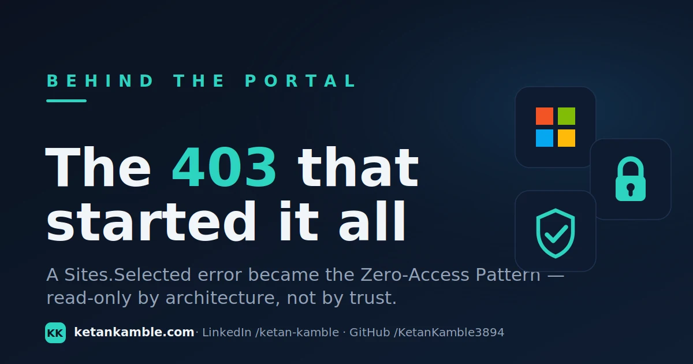

# The 403 that started it: how a Sites.Selected error became the Zero-Access Pattern

{ .post-cover width="1200" height="630" fetchpriority=high }

Everything else on this site — the ten read-only collectors, the Power BI reports, the AI agent that
answers questions about a fleet without touching it — points back to one moment in a lab tenant: a
**403** I fully expected to be a **200**. Not a bug. The system working exactly as designed. That 403 is
the reason the whole project is built the way it is, and this is the artifact that came out of it.

<!-- more -->

!!! quote "The proof, in one screen"
    ```
    PS> . .\read-only-gate.ps1
    Zero-Access read-only gate — identity: aa-collectors  [<guid>]
    [read ] DeviceManagementManagedDevices.Read.All
    [read ] Directory.Read.All
    [WRITE] DeviceManagementManagedDevices.ReadWrite.All
    READ-ONLY GATE FAILED — write-capable Graph roles granted:
    DeviceManagementManagedDevices.ReadWrite.All. Refusing to run the collector.
    ```
    One write scope slips onto the identity, the collector never makes its first call. The boundary is
    executable, not a promise.

!!! success "The payoff"
    Most "read-only" tooling is read-only because the author *intended* it to be — one wrong scope, one
    copied snippet, and it quietly gains the ability to change your tenant. This pattern makes the
    boundary a thing the machine checks on every run. The difference is the gap between *"trust me, it
    only reads"* and *"it cannot run if it can write."* One of those you can hand to an AI.

## What actually happened

I was reproducing a SharePoint scenario in a personal lab with **Sites.Selected** — the app-only Graph
model where an application holds the *Sites.Selected* permission but can still only reach the specific
sites it's been individually granted. I'd granted the app-role, consented it, watched it light up green
in the portal. Then the call to read a site came back **403 Forbidden**.

My first instinct was the usual checklist: wrong scope, missing admin consent, token not refreshed. All
fine. The permission *was* there. What I'd missed is the whole point of Sites.Selected: holding the
permission grants you **nothing** until a second, per-site grant is written on the site itself. The app
had the key to the building and no key to any room. The platform said no — and it was right to.

## The realisation

The interesting part wasn't the fix. It was *why the deny felt so solid.* The boundary held even though
the app "had permission," because access wasn't a matter of the app behaving — it was a matter of a grant
that simply didn't exist. Nothing was trusting the application to stay in its lane. There was no lane to
leave.

That reframed a problem I'd been circling for months: **how do you let an AI answer questions about a
fleet of thousands of endpoints without ever giving it a way to break one?** Every answer I'd tried was
some flavour of "give it access and trust it not to misuse it" — better prompts, tighter tool
definitions, a human in the loop. The 403 pointed at a different answer. Don't trust the boundary.
*Build it so there's no lane to leave.*

## The pattern that fell out of it

The Zero-Access Pattern is that idea applied end to end:

- The AI never touches Microsoft Graph or a live tenant. It reads **sanitised CSV snapshots** and nothing
  else. Its access to your systems is zero — hence the name.
- The snapshots are produced by scheduled, read-only collectors running under a **Managed Identity** with
  **only `.Read.All`** Graph roles. No secrets to leak, no write path to misuse.
- And the identity itself is **gated** — checked on every run — so the "only reads" claim is verified by a
  script, not asserted in a README.

That last piece is the founding artifact, and it's small on purpose.

## The gate, in one screen

[`read-only-gate.ps1`](../../scripts/read-only-gate.md) runs *as* the collector's identity, asks Graph
which application permissions that identity actually holds, and refuses to continue if any of them can
write. Dot-source it at the top of a runbook and the collector aborts before its first call the day
someone grants it a write scope by mistake:

```powershell
. .\read-only-gate.ps1     # throws if the identity can write — the collector never runs
# ...collector logic only reaches here on a clean, read-only identity...
```

It's deliberately not clever. It reads the identity's granted roles, classifies each as read
(`.Read.All` / `.Read`) or write, and turns a silent misconfiguration into a loud, early failure. The
value isn't the code — it's that the boundary is now something the machine enforces instead of something
you hope stayed true.

!!! warning "Honest about what it is"
    The gate checks the roles that are *granted*. It doesn't replace good hygiene — the first defence is
    never granting a write scope at all. It's the backstop that catches the day discipline slips. Every
    figure and identity name here is from a **personal lab**; verify the scopes and behaviour in your own
    tenant before relying on it.

## Where it goes from here

This is beat one. The same lab reproduction that produced the 403 is the exact material for a
call-by-call teardown of what Graph *actually does* under a routine admin action — that's the next thing
I'm writing. If you want the short version of the whole architecture, it lives in the
**[Zero-Access Agent](../../projects/zero-access-agent/index.md)** overview; if you want to stand the
collection layer up yourself, start with **[Setting up the collection
layer](../../projects/zero-access-agent/azure-automation-setup.md)**.

The founding idea is just this: give the AI the reports, never the systems — and make "never" something a
script can prove.

## Related

- :material-script-text: **The artifact** → [Read-Only Gate](../../scripts/read-only-gate.md)
- :material-shield-lock: **The architecture** → [Zero-Access Agent](../../projects/zero-access-agent/index.md)
- :material-cog-outline: **Stand it up** → [Setting up the collection layer](../../projects/zero-access-agent/azure-automation-setup.md)

---

*Independent content — not affiliated with, sponsored by, or endorsed by Microsoft. Microsoft, Intune,
Entra, Microsoft Graph, Azure and Power BI are trademarks of the Microsoft group of companies. Everything
here comes from a personal lab; verify in your own tenant.*
