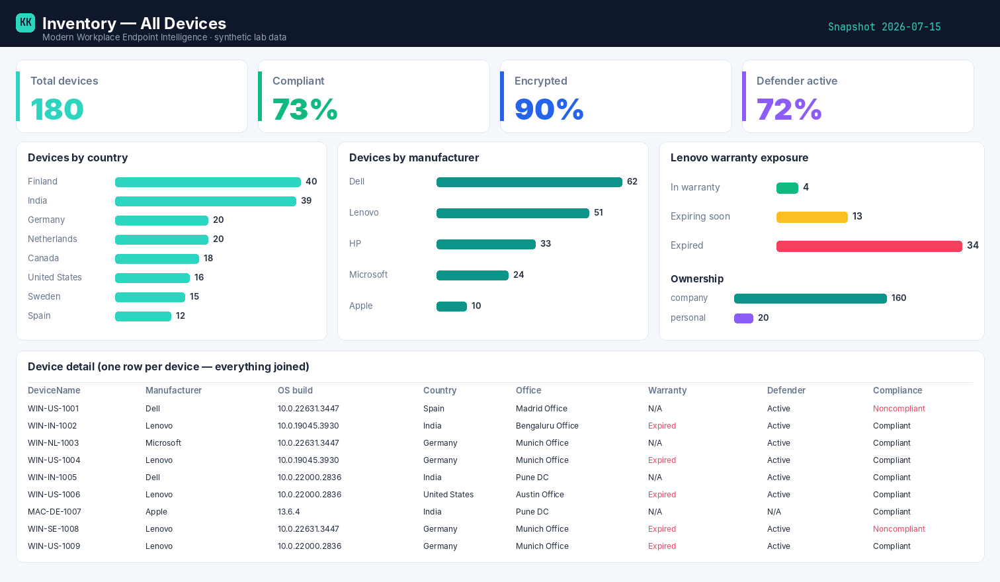

# Inventory — All Devices — Power BI report

Built on the read-only snapshot from the **[Inventory — All Devices script](../scripts/inventory-all-devices.md)** — no live tenant connection, just the sanitized CSV. One row per device, everything already joined.

{ .kk-zoom }

*Example built on synthetic `@contoso.com` data — 180 devices.*

## Download the template

[:material-download: Inventory — All Devices template (.pbit)](../assets/pbit/inventory-all-devices.pbit){ .md-button .md-button--primary }

!!! info "Opening the template"
    The `.pbit` carries the **parameterised CSV connection**, the full 26-column schema, and **every
    DAX measure** — on a blank canvas, so the visuals are yours to drop in (~5 minutes with the layout
    below). On open it asks for **`SnapshotCsvPath`** — point it at your `Inventory_AllDevices.csv` and
    refresh. If your Power BI Desktop is older and the template complains, the build kit below rebuilds
    it from scratch.

## Build kit

### 1 · Power Query (the connection)

The parameter `SnapshotCsvPath` (Text) feeds one query:

```text
let
    Source = Csv.Document(File.Contents(SnapshotCsvPath), [Delimiter=",", Encoding=65001, QuoteStyle=QuoteStyle.Csv]),
    Promoted = Table.PromoteHeaders(Source, [PromoteAllScalars=true])
in
    Promoted
```

### 2 · DAX measures

```dax
Total Devices          = DISTINCTCOUNT(Devices[DeviceName])
Compliant              = CALCULATE([Total Devices], Devices[ComplianceStatus] = "Compliant")
Compliant %            = DIVIDE([Compliant], [Total Devices])
Non-Compliant          = CALCULATE([Total Devices], Devices[ComplianceStatus] = "Noncompliant")
Encrypted %            = DIVIDE(CALCULATE([Total Devices], Devices[Encrypted] = "true"), [Total Devices])
Defender Active %      = DIVIDE(CALCULATE([Total Devices], Devices[DefenderState] = "Active"), [Total Devices])
Out of Warranty        = CALCULATE([Total Devices], Devices[WarrantyState] = "Expired")
Warranty Expiring Soon = CALCULATE([Total Devices], Devices[WarrantyState] = "Expiring soon")
```

!!! tip "Always count devices, not rows"
    Every count keys off `DISTINCTCOUNT(Devices[DeviceName])`. Once a device carries multiple policies
    or apps, a naïve row count double-counts it — the measures above never do.

### 3 · Visual layout (matches the screenshot)

| Row | Visual | Field / measure |
| --- | --- | --- |
| Top | 4 × Card | `Total Devices`, `Compliant %`, `Encrypted %`, `Defender Active %` |
| Middle-left | Bar chart | Axis `UserCountry`, value `Total Devices` |
| Middle-centre | Bar chart | Axis `Manufacturer`, value `Total Devices` |
| Middle-right | Stacked bar | Legend `WarrantyState`, value `Total Devices`; add `OwnerType` split |
| Bottom | Table | `DeviceName`, `Manufacturer`, `OSVersion`, `UserCountry`, `UserOfficeLocation`, `WarrantyState`, `DefenderState`, `ComplianceStatus` |
| Slicers | `UserCountry`, `OwnerType`, `ComplianceStatus` | cross-filter everything |

## How it's wired

The report points at the CSV the collector writes — because the shaping and pre-aggregation already
happened in the runbook, the Power BI side stays thin: connect, refresh, slice. Swap the parameter
path for your own container and nothing else changes.

## Related

- :material-script-text: **The script** → [Inventory — All Devices](../scripts/inventory-all-devices.md)
- :material-book-open-variant: **The story** → [One row per device](../blog/posts/inventory-all-devices.md)
- :material-shield-lock: **Part of** → [Zero-Access Agent](../projects/zero-access-agent/index.md)
