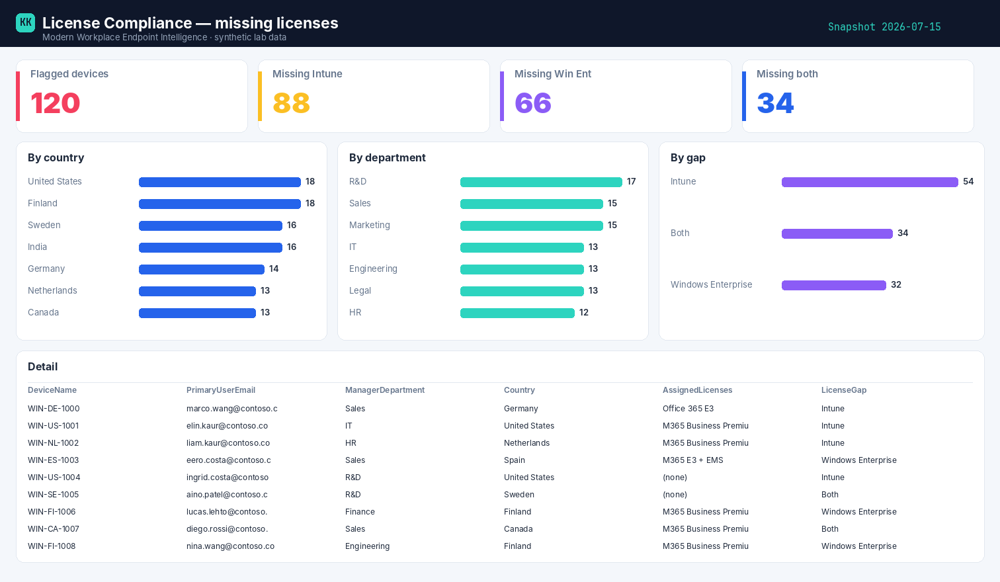

# License Compliance — Power BI report

Built on the read-only snapshot from the **[License Compliance script](../scripts/license-compliance.md)** — no live tenant connection, just the sanitized CSV the collector writes to Blob.

{ .kk-zoom }

*Example built on synthetic `@contoso.com` data.*

## Download the template

[:material-download: License Compliance template (.pbit)](../assets/pbit/license-compliance.pbit){ .md-button .md-button--primary }

!!! info "Opens to a finished report"
    The `.pbit` carries the data model, **every DAX measure**, *and* a **pre-built report page**
    (KPI cards, bar charts, a detail table and slicers). On open it prompts for three parameters —
    **`StorageAccount`**, **`ContainerName`**, **`FileName`** — then for your storage credentials, and
    loads straight from the container your collector writes to. No manual building.

## The measures

```dax
Flagged Devices  = DISTINCTCOUNT(Licenses[DeviceName])
Missing Intune   = CALCULATE(DISTINCTCOUNT(Licenses[DeviceName]), Licenses[LicenseGap] IN {"Intune","Both"})
Missing Win Ent  = CALCULATE(DISTINCTCOUNT(Licenses[DeviceName]), Licenses[LicenseGap] IN {"Windows Enterprise","Both"})
Missing Both     = CALCULATE(DISTINCTCOUNT(Licenses[DeviceName]), Licenses[LicenseGap] = "Both")
```

## How it's wired

The collector writes the CSV to your storage account; the template reads it from Blob. Because the
shaping and pre-aggregation already happened in the runbook, Power BI stays thin — connect, refresh,
slice. Swap the three parameters for your own container and nothing else changes.

## Related

- :material-script-text: **The script** → [License Compliance](../scripts/license-compliance.md)
- :material-book-open-variant: **The story** → [Who's missing an Intune license](../blog/posts/license-compliance.md)
- :material-shield-lock: **Part of** → [Zero-Access Agent](../projects/zero-access-agent/index.md)
