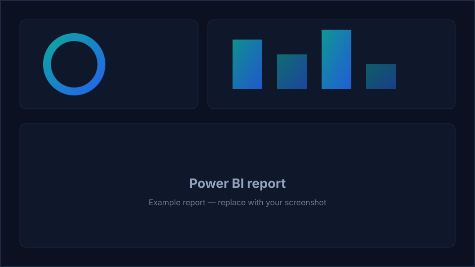

# Intune Documentation

Snapshots your Intune configuration — profiles, policies and settings — as documentation you can diff over time.

[:material-download: Download the script](https://github.com/KetanKamble3894/zero-access-agent/blob/main/scripts/Collect-IntuneDocumentation.ps1){ .md-button .md-button--primary }
[:material-github: View on GitHub](https://github.com/KetanKamble3894/zero-access-agent/blob/main/scripts/Collect-IntuneDocumentation.ps1){ .md-button }

## 1 · The script

Read-only by construction — it authenticates with a Managed Identity, calls Microsoft Graph with GET only, and writes a sanitized CSV snapshot. Set the three CONFIG values at the top, then run.

??? example "View the full script (12 KB)"
    ```powershell
    --8<-- "assets/scripts/Collect-IntuneDocumentation.ps1"
    ```

## 2 · The Power BI template

!!! note "`.pbit` goes here"
    Drop `intune-documentation.pbit` into `docs/assets/pbit/` and swap this note for a download button:
    `[:material-download: Intune Documentation template](../assets/pbit/intune-documentation.pbit)`

## 3 · Example report



*Replace `report-placeholder.svg` with a screenshot of your own `Intune Documentation` report.*

## Related

- :material-chart-box: **Power BI report** → [Intune Documentation report](../powerbi/intune-documentation-report.md)
- :material-book-open-variant: **Deep-dive teardown** → [in the Zero-Access Agent project](../projects/zero-access-agent/collectors/intune-documentation.md)

