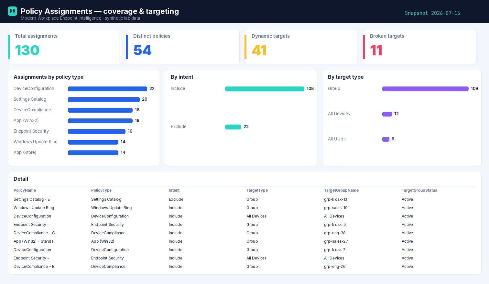

# Policy Assignments

Every Intune policy mapped to every group it targets — dynamic rules and broken targets included.

[:material-download: Download the script](https://github.com/KetanKamble3894/zero-access-agent/blob/main/scripts/Collect-PolicyAssignments.ps1){ .md-button .md-button--primary }
[:material-github: View on GitHub](https://github.com/KetanKamble3894/zero-access-agent/blob/main/scripts/Collect-PolicyAssignments.ps1){ .md-button }

## 1 · The script

Read-only by construction — it authenticates with a Managed Identity, calls Microsoft Graph read-only (`.Read.All` scopes), and writes a sanitized CSV snapshot. Set the CONFIG values at the top, then run.

??? example "View the full script (26 KB)"
    ```powershell
    --8<-- "assets/scripts/Collect-PolicyAssignments.ps1"
    ```

## 2 · The Power BI template

[:material-download: Policy Assignments template (.pbit)](../assets/pbit/policy-assignments.pbit){ .md-button .md-button--primary }

Opens to a **pre-built report** — KPI cards, charts, a detail table and slicers, already wired. On open it prompts for your **Storage account / container / file**, then loads from Blob. Full details on the **[report page](../powerbi/policy-assignments-report.md)**.

## 3 · Example report

{ .kk-zoom }

*Built on synthetic `@contoso.com` data. Point the template at your own snapshot to see your fleet.*

## Related

- :material-book-open-variant: **The story** → [Every policy, every target](../blog/posts/policy-assignments.md)
- :material-chart-box: **Power BI report** → [Policy Assignments report](../powerbi/policy-assignments-report.md)
- :material-shield-lock: **Part of** → [Zero-Access Agent](../projects/zero-access-agent/index.md)
